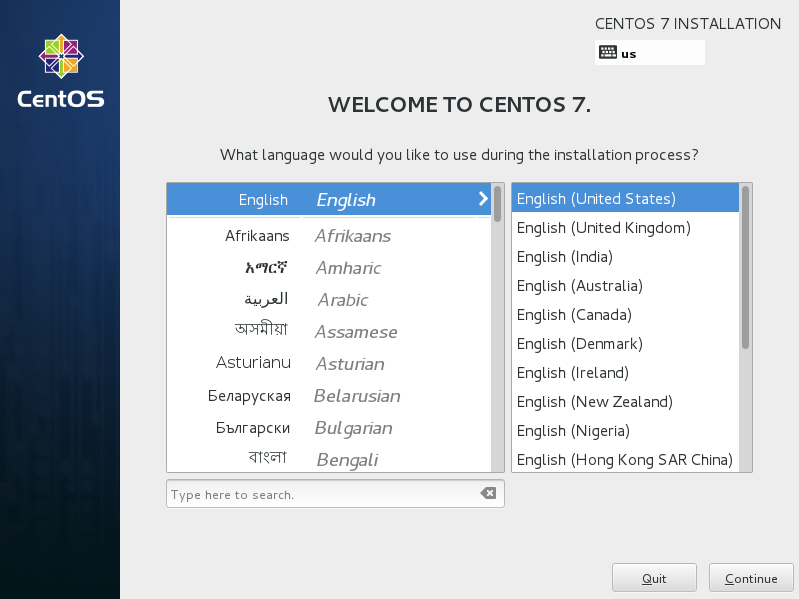
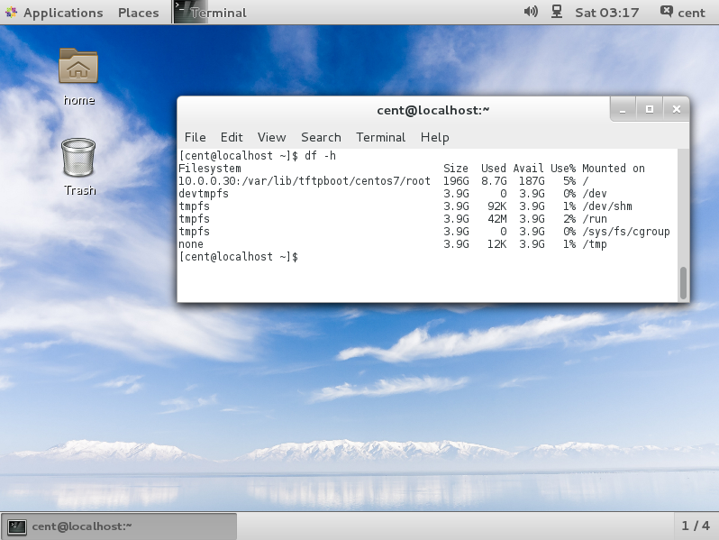

## 10.4. PXE

[PXE(Preboot eXecution Environment预启动执行环境)](https://en.wikipedia.org/wiki/Preboot_Execution_Environment)工作于Client/Server的网络模式，支持工作站通过网络从远端服务器下载镜像，并由此支持通过网络启动操作系统。计算机需要**具有支持PXE的网卡**。

### 10.4.1. 配置PXE服务器

安装所需的软件包：

`yum -y install syslinux xinetd tftp-server`

`mkdir /var/lib/tftpboot/pxelinux.cfg`

`cp /usr/share/syslinux/pxelinux.0 /var/lib/tftpboot/`

启动TFTP：

`/etc/xinetd.d/tftp`

```
# 更改
disable = no
```

```
systemctl start xinetd
systemctl enable xinetd
```

先[参照这里设置好DHCP基本设置](../10. 网络服务/10.1. DNS DHCP服务.html#1012-dhcp服务器)，并添加以下设置：

编辑`/etc/dhcp/dhcpd.conf`文件：

```
option domain-name-servers   10.0.0.30;
# 为“next-server”指定PXE服务器的主机名或IP地址
filename        "pxelinux.0";
next-server     10.0.0.30;
```

`systemctl restart dhcpd`

### 10.4.2. 网络安装

通过网络从PXE服务器将操作系统安装到客户端计算机。如果客户端计算机没有CD/DVD驱动器，这很有用。

首先将ISO镜像下载到PXE服务器。下例演示位于`/home/iso`的CentOS7镜像。

`mkdir -p /var/pxe/centos7`

`mkdir /var/lib/tftpboot/centos7`

`mount -t iso9660 -o loop /home/iso/CentOS-7-x86_64-DVD-1503-01.iso /var/pxe/centos7`

`cp /var/pxe/centos7/images/pxeboot/vmlinuz /var/lib/tftpboot/centos7/`

`cp /var/pxe/centos7/images/pxeboot/initrd.img /var/lib/tftpboot/centos7/`

`cp /usr/share/syslinux/menu.c32 /var/lib/tftpboot/`

编辑`/var/lib/tftpboot/pxelinux.cfg/default`文件：

```
timeout 100
default menu.c32

menu title ########## PXE Boot Menu ##########
label 1
   menu label ^1) Install CentOS 7
   kernel centos7/vmlinuz
   append initrd=centos7/initrd.img method=http://10.0.0.30/centos7 devfs=nomount

label 2
   menu label ^2) Boot from local drive
   localboot
```

先[参照这里安装好HTTP服务器](../5. Web服务器/5.1. Apache httpd.html)，并添加以下设置：

编辑`/etc/httpd/conf.d/pxeboot.conf`文件：

```
Alias /centos7 /var/pxe/centos7
<Directory /var/pxe/centos7>
    Options Indexes FollowSymLinks
    # 允许访问的IP地址
    Require ip 127.0.0.1 10.0.0.0/24
</Directory>
```

`systemctl restart httpd`

在客户端计算机的BIOS设置上启用网络引导并启动，然后显示安装菜单，按Enter键继续安装：


安装程序启动，这之后的安装与普通安装相同：



### 10.4.3. Kickstart安装

可以使用Kickstart自动执行安装工作。

先按上节内容配置好基本的网络安装（Network-Install）设置。

配置Kickstart：

生成加密的root密码（记住它）：

```
python -c 'import crypt,getpass; \ 
print(crypt.crypt(getpass.getpass(), \
crypt.mksalt(crypt.METHOD_SHA512)))'
```

```
Password:
$6$EC1T.oKN5f3seb20$y1WlMQ7Ih424OwOn.....
```

`mkdir /var/www/html/ks`

编辑`/var/www/html/ks/centos7-ks.cfg`文件：

```
install
# 自动进行每一步骤
autostep
# 安装后重启
reboot
# 加密算法
auth --enableshadow --passalgo=sha512
# 安装源
url --url=http://10.0.0.30/centos7/
# 安装磁盘
ignoredisk --only-use=sda
# 键盘布局
keyboard --vckeymap=cn --xlayouts='cn','us'
# 系统语言设置
lang zh_CN.UTF-8
# 网络设置
network --bootproto=dhcp --ipv6=auto --activate --hostname=localhost
# 上面生成的root密码
rootpw --iscrypted $6$EC1T.oKN5f3seb20$y1WlMQ7Ih424OwOn.....
# 时区
timezone Asia/Shanghai --isUtc --nontp
# 引导程序（bootloader）设置
bootloader --location=mbr --boot-drive=sda
# 初始化所有分区表
zerombr
clearpart --all --initlabel
# 分区
part /boot --fstype="xfs" --ondisk=sda --size=500
part pv.10 --fstype="lvmpv" --ondisk=sda --size=51200
volgroup VolGroup --pesize=4096 pv.10
logvol / --fstype="xfs" --size=20480 --name=root --vgname=VolGroup
logvol swap --fstype="swap" --size=4096 --name=swap --vgname=VolGroup

%packages
@core

%end
```

`chmod 644 /var/www/html/ks/centos7-ks.cfg`

编辑`/var/lib/tftpboot/pxelinux.cfg/default`文件：

```
timeout 100
default menu.c32

menu title ########## PXE Boot Menu ##########
label 1
   menu label ^1) Install CentOS 7
   kernel centos7/vmlinuz
   # 更改：指定Kickstart文件
   append initrd=centos7/initrd.img ks=http://10.0.0.30/ks/centos7-ks.cfg
   
label 2
   menu label ^2) Boot from local drive
   localboot 
```

在客户端计算机的BIOS设置上启用网络引导并启动，然后显示安装菜单，10秒钟后，安装过程将自动开始，完成并重新启动：


### 10.4.4. 无盘客户机

从PXE服务器启动没有本地硬盘的客户端计算机。

先按第二节内容配置好基本的网络安装设置。

安装所需的软件包：

`yum -y install dracut-network nfs-utils`

在PXE服务器上为无盘客户机构建系统：

`mkdir -p /var/lib/tftpboot/centos7/root`

`yum groups -y install "Server with GUI" --releasever=7 --installroot=/var/lib/tftpboot/centos7/root/`

生成加密的root密码（记住它）：

```
python -c 'import crypt,getpass; \ 
print(crypt.crypt(getpass.getpass(), \
crypt.mksalt(crypt.METHOD_SHA512)))'
```

```
Password:
$6$EC1T.oKN5f3seb20$y1WlMQ7Ih424OwOn.....
```

编辑`/var/lib/tftpboot/centos7/root/etc/shadow`文件：

```
# 设置上面生成的root密码
root:$6$EC1T.oKN5f3seb20$y1WlMQ7Ih424OwOn.....:16372:0:99999:7:::
```

编辑`/var/lib/tftpboot/centos7/root/etc/fstab`文件：

```
none    /tmp        tmpfs   defaults   0 0
tmpfs   /dev/shm    tmpfs   defaults   0 0
sysfs   /sys        sysfs   defaults   0 0
proc    /proc       proc    defaults   0 0
```

```
wget -P /var/lib/tftpboot/centos7/ \
http://mirror.centos.org/centos/7/os/x86_64/images/pxeboot/vmlinuz \
http://mirror.centos.org/centos/7/os/x86_64/images/pxeboot/initrd.img
```

编辑`/var/lib/tftpboot/pxelinux.cfg/default`文件：

```
default centos7

label centos7
    kernel centos7/vmlinuz
    append initrd=centos7/initrd.img root=nfs:10.0.0.30:/var/lib/tftpboot/centos7/root rw selinux=0
```

配置NFS服务器与客户端共享系统文件

编辑`/etc/exports`文件：

```
/var/lib/tftpboot/centos7/root 10.0.0.0/24(rw,no_root_squash)
```

```
systemctl start rpcbind nfs-server
systemctl enable rpcbind nfs-server
```

配置完成，启动一个BIOS设置启用了网络引导的无盘计算机，系统将启动如下。



