## 12.6. Cacti

[Cacti](http://www.cacti.net/)是一套基于PHP，MySQL，SNMP及RRDTool开发的网络流量监测图形分析工具。

### 12.6.1. 安装Cacti

先安装[Apache httpd](../5. Web服务器/5.1. Apache httpd.html)，[PHP](../5. Web服务器/5.1. Apache httpd.html#513-使用php脚本)和[MariaDB](../6. 数据库/6.1. MariaDB.html)。

`yum --enablerepo=epel -y install cacti net-snmp net-snmp-utils php-mysql php-snmp rrdtool` 从EPEL安装Cacti，SNMP

配置SNMP（Simple Network Management Protocol简单网络管理协议）：

编辑`/etc/snmp/snmpd.conf`文件：

```
# 注释
#com2sec notConfigUser   default       public

# 取消注释并更改
# “mynetwork”部分更改为自己的本地网络
# 除了“public”或“private”，更改团体名
com2sec  local       localhost    Serverworld
com2sec  mynetwork   10.0.0.0/24  Serverworld

# 取消注释并更改
group MyRWGroup v2c     local
group MyROGroup v2c     mynetwork

# 取消注释
view all    included  .1           80

# 取消注释并更改
access MyROGroup "" v2c   noauth   exact   all   none   none
access MyRWGroup "" v2c   noauth   exact   all   all      all
```

```
systemctl start snmpd
systemctl enable snmpd
```

验证（将“Serverworld”替换为自己的团体名）：

`snmpwalk -v2c -c Serverworld localhost system`

```
SNMPv2-MIB::sysDescr.0 = STRING: Linux dlp.srv.world 3.10.0-229.4.2.el7.x86_64 #1 SMP Wed May.....
SNMPv2-MIB::sysObjectID.0 = OID: NET-SNMP-MIB::netSnmpAgentOIDs.10
DISMAN-EVENT-MIB::sysUpTimeInstance = Timeticks: (91954) 0:15:19.54
SNMPv2-MIB::sysContact.0 = STRING: Root <root@localhost> (configure /etc/snmp
.....
.....
SNMPv2-MIB::sysORUpTime.9 = Timeticks: (4) 0:00:00.04
SNMPv2-MIB::sysORUpTime.10 = Timeticks: (4) 0:00:00.04
```

为Cacti创建数据库并导入表。

`mysql -u root -p`

```
Enter password:
Welcome to the MariaDB monitor.  Commands end with ; or \g.
Your MariaDB connection id is 3342
Server version: 5.5.41-MariaDB MariaDB Server

Copyright (c) 2000, 2014, Oracle, MariaDB Corporation Ab and others.

Type 'help;' or '\h' for help. Type '\c' to clear the current input statement.

# 创建“cacti”数据库（在“password”部分设置任意密码）
MariaDB [(none)]> create database cacti;
Query OK, 1 row affected (0.00 sec)
MariaDB [(none)]> grant all privileges on cacti.* to cacti@'localhost' identified by 'password';
Query OK, 0 rows affected (0.00 sec)
MariaDB [(none)]> flush privileges;
Query OK, 0 rows affected (0.00 sec)
MariaDB [(none)]> exit
Bye
```

`mysql -u cacti -p cacti < /usr/share/doc/cacti-*/cacti.sql`

```
Enter password:  # 上面设置的cacti用户的密码
```

配置Cacti：

编辑`/etc/cron.d/cacti`文件：

```
# 取消注释
*/5 * * * * cacti /usr/bin/php /usr/share/cacti/poller.php > /dev/null 2>&1
```

编辑`/usr/share/cacti/include/config.php`文件：

```
# 更改到MariaDB的连接信息
$database_type = "mysql";
$database_default = "cacti";
$database_hostname = "localhost";
$database_username = "cacti";
$database_password = "password";
$database_port = "3306";
$database_ssl = false;
```

编辑`/etc/httpd/conf.d/cacti.conf`文件：

```
# 如果需要，添加访问权限
Require host localhost
Require ip 10.0.0.0/24
```

`systemctl restart httpd`

### 12.6.2. Cacti初始设置

从Cacti服务器允许的网络中的客户端访问`http://(Cacti服务器的主机名或IP地址)/cacti/`，然后进行初始设置运行，单击“Next”继续：

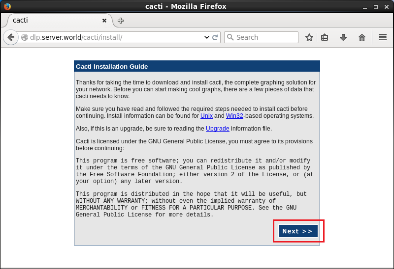

使用默认值继续下一步：

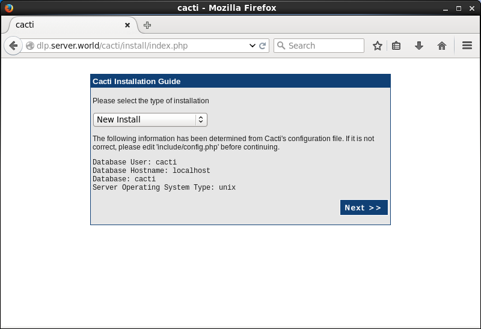

保持默认值，点击“Finish”：

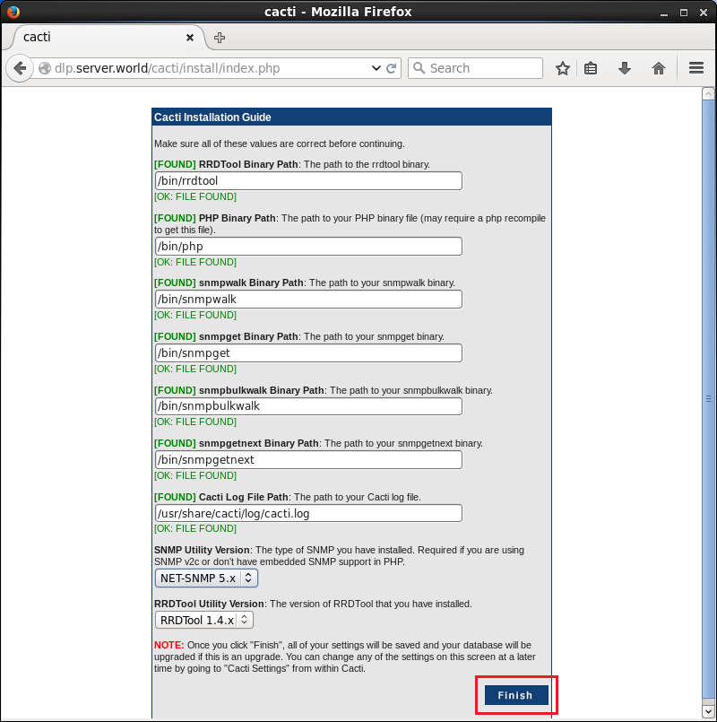

显示登录画面。使用管理员用户“admin”登录，初始密码为“admin”：

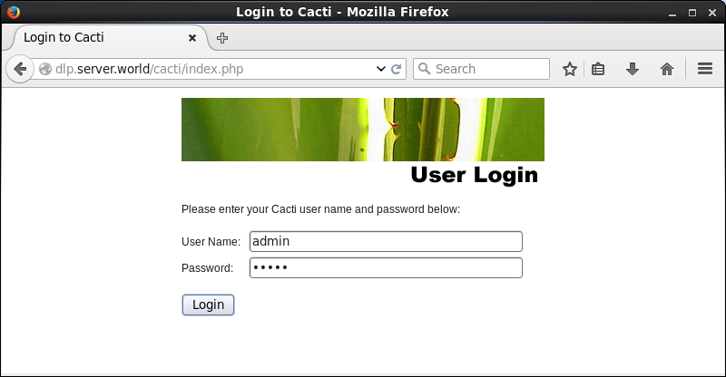

登录后，需要更改管理员密码，设置任意密码：


更改密码后，Cacti的主页显示如下：


### 12.6.3. 基本监控设置

登录到Cacti管理网站，然后单击“Create devices”：

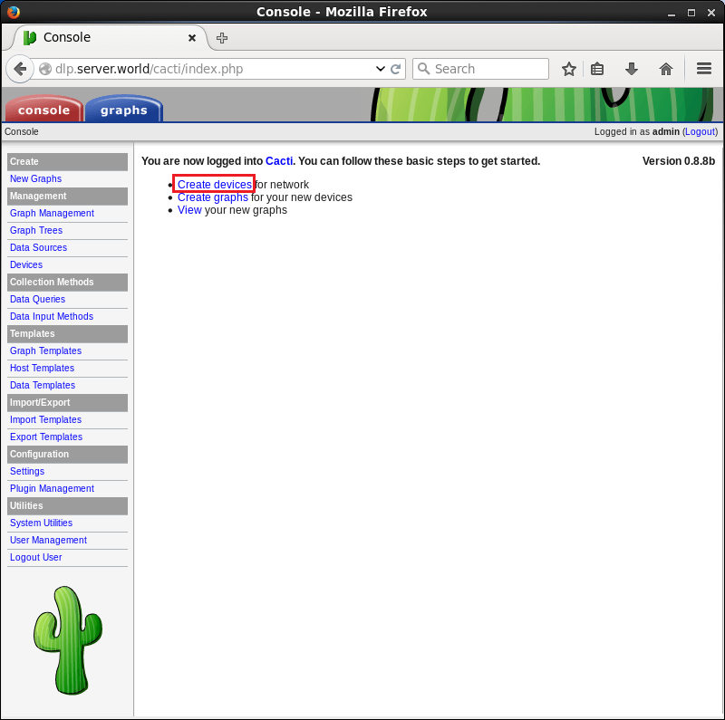

单击“Localhost”：

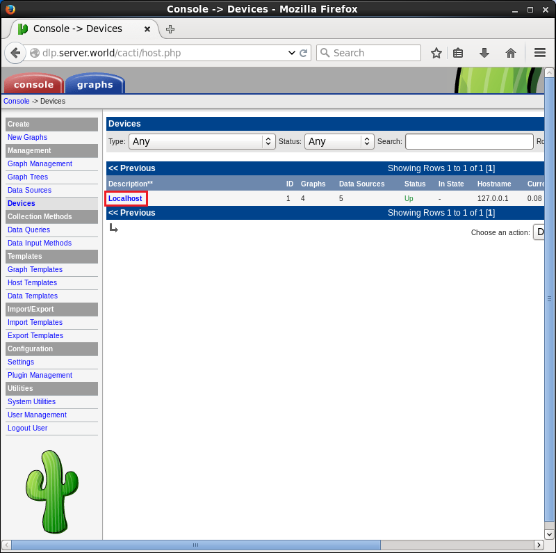

指定SNMP版本“2”，并将团体名更改为在`snmpd.conf`中设置的团体名：

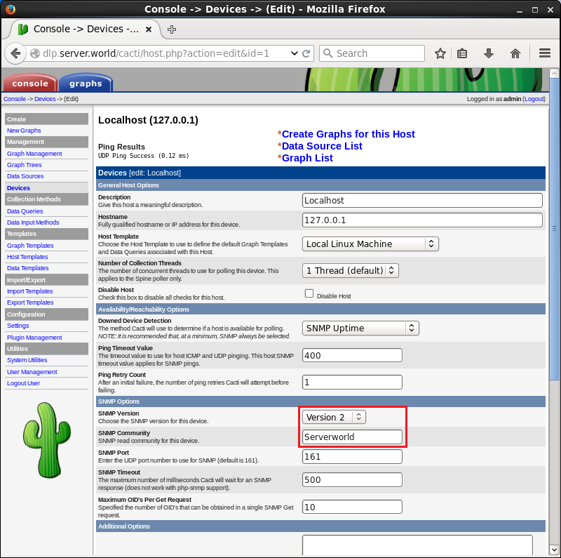

向下滚动并单击“Save”：

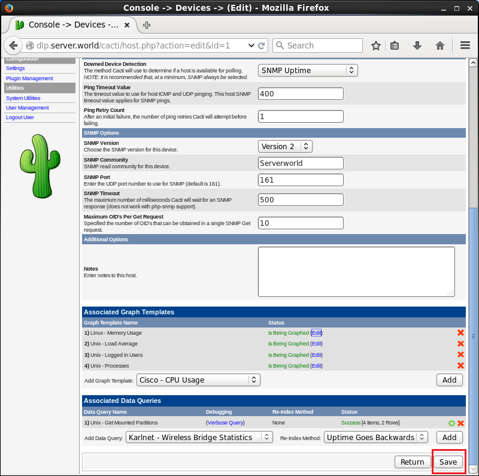

默认情况下会创建负载平均值，内存使用率，登录用户，CPU使用率的图表。对于磁盘使用率，选中要监控的设备上的复选框。全部完成后，单击“OK”：

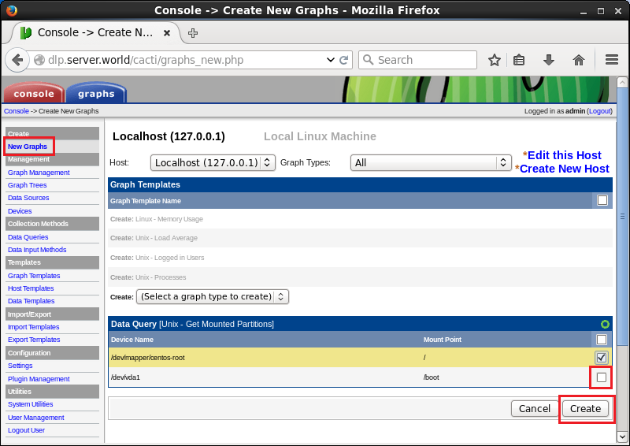

几分钟后，转到“graphs”选项卡，如下所示查看系统状态：

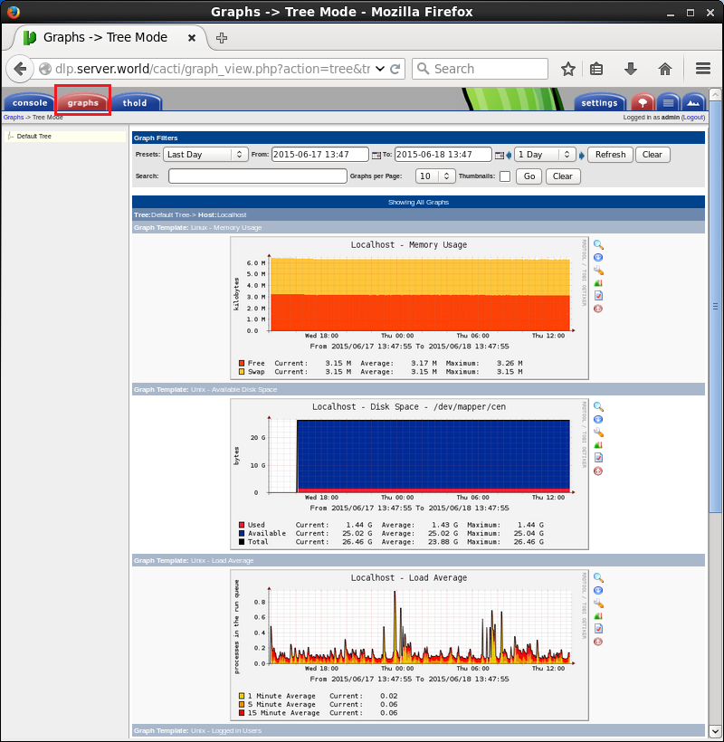

### 12.6.4. 电子邮件通知设置

下载插件前到[官网插件页面](http://docs.cacti.net/plugins)确认为最新版本。

`wget -P /usr/share/cacti/plugins http://docs.cacti.net/_media/plugin:settings-v0.71-1.tgz`

`tar zxvf /usr/share/cacti/plugins/plugin:settings-v0.71-1.tgz -C /usr/share/cacti/plugins`

登录到Cacti管理网站，单击左侧菜单上的“Plugin Management”，然后单击右侧窗格中的“Settings”字段上的图标：


单击光标按钮以启用插件：

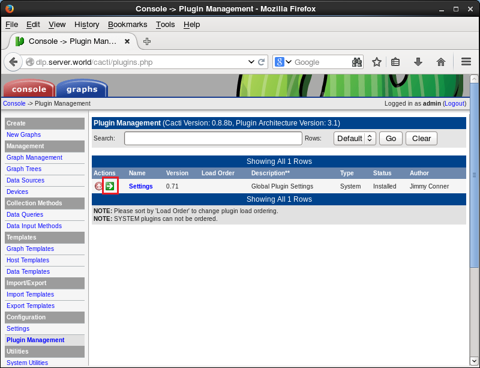

启用后，状态变为“Active”：

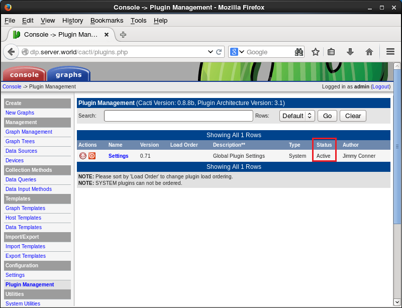

单击左侧菜单上的“Settings”，转到右侧窗格中的“Mail/DNS”选项卡，并输入以下项目，然后单击“Save”：

Test Mail -> 测试邮件的收件人地址

Mail Services -> 用来发送电子邮件的服务

From Email Address -> 发件人邮件地址

From Name -> 发件人名称


成功发送电子邮件后，显示“Success”：

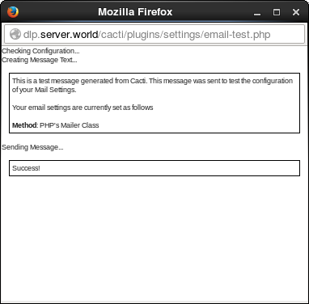

### 12.6.5. 启用阈值插件

启用阈值插件以设置阈值。

下载插件前到[官网插件页面](http://docs.cacti.net/plugins)确认为最新版本。

`wget -P /usr/share/cacti/plugins http://docs.cacti.net/_media/plugin:thold-v0.5.0.tgz`

`tar zxvf /usr/share/cacti/plugins/plugin:thold-v0.5.0.tgz -C /usr/share/cacti/plugins`

登录到Cacti管理网站，单击左侧菜单上的“Plugin Management”，然后单击右侧窗格中的“Thold”字段上的图标：

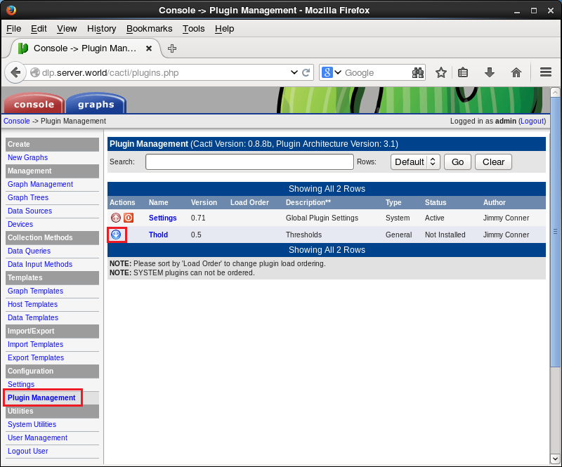

单击光标按钮以启用插件：


启用后，状态变为“Active”：


单击左侧菜单上的“Notification Lists”，然后单击右侧窗格中的“Add”：


在“Name”字段上输入任意名称，在“Description”字段中输入任意描述，在“Email Address”字段中输入目标电子邮件地址，然后单击“Create”按钮：

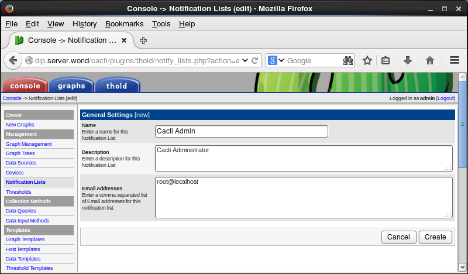

单击左侧菜单上的“Settings”，并转到右侧窗格中的“Thresholds”选项卡：


向下滚动并在“Dead Host Notification Email”字段上输入通知电子邮件地址，然后单击“Save”按钮：

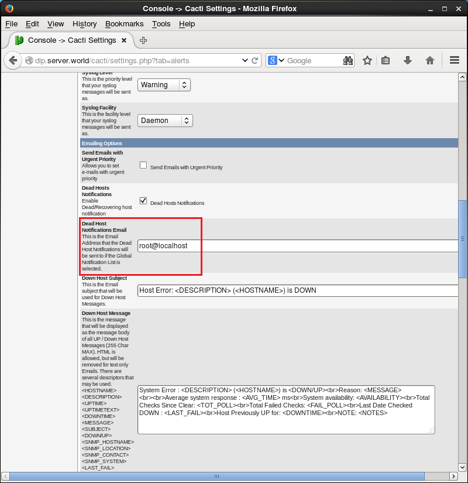

### 12.6.6. 设置阈值

设置阈值前先按照前两节内容设置好**电子邮件通知**和**阈值插件**。

本例演示将阈值设置为“Disk free status无磁盘状态”。

登录到Cacti管理网站，单击左侧菜单上的“Thresholds”，然后单击右侧窗格中的“Add”：

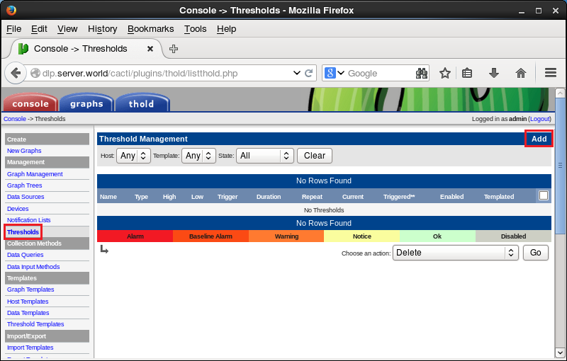

选择“Host”，“Graph”，“Data Source”，最后点击“Create”：


输入Warning警告和Alert警戒情况下的阈值。此外，在“Notification List”字段中选择通知目的地。全部完成后，单击“Save”：

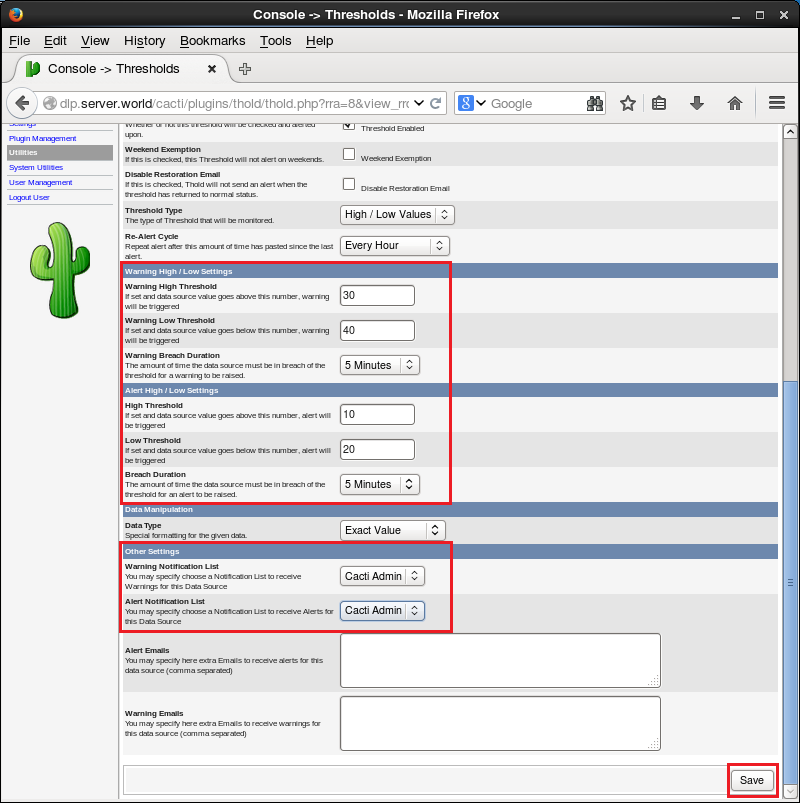

可以为项目设置阈值：

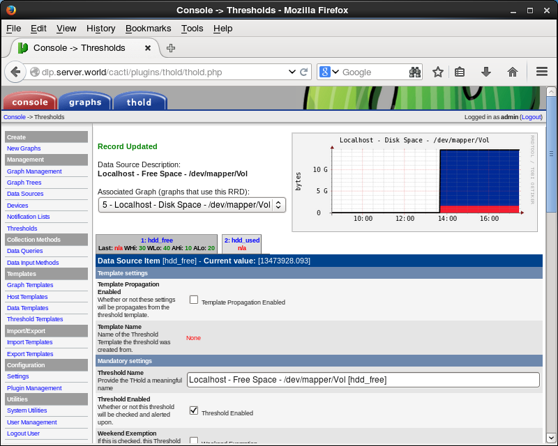

如果系统值超过阈值，则发送通知如下：

```
From cacti@dlp.srv.world  Fri Mar  5 20:30:03 2015
Content-Type: text/plain; charset="UTF-8"

An Alert has been issued that requires your attention.

Host: Localhost (127.0.0.1)
URL: http://dlp.srv.world/cacti//graph.php?local_graph_id=5&rra_id=1
Message: ALERT: Localhost - Free Space - /dev/mapper/Vol [hdd_free] [hdd_free] i
s still above threshold of 10 with
13472524
```

### 12.6.7. 添加监控主机


