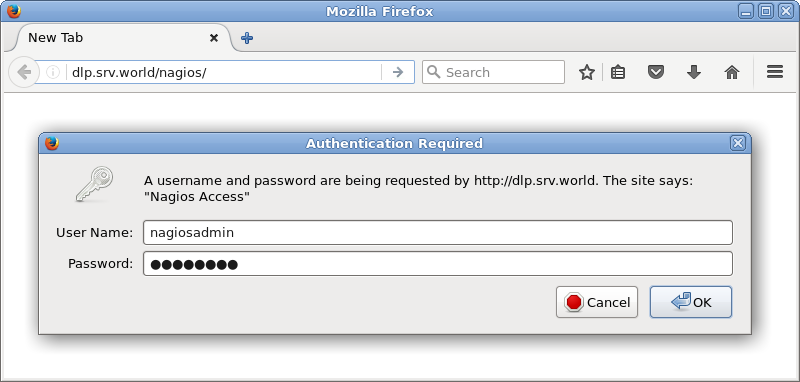
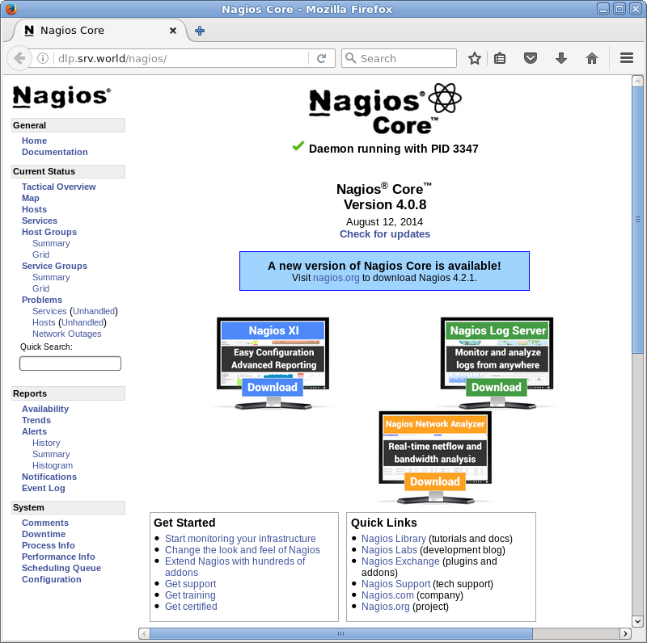
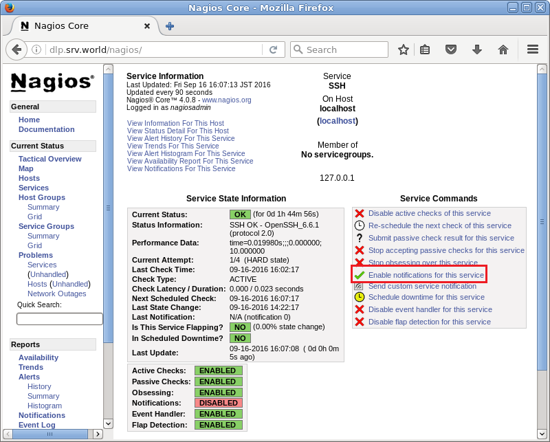
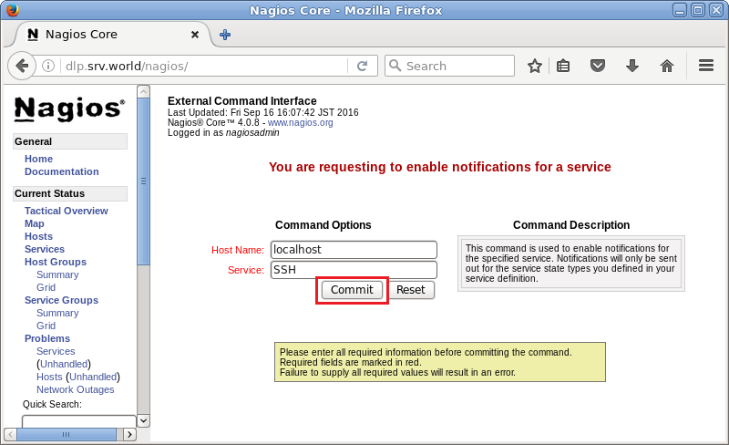

## 12.7. Nagios

[Nagios](http://www.nagios.org/)是一个监控系统运行状态和网络信息的监控系统，能监控所指定的本地或远程主机以及服务，同时提供异常通知功能等。

### 12.7.1. 安装Nagios

先安装[Apache httpd](../5. Web服务器/5.1. Apache httpd.html)和[PHP](../5. Web服务器/5.1. Apache httpd.html#513-使用php脚本)。

`yum --enablerepo=epel -y install nagios nagios-plugins-{ping,disk,users,procs,load,swap,ssh,http}` # 从EPEL安装Nagios和基本插件以监视服务器本身

配置Nagios：

编辑`/etc/httpd/conf.d/nagios.conf`文件：

```
# 更改设置以设置访问权限
#Require all granted
#Require local
Require ip 127.0.0.1 10.0.0.0/24
```

添加Nagios管理用户：

`htpasswd /etc/nagios/passwd nagiosadmin`

```
New password:  # 设置密码
Re-type new password:  # 确认密码
Adding password for user nagiosadmin
```

```
systemctl start nagios
systemctl enable nagios
systemctl restart httpd
```
firewalld防火墙规则：

```
firewall-cmd --add-service={http,https} --permanent
firewall-cmd --reload
```

从Nagios服务器允许的网络中的客户端访问`http://(Nagios服务器的主机名或IP地址)/nagios/`，并使用Nagios管理员用户“nagiosadmin”进行身份验证以登录：



成功验证后，将显示Nagios管理网站：



可以点击“Tactical Overview”查看系统状态等：


### 12.7.2. 电子邮件通知设置

某些项目默认启用，如果需要更改，配置如下：

`yum -y install mailx`

编辑`/etc/nagios/objects/contacts.cfg`文件：

```
# 设置收件人电子邮件地址
email root@localhost
```

`systemctl restart nagios`

可以更改Nagios管理网站上的通知设置。

登录并点击“Services”，显示服务列表。在服务名称旁显示的图标就是禁用通知的图标。（HTTP和SSH如下所示）要在服务上启用通知，先点击服务名称：


点击“Enable notifications for this service”：



点击“Commit”：



可以设置通知：


如果启用通知并且服务存在一些问题，则会将如下通知发送给设置的收件人：

```
Subject: ** PROBLEM Service Alert: localhost/SSH is CRITICAL **
User-Agent: Heirloom mailx 12.4 7/29/08
Content-Type: text/plain; charset=us-ascii
From: nagios@dlp.srv.world

***** Nagios *****

Notification Type: PROBLEM

Service: SSH
Host: localhost
Address: 127.0.0.1
State: CRITICAL

Date/Time: Wed Feb 25 03:29:48 JST 2015

Additional Info:

Connection refused
```

### 12.7.3. 设置阈值

某些项目默认设置，如果需要更改，配置如下：

默认情况下，在配置文件中设置阈值。例如，监控根分区的磁盘使用情况的项目设置如下：

编辑`/etc/nagios/objects/localhost.cfg`文件：

```
# Define a service to check the disk space of the root partition
# on the local machine.  Warning if > 20% free, critical if
# > 10% free space on partition.

# 阀值设置为：>20%可用磁盘为警告，>10%可用磁盘为严重
# 可以自己更改这些值
define service{
        use                       local-service
        host_name                 localhost
        service_description       Root Partition
        check_command             check_local_disk!20%!10%!/
        }
```

`systemctl restart nagios`

若需要添加新插件并为其配置，如下设置（以添加check_ntp_time插件为例）：

`/usr/lib64/nagios/plugins/check_ntp_time -h` # 显示插件的选项

```
...
...
 -w, --warning=THRESHOLD
    Offset to result in warning status (seconds)
 -c, --critical=THRESHOLD
...
...
```

编辑`/etc/nagios/objects/commands.cfg`文件，添加带有阈值选项的插件的命令的定义：

```
# 添加以下内容到最后
define command{
        command_name    check_ntp_time
        command_line    $USER1$/check_ntp_time -H $ARG1$ -w $ARG2$ -c $ARG3$
        }
```

编辑`/etc/nagios/objects/localhost.cfg`文件，添加带有阈值的服务的定义：

```
# 添加以下内容到最后（如果有1秒的时间差为警告，如果有2秒为严重）
define service{
        use                             local-service
        host_name                       localhost
        service_description             NTP_TIME
        check_command                   check_ntp_time!ntp1.jst.mfeed.ad.jp!1!2
        notifications_enabled           1
        }
```

`systemctl restart nagios`

如果系统值超过阈值，则发送通知：

```
Subject: ** PROBLEM Service Alert: localhost/Root Partition is CRITICAL **
User-Agent: Heirloom mailx 12.4 7/29/08
Content-Type: text/plain; charset=us-ascii
From: nagios@dlp.srv.world
Status: R

***** Nagios *****

Notification Type: PROBLEM

Service: Root Partition
Host: localhost
Address: 127.0.0.1
State: CRITICAL

Date/Time: Wed Feb 25 07:49:12 JST 2015

Additional Info:

DISK CRITICAL - free space: / 13232 MB (9% inode=15%):
```

### 12.7.4. 添加监控目标项


### 12.7.5. 添加监控目标主机


