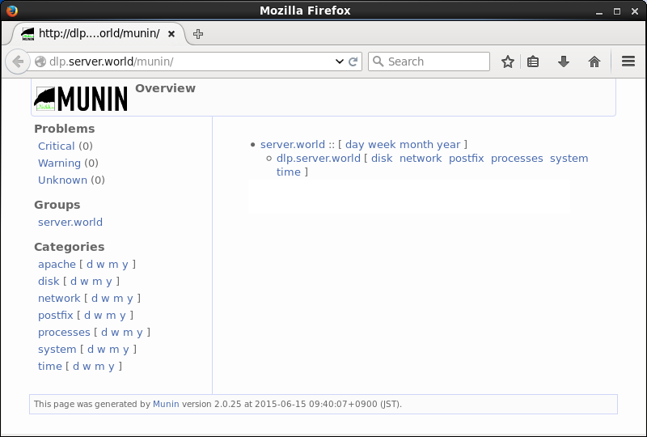

## 12.2. Munin

[Munin](http://munin-monitoring.org/)可监控核心系统资源，包括内存、磁盘、CPU占用、服务器应用如MySQL、Apache和Squid等。

### 12.2.1. 安装Munin

先[安装Apache httpd](../5. Web服务器/5.1. Apache httpd.html)。

安装Munin服务器，并安装Munin代理以监视Munin服务器自身：

`yum --enablerepo=epel -y install munin munin-node` # 从EPEL安装

配置Munin：

编辑`/etc/munin/munin.conf`文件：

```
# 添加访问权限
Order Deny,Allow
Deny from all
Allow from 127.0.0.1 10.0.0.0/24
```

`systemctl restart httpd`

`htpasswd -c /etc/munin/munin-htpasswd cent` # 添加用户：使用`-c`创建一个新文件

```
New password:  # 设置密码
Re-type new password:  # 确认密码
Adding password for user cent
```

将Munin节点配置为监测目标：

编辑`/etc/munin/munin-node.conf`文件：

```
# 更改为自己的主机名
host_name dlp.srv.world
```

```
systemctl start munin-node
systemctl enable munin-node
```

从配置中允许的网络中的客户端访问`http://(Munin服务器的主机名或IP地址)/munin/`，这里需要验证，输入在上面设置的用户名和密码，然后继续：


验证成功后，将显示主页。可以在图表上点击主机名：




