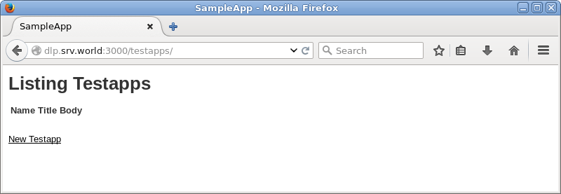
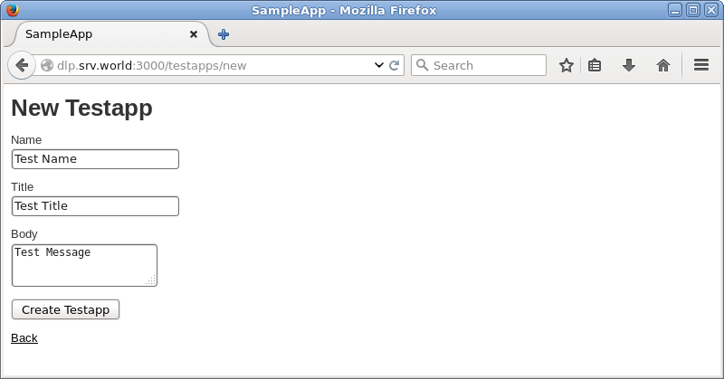
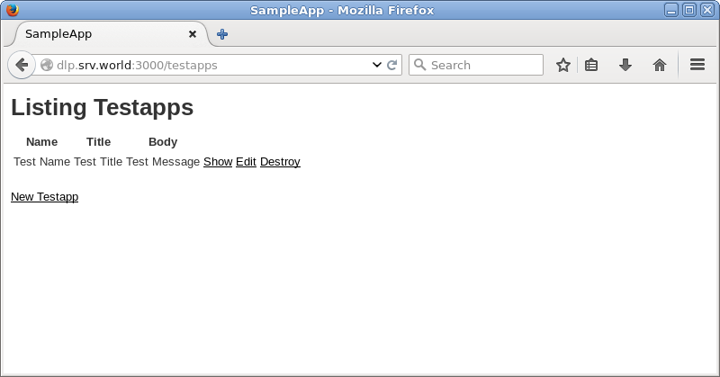
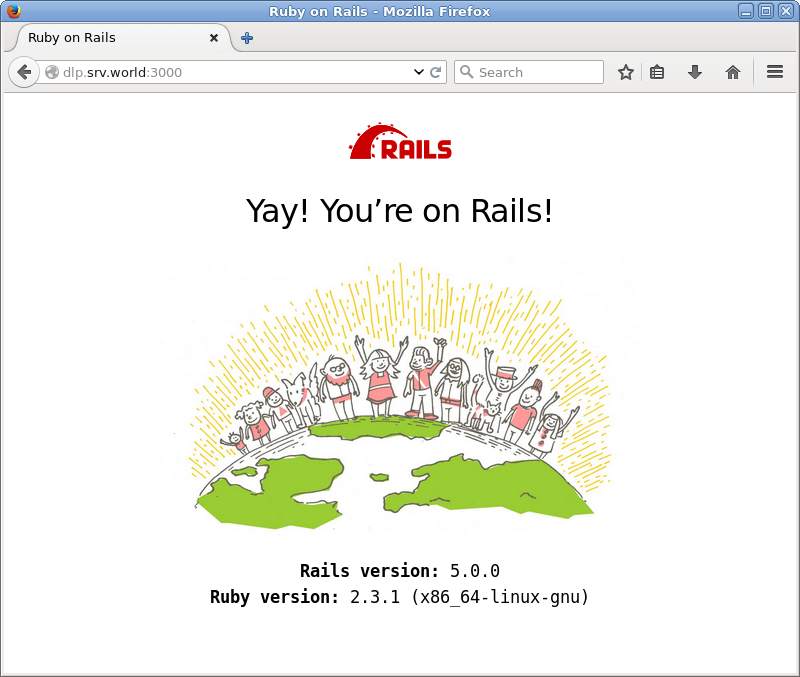
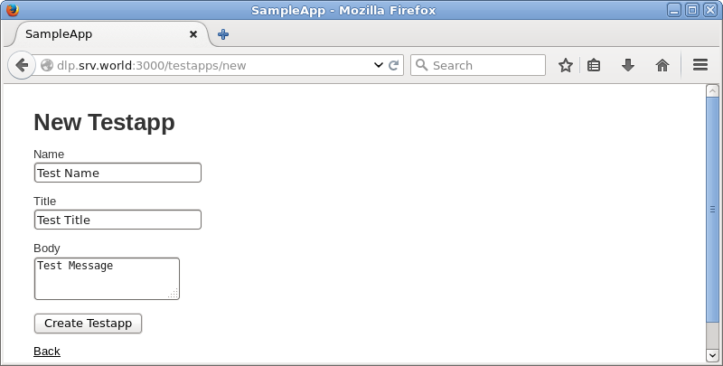
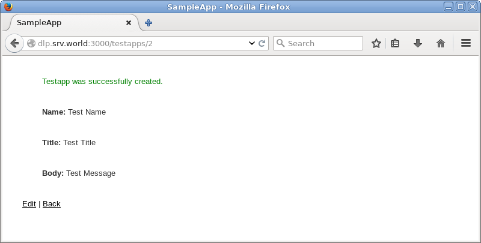
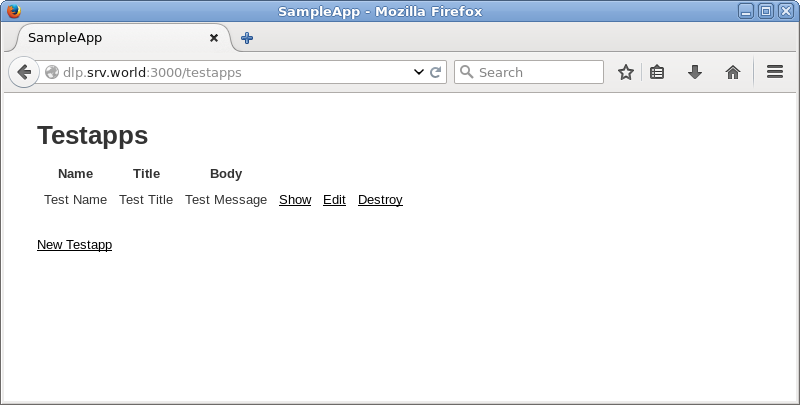

## 13.1. Ruby

[Ruby](http://www.ruby-lang.org/zh_cn/)是一种跨平台、面向对象的动态类型编程语言。Ruby体现了表达的一致性和简单性，它不仅是一门编程语言，更是表达想法的一种简练方式。

### 13.1.1. Ruby 2.2

在CentOS7官方库中的Ruby版本是2.0，如果需要可使用RPM软件包安装2.2。

即使已经安装了2.0，也可以安装，因为2.2位于另一个路径上：

`yum --enablerepo=centos-sclo-rh -y install rh-ruby22` # 从SCLo安装

以上方式安装在`/opt`目录下，要使用它，如下加载环境变量：

`scl enable rh-ruby22 bash`

`ruby -v`

```
ruby 2.2.2p95 (2015-04-13 revision 50295) [x86_64-linux]
```

`which ruby`

```
/opt/rh/rh-ruby22/root/usr/bin/ruby
```

如果想在登录时自动启用Ruby 2.2，编辑`/etc/profile.d/rh-ruby22.sh`文件：

```
#!/bin/bash

source /opt/rh/rh-ruby22/enable
export X_SCLS="`scl enable rh-ruby22 'echo $X_SCLS'`"
export PATH=$PATH:/opt/rh/rh-ruby22/root/usr/local/bin
```

### 13.1.2. Ruby 2.3

`yum --enablerepo=centos-sclo-rh -y install rh-ruby23` # 从SCLo安装

以上方式安装在`/opt`目录下，要使用它，如下加载环境变量：

`scl enable rh-ruby23 bash`

`ruby -v`

```
ruby 2.3.0p0 (2015-12-25 revision 53290) [x86_64-linux]
```

`which ruby`

```
/opt/rh/rh-ruby23/root/usr/bin/ruby
```

如果想在登录时自动启用Ruby 2.3，编辑`/etc/profile.d/rh-ruby23.sh`文件：

```
#!/bin/bash

source /opt/rh/rh-ruby23/enable
export X_SCLS="`scl enable rh-ruby23 'echo $X_SCLS'`"
```

### 13.1.3. Rails 4

先安装Ruby 2.2。

安装其他所需的软件包：

`yum --enablerepo=epel,centos-sclo-rh -y install rh-ruby22-ruby-devel nodejs libuv gcc make libxml2 libxml2-devel mariadb-devel zlib-devel libxslt-devel` # 从EPEL，SCLo安装

安装Rails 4：

`gem install bundler`

`gem install nokogiri -- --use-system-libraries`

`gem install rails --version="~>4.0" --no-ri --no-rdoc`

`rails -v`

```
Rails 4.2.6
```

创建示例应用程序并确保其正常工作：

先[安装MariaDB数据库服务器](../6. 数据库/6.1. MariaDB.html)。

`gem install mysql2 --no-ri --no-rdoc -- --with-mysql-config=/usr/bin/mysql_config`

`rails new SampleApp -d mysql`

`cd SampleApp`

编辑`config/database.yml`文件：

```
default: &default
  adapter: mysql2
  encoding: utf8
  pool: 5
  username: root
  password: password  # MariaDB密码
  socket: /var/lib/mysql/mysql.sock
```

创建测试应用程序：

`rake db:create`

`rails generate scaffold testapp name:string title:string body:text`

`rake db:migrate`

`rails server --binding=0.0.0.0`

```
=> Booting WEBrick
=> Rails 4.2.6 application starting in development on http://0.0.0.0:3000
=> Run `rails server -h` for more startup options
=> Ctrl-C to shutdown server
[2016-07-03 19:07:29] INFO  WEBrick 1.3.1
[2016-07-03 19:07:29] INFO  ruby 2.2.2 (2015-04-13) [x86_64-linux]
[2016-07-03 19:07:29] INFO  WEBrick::HTTPServer#start: pid=3225 port=3000
```

从客户端计算机访问`http://(服务器的主机名或IP地址):3000/`。如果以下网站正常显示，表示正常：


访问`http://(服务器的主机名或IP地址):3000/testapps/`，然后可以使用示例应用程序，如下所示：









### 13.1.4. Rails 5

先安装Ruby 2.3。

安装其他所需的软件包：

`yum --enablerepo=epel,centos-sclo-rh -y install rh-ruby23-ruby-devel nodejs gcc make libxml2 libxml2-devel mariadb-devel zlib-devel libxslt-devel` # 从EPEL，SCLo安装

安装Rails 5：

`gem install bundler`

`gem install nokogiri -- --use-system-libraries`

`gem install rails --no-ri --no-rdoc`

`rails -v`

```
Rails 5.0.0
```

创建示例应用程序并确保其正常工作：

先[安装MariaDB数据库服务器](../6. 数据库/6.1. MariaDB.html)。

`gem install mysql2 --no-ri --no-rdoc -- --with-mysql-config=/usr/bin/mysql_config`

`rails new SampleApp -d mysql`

`cd SampleApp`

编辑`config/database.yml`文件：

```
default: &default
  adapter: mysql2
  encoding: utf8
  pool: 5
  username: root
  password: password  # MariaDB密码
  socket: /var/lib/mysql/mysql.sock
```

创建测试应用程序：

`rails db:create`

```
Created database 'SampleApp_development'
Created database 'SampleApp_test'
```

`rails generate scaffold testapp name:string title:string body:text`

`rails db:migrate`

`rails server --binding=0.0.0.0`

```
=> Booting Puma
=> Rails 5.0.0 application starting in development on http://0.0.0.0:3000
=> Run `rails server -h` for more startup options
Puma starting in single mode...
* Version 3.4.0 (ruby 2.3.0-p0), codename: Owl Bowl Brawl
* Min threads: 5, max threads: 5
* Environment: development
* Listening on tcp://0.0.0.0:3000
Use Ctrl-C to stop
```

从客户端计算机访问`http://(服务器的主机名或IP地址):3000/`。如果以下网站正常显示，表示正常：



访问`http://(服务器的主机名或IP地址):3000/testapps/`，然后可以使用示例应用程序，如下所示：









