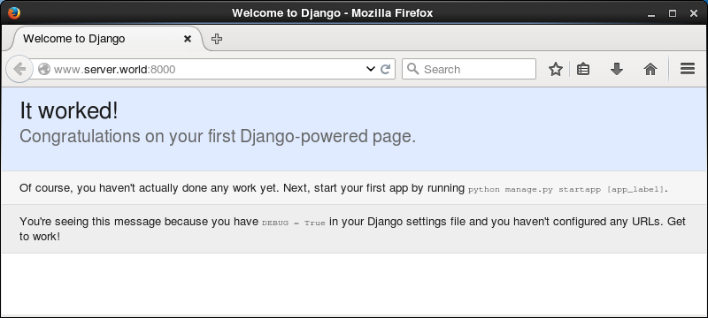
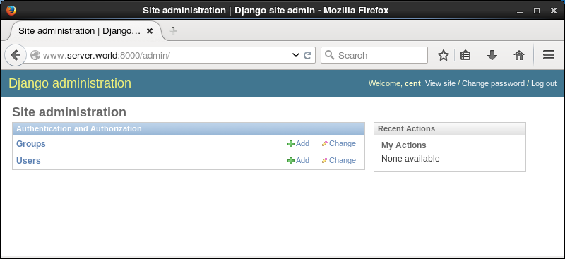

## 13.4. Python

[Python](http://www.python.org/)是一种面向对象的解释性的计算机程序设计语言，也是一种功能强大而完善的通用型语言，已经具有十多年的发展历史，成熟且稳定。

### 13.4.1. 安装Python 3.3

在CentOS7官方库中的Python版本是2.7，如果需要可使用RPM软件包安装3.3。

即使已经安装了2.7，也可以安装，因为3.3位于另一个路径上：

`yum --enablerepo=centos-sclo-rh -y install python33` # 从SCLo安装

以上方式安装在`/opt`目录下，要使用它，如下加载环境变量：

`scl enable python33 bash`

`python -V`

```
Python 3.3.2
```

`which python`

```
/opt/rh/python33/root/usr/bin/python
```

如果想在登录时自动启用Python 3.3，编辑`/etc/profile.d/python33.sh`文件：

```
#!/bin/bash

source /opt/rh/python33/enable
export X_SCLS="`scl enable python33 'echo $X_SCLS'`"
```

### 13.4.2. 安装Python 3.4

在CentOS7官方库中的Python版本是2.7，如果需要可使用RPM软件包安装3.4。

即使已经安装了2.7，也可以安装，因为3.4位于另一个路径上：

`yum --enablerepo=centos-sclo-rh -y install rh-python34` # 从SCLo安装

以上方式安装在`/opt`目录下，要使用它，如下加载环境变量：

`scl enable rh-python34 bash`

`python -V`

```
Python 3.4.2
```

`which python`

```
/opt/rh/rh-python34/root/usr/bin/python
```

如果想在登录时自动启用Python 3.4，编辑`/etc/profile.d/python34.sh`文件：

```
#!/bin/bash

source /opt/rh/rh-python35/enable
export X_SCLS="`scl enable rh-python35 'echo $X_SCLS'`"
```

### 13.4.3. 安装Python 3.5

在CentOS7官方库中的Python版本是2.7，如果需要可使用RPM软件包安装3.5。

即使已经安装了2.7，也可以安装，因为3.5位于另一个路径上：

`yum --enablerepo=centos-sclo-rh -y install rh-python35` # 从SCLo安装

以上方式安装在`/opt`目录下，要使用它，如下加载环境变量：

`scl enable rh-python35 bash`

`python -V`

```
Python 3.5.1
```

`which python`

```
/opt/rh/rh-python35/root/usr/bin/python
```

如果想在登录时自动启用Python 3.5，编辑`/etc/profile.d/python35.sh`文件：

```
#!/bin/bash

source /opt/rh/rh-python35/enable
export X_SCLS="`scl enable rh-python35 'echo $X_SCLS'`"
```

### 13.4.4. 安装Django

[Django](http://www.djangoproject.com/)是Python编程语言驱动的一个开源模型-视图-控制器（MVC）风格的Web应用程序框架。

`yum --enablerepo=epel -y install python-virtualenv` # 从EPEL安装一些软件包

在Virtualenv环境下安装Django（可以使用普通用户）：

`virtualenv venv`

`cd ~/venv`

`source bin/activate`

`pip install django` # 由于pip源速度原因，可以将`pip install`换成`pip install -i http://mirrors.aliyun.com/pypi/simple`

```
Downloading/unpacking django
  Downloading Django-1.8.3.tar.gz (7.3MB): 7.3MB downloaded
  Running setup.py egg_info for package django

    warning: no previously-included files matching '__pycache__' found under directory '*'
    warning: no previously-included files matching '*.py[co]' found under directory '*'
Installing collected packages: django
  Running setup.py install for django

    warning: no previously-included files matching '__pycache__' found under directory '*'
    warning: no previously-included files matching '*.py[co]' found under directory '*'
    changing mode of build/scripts-2.7/django-admin.py from 664 to 775
    changing mode of /home/cent/venv/bin/django-admin.py to 775
    Installing django-admin script to /home/cent/venv/bin
Successfully installed django
Cleaning up...
# 上面的“warning”没有问题
```

`django-admin --version`

```
1.8.3
```

`deactivate`

创建测试项目：

`cd ~/venv`

`source bin/activate`

`django-admin startproject testproject` # 创建“testproject”

`cd testproject`

`python manage.py migrate` # 配置数据库（默认为SQLite）

`python manage.py createsuperuser` # 创建管理用户

```
Username (leave blank to use 'cent'): cent
Email address: cent@www.srv.world
Password:
Password (again):
Superuser created successfully.
```

`python manage.py runserver 0.0.0.0:8000` # 启动服务器

```
Performing system checks...

System check identified no issues (0 silenced).
August 04, 2015 - 08:09:47
Django version 1.8.3, using settings 'testproject.settings'
Starting development server at http://0.0.0.0:8000/
Quit the server with CONTROL-C.
```

从客户端计算机访问`http://(server's hostname or IP address):8000/`。如果显示以下网站，表示正常：



可以在`http://(server's hostname or IP address):8000/admin`上使用管理员用户管理网站：




创建测试应用程序：

`cd ~/venv`

`source bin/activate`

`cd testproject`

`python manage.py startapp testapp`

编辑`testapp/views.py`文件：

```
# 添加以下内容到最后
from django.http import HttpResponse
def main(request):
    html = '<html>\n' \
           '<body>\n' \
           '<div style="width: 100%; font-size: 40px; font-weight: bold; text-align: center;">\n' \
           'Django Test Page\n' \
           '</div>\n' \
           '</body>\n' \
           '</html>\n'
    return HttpResponse(html)
```

`mv testproject/urls.py testproject/urls.py.org`

编辑`testproject/urls.py`文件：

```
from django.conf.urls import patterns, url

urlpatterns = patterns('',
    url(r'^testapp/$', 'testapp.views.main'),
)
```

编辑`testproject/settings.py`文件：

```
# 添加“testapp”
INSTALLED_APPS = (
    'django.contrib.admin',
    'django.contrib.auth',
    'django.contrib.contenttypes',
    'django.contrib.sessions',
    'django.contrib.messages',
    'django.contrib.staticfiles',
    'testapp',
)
```

`python manage.py runserver 0.0.0.0:8000`

从客户端计算机访问`http://(server's hostname or IP address):8000/testapp/`。如果显示以下网站，表示正常：


