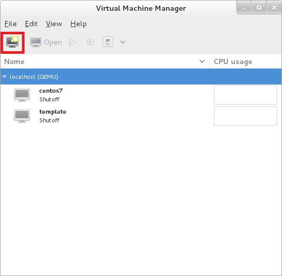
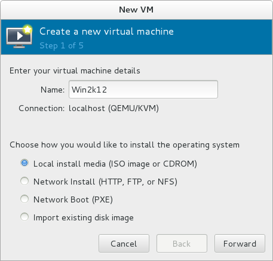
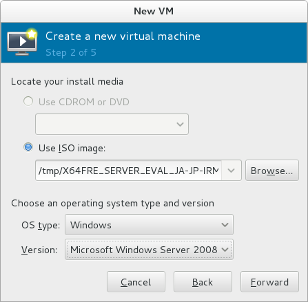
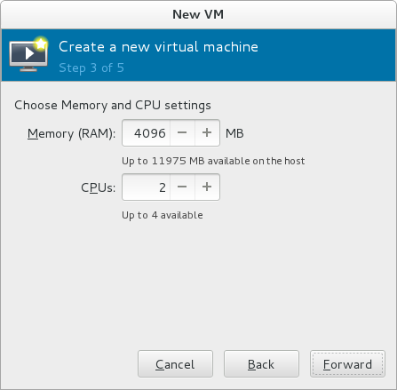
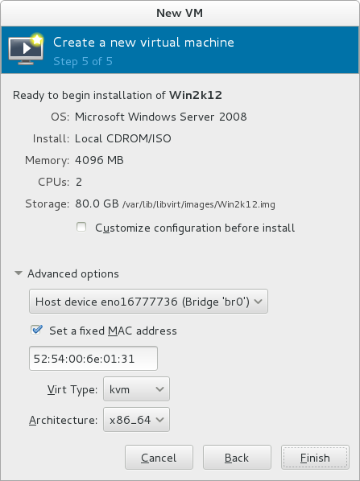
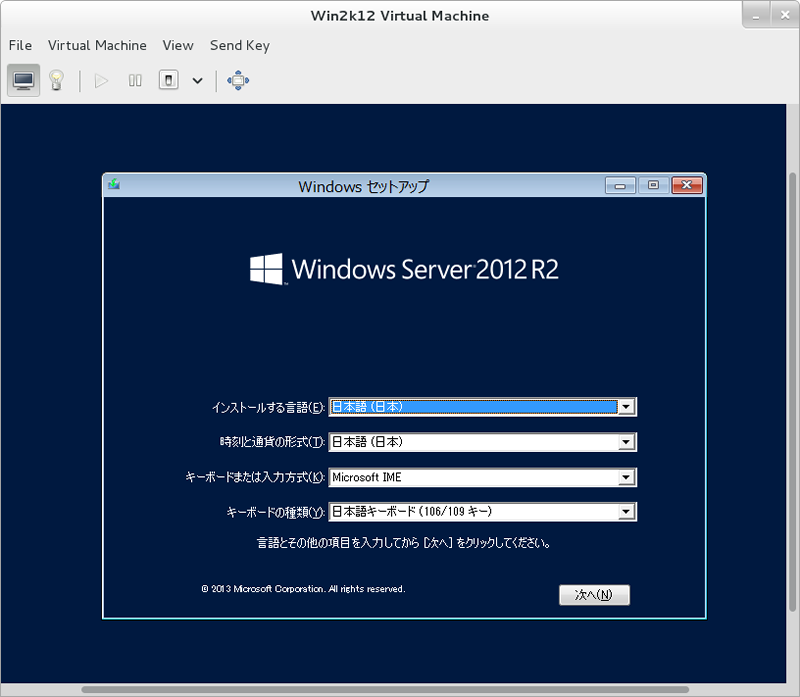

## 2.1. KVM

是使用KVM（Kernel-based Virtual Machine）加QEMU的虚拟化。这要求计算机CPU具有Intel VT或AMD-V功能。

`egrep '^flags.*(vmx|svm)' /proc/cpuinfo` # 运行以验证是否支持（运行后有显示则支持）。

```
flags		: fpu vme de pse tsc msr pae mce cx8 apic sep mtrr pge mca cmov pat pse36 clflush mmx fxsr sse sse2 ht syscall nx mmxext fxsr_opt pdpe1gb rdtscp lm 3dnowext 3dnow constant_tsc rep_good nonstop_tsc extd_apicid pni monitor cx16 popcnt lahf_lm cmp_legacy svm extapic cr8_legacy abm sse4a misalignsse 3dnowprefetch osvw ibs skinit wdt npt lbrv svm_lock nrip_save
```

### 2.1.1. 安装KVM

`yum -y install qemu-kvm libvirt virt-install bridge-utils`

`lsmod | grep kvm` # 确保模块已加载

```
kvm_intel       138567  0
kvm             441119  1 kvm_intel
```

启动并设置开机启动：

```
systemctl start libvirtd
systemctl enable libvirtd
```

**为KVM虚拟机配置桥接网络：**

这里以“eth0”为例，实际操作中替换为你自己环境的接口名称（IP和网关等也是）。

`nmcli c add type bridge autoconnect yes con-name br0 ifname br0` # 添加桥接“br0”

`nmcli c modify br0 ipv4.addresses 10.0.0.30/24 ipv4.method manual` # 给br0设置IP

`nmcli c modify br0 ipv4.gateway 10.0.0.1` # 给br0设置网关

`nmcli c modify br0 ipv4.dns 10.0.0.1` # 给br0设置DNS

`nmcli c delete eth0` # 删除eth0的当前设置（如果是远程操作会断开，最好是本机操作或双网卡）

`nmcli c add type bridge-slave autoconnect yes con-name eth0 ifname eth0 master br0` # 添加eth0接口作为br0的成员

设置完成后重启电脑。

`ip addr` # 查看修改后信息

```
1: lo: <LOOPBACK,UP,LOWER_UP> mtu 65536 qdisc noqueue state UNKNOWN group default
    link/loopback 00:00:00:00:00:00 brd 00:00:00:00:00:00
    inet 127.0.0.1/8 scope host lo
       valid_lft forever preferred_lft forever
    inet6 ::1/128 scope host
       valid_lft forever preferred_lft forever
2: eth0: <BROADCAST,MULTICAST,UP,LOWER_UP> 
    mtu 1500 qdisc pfifo_fast master br0 state UP group default qlen 1000
    link/ether 00:0c:29:9f:9b:d3 brd ff:ff:ff:ff:ff:ff
3: virbr0: <NO-CARRIER,BROADCAST,MULTICAST,UP> mtu 1500 qdisc noqueue state DOWN group default
    link/ether 22:f8:64:25:97:44 brd ff:ff:ff:ff:ff:ff
    inet 192.168.122.1/24 brd 192.168.122.255 scope global virbr0
       valid_lft forever preferred_lft forever
4: br0: <BROADCAST,MULTICAST,UP,LOWER_UP> mtu 1500 qdisc noqueue state UP group default
    link/ether 00:0c:29:9f:9b:d3 brd ff:ff:ff:ff:ff:ff
    inet 10.0.0.30/24 brd 10.0.0.255 scope global br0
       valid_lft forever preferred_lft forever
    inet6 fe80::20c:29ff:fe9f:9bd3/64 scope link
       valid_lft forever preferred_lft forever
```

### 2.1.2. 创建一个虚拟机

以安装CentOS7为例

通过网络以文本模式安装客户机，可以在控制台或Putty等远程连接上使用。此外，虚拟机的映像默认放置在`/var/lib/libvirt/images`作为存储池，但本示例演示创建和使用新的存储池。

```
virt-install \
--name centos7 \
--ram 4096 \
--disk path=/var/kvm/images/centos7.img,size=30 \
--vcpus 2 \
--os-type linux \
--os-variant centos7.0 \
--network bridge=br0 \
--graphics none \
--console pty,target_type=serial \
--location 'http://mirrors.163.com/centos/7/os/x86_64/' \
--extra-args 'console=ttyS0,115200n8 serial'
```

上面选项的意思如下（更多的选项可使用`man virt-install`命令查看）。

`--name` 指定虚拟机的名称

`--ram` 指定虚拟机的内存大小

`--disk path=xxx ,size=xxx` “path=”指定虚拟机磁盘的位置，“size=”指定虚拟机的磁盘空间

`--vcpus` 指定虚拟CPU

`--os-type` 指定客户机的类型

`--os-variant` 指定客户机的种类（可以使用命令`osinfo-query os`查看列表）

`--network` 指定虚拟机的网络类型

`--graphics` 指定图像的种类。如果设置为“none”，则意味着没有图像。

`--console` 指定控制台类型

`--location` 指定安装源位置

`--extra-args` 指定在内核中设置的参数

**创建模板：**

在文本模式下安装，与普通的安装过程相同。安装完成后，首先重新启动，然后登录。

使用快捷键“Ctrl + ]”从客户机转到主机

使用命令`virsh console 虚拟机名称`从主机转到客户机，如：

`virsh console centos7`

因为从网络安装客户机后，它是最小化安装，因此可以将其保存为模板以便以后创建新虚拟机。

`virt-clone --original centos7 --name template --file /var/kvm/images/template.img` # 创建一个模板

```
Allocating 'template.img' | 20 GB 01:44

Clone 'template' created successfully.
```

`ll /var/kvm/images/template.img` # 磁盘映像

```
-rwxr-xr-x 1 root root 32212254720 Jul 11 23:34 /var/kvm/images/template.img
```

`ll /etc/libvirt/qemu/template.xml` # xml文件

```
-rw------- 1 root root 1843 Jul 11 23:32 /etc/libvirt/qemu/template.xml
```

在使用之前，[对客户机设置基本初始配置](../1.%20初始化设置/Introduction.html)。

**定义新的存储池：**

`mkdir /etc/libvirt/storage`

编辑`/etc/libvirt/storage/disk01.xml`文件：

```
  # 新建
<pool type='dir'>
  # 设置一个名称
  <name>disk01</name>
  <capacity>0</capacity>
  <allocation>0</allocation>
  <available>0</available>
  <source>
  </source>
  <target>
    # 指定池目录
    <path>/var/kvm/images</path>
    <permissions>
        <mode>0700</mode>
        <owner>-1</owner>
        <group>-1</group>
    </permissions>
  </target>
</pool>
```

`virsh pool-define /etc/libvirt/storage/disk01.xml` # 定义池

```
Pool disk01 defined from /etc/libvirt/storage/disk01.xml
```

`virsh pool-start disk01` # 启动池

```
Pool disk01 started
```

`virsh pool-autostart disk01` # 设置自动启动

```
Pool disk01 marked as autostarted
```

`virsh pool-list` # 显示池列表

```
Name                 State      Autostart
-----------------------------------------
disk01               active     yes
```

`virsh pool-info disk01` # 显示详细信息

```
Name:           disk01
UUID:           2de62477-7132-4512-b5d8-003e28da105c
State:          running
Persistent:     yes
Autostart:      yes
Capacity:       197.17 GiB
Allocation:     2.90 GiB
Available:      194.27 GiB
```

### 2.1.3. 图形界面管理

如果安装了[桌面环境](https://www.server-world.info/en/note?os=CentOS_7&p=x)，则可以在图形界面上创建虚拟机。此示例显示在图形界面上安装Windows Server 2012 R2。

先安装管理工具：

`yum -y install virt-manager`

启动桌面并运行“Virtual Machine Manager”：


单击“New”按钮（左上角的电脑图标），然后打开向导以创建新的虚拟机：



指定虚拟机和安装源的名称。此示例选择本地媒体：



选择安装介质或ISO映像，并指定操作系统类型和版本。Windows Server 2012没有被列出，可以选择Windows 2008来安装：



指定内存大小和虚拟CPU数量：



指定磁盘大小：


打开“Advanced options”，确保网络等的设置正确：



Windows Server 2012 R2安装开始：



### 2.1.4. 基本操作

virsh命令的基本操作

**启动虚拟机：**

`virsh start centos7` # 启动虚拟机“centos7”

```
Domain centos7 started
```

`virsh start centos7 --console` # 启动并连接到“centos7”的控制台

```
Domain centos7 started
Connected to domain centos7
```

**停止虚拟机：**

`virsh shutdown centos7` # 停止虚拟机“centos7”

```
Domain centos7 is being shutdown
```

`virsh destroy centos7` # 强制停止虚拟机“centos7”

```
Domain centos7 destroyed
```

**虚拟机设置自动启动：**

`virsh autostart centos7` # 启用“centos7”的自动启动

```
Domain centos7 marked as autostarted
```

`virsh autostart --disable centos7` # 禁用“centos7”的自动启动

```
Domain centos7 unmarked as autostarted
```

**列出所有虚拟机：**

`virsh list` # 列出所有活动的虚拟机

```
 Id    Name               State
----------------------------------------
 2     centos7            running
```

`virsh list --all` # 列出所有虚拟机（包括非活动）

```
 Id    Name               State
----------------------------------------
 -     centos7            shut off
 -     template           shut off
 -     Win2k12            shut off
```

**切换控制台：**

使用快捷键“Ctrl + ]”从客户机转到主机

使用命令`virsh console 虚拟机名称`从主机转到客户机，如：

`virsh console centos7`

```
Connected to domain centos7
Escape character is ^]  # 回车

CentOS Linux 7 (Core)
Kernel 3.10.0-123.el7.x86_64 on an x86_64

localhost login:  # 已切换到客户机
Password:  # 输入客户机密码
```

其他选项：

`virsh --help` # 通过此命令查看更多

```
virsh [options]... [<command_string>]
virsh [options]... <command> [args...]

  options:
    -c | --connect=URI      hypervisor connection URI
    -r | --readonly         connect readonly
    -d | --debug=NUM        debug level [0-4]
    -h | --help             this help
    -q | --quiet            quiet mode
    -t | --timing           print timing information
    -l | --log=FILE         output logging to file
    -v                      short version
    -V                      long version
         --version[=TYPE]   version, TYPE is short or long (default short)
    -e | --escape <char>    set escape sequence for console

  commands (non interactive mode):

 Domain Management (help keyword 'domain')
    attach-device                  从一个XML文件附加装置
    attach-disk                    附加磁盘设备
    attach-interface               获得网络界面
    autostart                      自动开始一个域
    blkdeviotune                   Set or query a block device I/O tuning parameters.
    blkiotune                      Get or set blkio parameters
    blockcommit                    Start a block commit operation.
    blockcopy                      Start a block copy operation.
    blockjob                       Manage active block operations
    blockpull                      Populate a disk from its backing image.
    blockresize                    Resize block device of domain.
    change-media                   Change media of CD or floppy drive
    console                        连接到客户会话
    cpu-baseline                   compute baseline CPU
    cpu-compare                    compare host CPU with a CPU described by an XML file
    cpu-stats                      show domain cpu statistics
    create                         从一个 XML 文件创建一个域
    define                         从一个 XML 文件定义（但不开始）一个域
    desc                           show or set domain's description or title
    destroy                        destroy (stop) a domain
    detach-device                  从一个 XML 文件分离设备
    detach-disk                    分离磁盘设备
    detach-interface               分离网络界面
    domdisplay                     domain display connection URI
    domhostname                    print the domain's hostname
    domid                          把一个域名或 UUID 转换为域 id
    domif-setlink                  set link state of a virtual interface
    domiftune                      get/set parameters of a virtual interface
    domjobabort                    abort active domain job
    domjobinfo                     domain job information
    domname                        将域 id 或 UUID 转换为域名
    dompmsuspend                   suspend a domain gracefully using power management functions
    dompmwakeup                    wakeup a domain from pmsuspended state
    domuuid                        把一个域名或 id 转换为域 UUID
    domxml-from-native             Convert native config to domain XML
    domxml-to-native               Convert domain XML to native config
    dump                           把一个域的内核 dump 到一个文件中以方便分析
    dumpxml                        XML 中的域信息
    edit                           编辑某个域的 XML 配置
    inject-nmi                     Inject NMI to the guest
    send-key                       Send keycodes to the guest
    managedsave                    managed save of a domain state
    managedsave-remove             Remove managed save of a domain
    maxvcpus                       connection vcpu maximum
    memtune                        Get or set memory parameters
    migrate                        将域迁移到另一个主机中
    migrate-setmaxdowntime         set maximum tolerable downtime
    migrate-setspeed               Set the maximum migration bandwidth
    migrate-getspeed               Get the maximum migration bandwidth
    numatune                       Get or set numa parameters
    reboot                         重新启动一个域
    reset                          reset a domain
    restore                        从一个存在一个文件中的状态恢复一个域
    resume                         重新恢复一个域
    save                           把一个域的状态保存到一个文件
    save-image-define              redefine the XML for a domain's saved state file
    save-image-dumpxml             saved state domain information in XML
    save-image-edit                edit XML for a domain's saved state file
    schedinfo                      显示/设置日程安排变量
    screenshot                     take a screenshot of a current domain console and store it into a file
    setmaxmem                      改变最大内存限制值
    setmem                         改变内存的分配
    setvcpus                       改变虚拟 CPU 的号
    shutdown                       关闭一个域
    start                          开始一个（以前定义的）非活跃的域
    suspend                        挂起一个域
    ttyconsole                     tty 控制台
    undefine                       undefine a domain
    update-device                  update device from an XML file
    vcpucount                      domain vcpu counts
    vcpuinfo                       detailed domain vcpu information
    vcpupin                        control or query domain vcpu affinity
    emulatorpin                    control or query domain emulator affinity
    vncdisplay                     vnc 显示

 Domain Monitoring (help keyword 'monitor')
    domblkerror                    Show errors on block devices
    domblkinfo                     domain block device size information
    domblklist                     list all domain blocks
    domblkstat                     获得域设备块状态
    domcontrol                     domain control interface state
    domif-getlink                  get link state of a virtual interface
    domiflist                      list all domain virtual interfaces
    domifstat                      获得域网络接口状态
    dominfo                        域信息
    dommemstat                     get memory statistics for a domain
    domstate                       域状态
    list                           列出域

 Host and Hypervisor (help keyword 'host')
    capabilities                   性能
    freecell                       NUMA可用内存
    hostname                       打印管理程序主机名
    node-memory-tune               Get or set node memory parameters
    nodecpustats                   Prints cpu stats of the node.
    nodeinfo                       节点信息
    nodememstats                   Prints memory stats of the node.
    nodesuspend                    suspend the host node for a given time duration
    qemu-attach                    QEMU Attach
    qemu-monitor-command           QEMU Monitor Command
    qemu-agent-command             QEMU Guest Agent Command
    sysinfo                        print the hypervisor sysinfo
    uri                            打印管理程序典型的URI
    version                        显示版本

 Interface (help keyword 'interface')
    iface-begin                    create a snapshot of current interfaces settings, which can be later committed (iface-commit) or restored (iface-rollback)
    iface-bridge                   create a bridge device and attach an existing network device to it
    iface-commit                   commit changes made since iface-begin and free restore point
    iface-define                   define (but don't start) a physical host interface from an XML file
    iface-destroy                  destroy a physical host interface (disable it / "if-down")
    iface-dumpxml                  interface information in XML
    iface-edit                     edit XML configuration for a physical host interface
    iface-list                     list physical host interfaces
    iface-mac                      convert an interface name to interface MAC address
    iface-name                     convert an interface MAC address to interface name
    iface-rollback                 rollback to previous saved configuration created via iface-begin
    iface-start                    start a physical host interface (enable it / "if-up")
    iface-unbridge                 undefine a bridge device after detaching its slave device
    iface-undefine                 undefine a physical host interface (remove it from configuration)

 Network Filter (help keyword 'filter')
    nwfilter-define                define or update a network filter from an XML file
    nwfilter-dumpxml               network filter information in XML
    nwfilter-edit                  edit XML configuration for a network filter
    nwfilter-list                  list network filters
    nwfilter-undefine              undefine a network filter

 Networking (help keyword 'network')
    net-autostart                  自动开始网络
    net-create                     从一个 XML 文件创建一个网络
    net-define                     从一个 XML 文件定义(但不开始)一个网络
    net-destroy                    destroy (stop) a network
    net-dumpxml                    XML 中的网络信息
    net-edit                       为网络编辑 XML 配置
    net-info                       network information
    net-list                       列出网络
    net-name                       把一个网络UUID 转换为网络名
    net-start                      开始一个(以前定义的)不活跃的网络
    net-undefine                   取消定义一个非活跃的网络
    net-update                     update parts of an existing network's configuration
    net-uuid                       把一个网络名转换为网络UUID

 Node Device (help keyword 'nodedev')
    nodedev-create                 create a device defined by an XML file on the node
    nodedev-destroy                destroy (stop) a device on the node
    nodedev-detach                 detach node device from its device driver
    nodedev-dumpxml                XML 中的节点设备详情
    nodedev-list                   这台主机中中的枚举设备
    nodedev-reattach               reattach node device to its device driver
    nodedev-reset                  重置节点设备

 Secret (help keyword 'secret')
    secret-define                  define or modify a secret from an XML file
    secret-dumpxml                 secret attributes in XML
    secret-get-value               Output a secret value
    secret-list                    list secrets
    secret-set-value               set a secret value
    secret-undefine                undefine a secret

 Snapshot (help keyword 'snapshot')
    snapshot-create                Create a snapshot from XML
    snapshot-create-as             Create a snapshot from a set of args
    snapshot-current               Get or set the current snapshot
    snapshot-delete                Delete a domain snapshot
    snapshot-dumpxml               Dump XML for a domain snapshot
    snapshot-edit                  edit XML for a snapshot
    snapshot-info                  snapshot information
    snapshot-list                  List snapshots for a domain
    snapshot-parent                Get the name of the parent of a snapshot
    snapshot-revert                Revert a domain to a snapshot

 Storage Pool (help keyword 'pool')
    find-storage-pool-sources-as   找到潜在存储池源
    find-storage-pool-sources      发现潜在存储池源
    pool-autostart                 自动启动某个池
    pool-build                     建立池
    pool-create-as                 从一组变量中创建一个池
    pool-create                    从一个 XML 文件中创建一个池
    pool-define-as                 在一组变量中定义池
    pool-define                    在一个 XML 文件中定义（但不启动）一个池
    pool-delete                    删除池
    pool-destroy                   destroy (stop) a pool
    pool-dumpxml                   XML 中的池信息
    pool-edit                      为存储池编辑 XML 配置
    pool-info                      存储池信息
    pool-list                      列出池
    pool-name                      将池 UUID 转换为池名称
    pool-refresh                   刷新池
    pool-start                     启动一个（以前定义的）非活跃的池
    pool-undefine                  取消定义一个不活跃的池
    pool-uuid                      把一个池名称转换为池 UUID

 Storage Volume (help keyword 'volume')
    vol-clone                      clone a volume.
    vol-create-as                  从一组变量中创建卷
    vol-create                     从一个 XML 文件创建一个卷
    vol-create-from                create a vol, using another volume as input
    vol-delete                     删除卷
    vol-download                   download volume contents to a file
    vol-dumpxml                    XML 中的卷信息
    vol-info                       存储卷信息
    vol-key                        returns the volume key for a given volume name or path
    vol-list                       列出卷
    vol-name                       returns the volume name for a given volume key or path
    vol-path                       returns the volume path for a given volume name or key
    vol-pool                       returns the storage pool for a given volume key or path
    vol-resize                     resize a vol
    vol-upload                     upload file contents to a volume
    vol-wipe                       wipe a vol

 Virsh itself (help keyword 'virsh')
    cd                             change the current directory
    connect                        连接（重新连接）到 hypervisor
    echo                           echo arguments
    exit                           退出这个非交互式终端
    help                           打印帮助
    pwd                            print the current directory
    quit                           退出这个非交互式终端


  (specify help <group> for details about the commands in the group)

  (使用 --help <command> 来获得这个命令的详细信息)
```

### 2.1.5. 虚拟管理工具

为虚拟管理安装有用的工具。

`yum -y install libguestfs-tools virt-top`

`virt-ls -l -d centos7 /root` # “ls”虚拟机中的目录

```
total 36
dr-xr-x---.  2 root root 4096 Jan  8 22:38 .
drwxr-xr-x. 17 root root 4096 Jan  8 22:36 ..
-rw-------.  1 root root   61 Jan  8 22:38 .bash_history
-rw-r--r--.  1 root root   18 Dec 29  2013 .bash_logout
-rw-r--r--.  1 root root  176 Dec 29  2013 .bash_profile
-rw-r--r--.  1 root root  176 Dec 29  2013 .bashrc
...
```

`virt-cat -d centos7 /etc/passwd` # “cat”虚拟机中的文件

```
root:x:0:0:root:/root:/bin/bash
bin:x:1:1:bin:/bin:/sbin/nologin
daemon:x:2:2:daemon:/sbin:/sbin/nologin
adm:x:3:4:adm:/var/adm:/sbin/nologin
lp:x:4:7:lp:/var/spool/lpd:/sbin/nologin
sync:x:5:0:sync:/sbin:/bin/sync
...
```

`virt-edit -d centos7 /etc/fstab` # 编辑虚拟机中的文件

```
#
# /etc/fstab
# Created by anaconda on Thu Jan  8 13:20:43 2015
#
# Accessible filesystems, by reference, are maintained under '/dev/disk'
# See man pages fstab(5), findfs(8), mount(8) and/or blkid(8) for more info
#
/dev/mapper/centos-root /                       xfs     defaults        1 1
UUID=537b215f-30a1-4e82-b05d-f480aa8e1034 /boot xfs     defaults        1 2
/dev/mapper/centos-swap swap                    swap    defaults        0 0
```

`virt-df -d centos7` # 显示虚拟机中的磁盘使用情况

```
Filesystem                     1K-blocks       Used  Available  Use%
centos7:/dev/sda1                 508588      72348     436240   15%
centos7:/dev/centos/root         8910848     779252    8131596    9%
```

`guestmount -d centos7 -i /media` # 装载虚拟机的磁盘，`ll /media`查看

```
total 32
lrwxrwxrwx.  1 root root    7 Jan  8 22:22 bin -> usr/bin
dr-xr-xr-x.  4 root root 4096 Jan  8 22:37 boot
drwxr-xr-x.  2 root root    6 Jan  8 22:20 dev
drwxr-xr-x. 74 root root 8192 Jan  8 22:36 etc
...
```

`virt-top` # 显示虚拟机的状态

```
virt-top 22:32:14 - x86_64 4/4CPU 2801MHz 11968MB
2 domains, 1 active, 1 running, 0 sleeping, 0 paused, 1 inactive D:0 O:0 X:0
CPU: 0.2%  Mem: 500 MB (500 MB by guests)

   ID S RDRQ WRRQ RXBY TXBY %CPU %MEM    TIME   NAME
    6 R    0    0            0.2  4.0   0:09.14 guestfs-o7nss1p3kxvyl1r5
    -                                           (centos7)
```

### 2.1.6. 实时迁移

需要2个KVM主机服务器和一个存储服务器（先设置好DNS或hosts以正常解析域名或IP地址），如下所示：


配置存储虚拟机映像的存储服务器。存储服务器可以使用[NFS](https://www.server-world.info/en/note?os=CentOS_7&p=nfs&f=1)，[iSCSI](https://www.server-world.info/en/note?os=CentOS_7&p=iscsi&f=1)，[GlusterFS](https://www.server-world.info/en/note?os=CentOS_7&p=glusterfs&f=1)。本示例使用[NFS存储服务器](https://www.server-world.info/en/note?os=CentOS_7&p=nfs&f=1)。

配置两台KVM主机服务器，并将存储服务器提供的目录（本示例为`/var/kvm/images`）挂载到KVM服务器上的相同挂载点上。

在一台KVM主机服务器（本示例10.0.0.21）上创建并启动虚拟机。

在虚拟机运行的服务器上执行实时迁移。完成后，虚拟机将迁移到另一台KVM主机上，如下所示：

`virsh list` # 在10.0.0.21列出运行中的虚拟机（本示例为“centos7”）

```
 Id    Name             State
--------------------------------------
 3     centos7          running
```

`virsh migrate --live centos7 qemu+ssh://10.0.0.22/system` # 执行后提示输入10.0.0.22的root密码

`virsh list` # 再次列出，“centos7”不再显示，已迁移

```
Id    Name             State
--------------------------------------
```

`virsh list` # 在10.0.0.22列出运行中的虚拟机

```
Id    Name              State
---------------------------------------
 1     centos7           running
```

`virsh migrate --live centos7 qemu+ssh://10.0.0.21/system` # 迁移回到10.0.0.21

`virsh list`

```
 Id    Name             State
--------------------------------------
```

### 2.1.7. SPICE服务器

安装桌面虚拟化“SPICE ( Simple Protocol for Independent Computing Environment )”。可以从远程客户端计算机连接到虚拟机。

`yum -y install spice-server spice-protocol` # 通常会作为KVM的依赖已安装

编辑现有虚拟机的xml文件并使用SPICE启动虚拟机，如下所示。如果是没有图形的虚拟机，可以更改为如下设置，但如果您创建了带有图形的虚拟机，删除xml文件中的`<graphics>***`和`<video>***`部分，因为qxl用于图形。

`virsh edit centos7` # 编辑“centos7”的配置

```
<domain type='kvm'>
  <name>centos7</name>
  <uuid>b38a50ca-a1ae-4d37-ba10-caf1e05b43ce</uuid>
  <memory unit='KiB'>4194304</memory>
  <currentMemory unit='KiB'>4194304</currentMemory>
  <vcpu placement='static'>2</vcpu>
  .
  .
  .
      # add follows
      # set any password for "passwd=***" section
      # specify a uniq number for "sound" section "slot='0x06'"
      # the "slot='0x02'" in video section is fixed number for graphics
     <graphics type='spice' port='5900' autoport='no' listen='0.0.0.0' passwd='password'>
      <listen type='address' address='0.0.0.0'/>
    </graphics>
    <sound model='ac97'>
      <address type='pci' domain='0x0000' bus='0x00' slot='0x06' function='0x0'/>
    </sound>
    <video>
      <model type='qxl' ram='65536' vram='32768' heads='1'/>
      <address type='pci' domain='0x0000' bus='0x00' slot='0x02' function='0x0'/>
    </video>
     <memballoon model='virtio'>
      <address type='pci' domain='0x0000' bus='0x00' slot='0x05' function='0x0'/>
    </memballoon>
  </devices>
</domain>
```

`virsh start centos7` # 启动虚拟机

如果想在初始创建虚拟机时启用SPICE，请如下指定。然后，可以使用SPICE安装需要图形界面的系统（如Windows），而不用在KVM主机上安装桌面环境。

```
virt-install \
--name Win2k12R2 \
--ram 6144 \
--disk path=/var/kvm/images/Win2k12R2.img,size=100 \
--vcpus=4 \
--os-type windows \
--os-variant=win2k12r2 \
--network bridge=br0 \
--graphics spice,listen=0.0.0.0,password=password,keymap=en \
--video qxl \
--cdrom /tmp/en_windows_server_2012_r2_vl_with_update_x64_dvd_4065221.iso
```

firewalld防火墙设置（端口5900/TCP）：

```
firewall-cmd --add-port=5900/tcp --permanent
firewall-cmd --reload
```

配置完成。参阅[从SPICE客户端连接到SPICE服务器](#218-spice客户端)。

### 2.1.8. SPICE客户端


### 2.1.9. KVM嵌套

配置KVM嵌套。可以在KVM主机上安装KVM并创建虚拟机作为KVM嵌套。

启用KVM嵌套的设置：

编辑`/etc/modprobe.d/kvm-nested.conf`文件，加入以下内容：

`options kvm_intel nested=1`

`modprobe -r kvm_intel` # 卸载

`modprobe kvm_intel` # 重载

`cat /sys/module/kvm_intel/parameters/nested` # 显示`Y`表示已启用

可以配置KVM嵌套，并且可以在嵌套的虚拟机上创建虚拟机。编辑要嵌套的虚拟机的配置，如下所示：

`virsh edit centos7` # 编辑虚拟机“centos7”

`<cpu mode='host-passthrough'>` # 更改“cpu mode”部分


