## 2.2. oVirt

[oVirt](https://www.ovirt.org/)是基于KVM项目的开源软件，该虚拟机软件支持主流的x86硬件，并允许用户在其上运行Linux及Windows操作系统。提供基于Web的虚拟机管理控制平台，无论是一台主机上的几个虚拟机，还是管理数百台主机上的成千个虚拟机，它皆能胜任。

本例基于以下环境：


### 2.2.1. 配置控制服务器

配置oVirt控制服务器：

`yum -y install http://resources.ovirt.org/pub/yum-repo/ovirt-release35.rpm` # 可以[先查看版本](http://resources.ovirt.org/pub/yum-repo/)，确认需要下载的链接

`yum -y install ovirt-engine`

`touch /etc/exports`

`systemctl start rpcbind nfs-server`

`engine-setup`

```
[ INFO  ] Stage: Initializing
[ INFO  ] Stage: Environment setup
          Configuration files: ['/etc/ovirt-engine-setup.conf.d/10-packaging-jboss.conf', 
          '/etc/ovirt-engine-setup.conf.d/10-packaging.conf']
          Log file: /var/log/ovirt-engine/setup/ovirt-engine-setup-20150710215442-svdtg0.log
          Version: otopi-1.3.2 (otopi-1.3.2-1.el7.centos)
[ INFO  ] Stage: Environment packages setup
[ INFO  ] Stage: Programs detection
[ INFO  ] Stage: Environment setup
[ INFO  ] Stage: Environment customization

          --== PRODUCT OPTIONS ==--

            # 回车
          Configure Engine on this host (Yes, No) [Yes]:
            # 回车
          Configure WebSocket Proxy on this host (Yes, No) [Yes]:

          --== PACKAGES ==--

[ INFO  ] Checking for product updates...
[ INFO  ] No product updates found

          --== ALL IN ONE CONFIGURATION ==--


          --== NETWORK CONFIGURATION ==--

          Setup can automatically configure the firewall on this system.
          Note: automatic configuration of the firewall may overwrite current settings.
            # 回车
          Do you want Setup to configure the firewall? (Yes, No) [Yes]:
          The following firewall managers were detected on this system: firewalld
            # 输入“firewalld”
            Firewall manager to configure (firewalld): firewalld 
          [ INFO  ] firewalld will be configured as firewall manager.
            # 指定此主机的FQDN（通常如下自动指定）
          Host fully qualified DNS name of this server [dlp.srv.world]:

          --== DATABASE CONFIGURATION ==--

            # 选择本地数据库或远程数据库（本处选择本地）
          Where is the Engine database located? (Local, Remote) [Local]:
          Setup can configure the local postgresql server automatically for the engine to run. 
          This may conflict with existing applications.
            # 选择自动或手动设置数据库（本处选择自动）
          Would you like Setup to automatically configure postgresql and create Engine database, 
          or prefer to perform that manually? (Automatic, Manual) [Automatic]:

          --== OVIRT ENGINE CONFIGURATION ==--

            # 设置oVirt管理员密码
          Engine admin password:
          Confirm engine admin password:
            # 选择应用程序模式（选择“Both”）
          Application mode (Virt, Gluster, Both) [Both]:

          --== PKI CONFIGURATION ==--

            # 指定证书的组织名称
          Organization name for certificate [srv.world]:

          --== APACHE CONFIGURATION ==--

          Setup can configure the default page of the web server to present the application home page. 
          This may conflict with existing applications.
            # 选择“Yes”或“No”（本处选择“Yes”）
          Do you wish to set the application as the default page of the web server? (Yes, No) [Yes]:
          Setup can configure apache to use SSL using a certificate issued from the internal CA.
            # 选择自动或手动设置证书
          Do you wish Setup to configure that, or prefer to perform 
                      that manually? (Automatic, Manual) [Automatic]:

          --== SYSTEM CONFIGURATION ==--

            # 选择“Yes”或“No”（本处选择“Yes”）
          Configure an NFS share on this server to be used as an ISO Domain? (Yes, No) [Yes]:
            # 指定本地ISO域的路径（本处保持默认）
          Local ISO domain path [/var/lib/exports/iso]:
            # 指定本地ISO域的ACL（本处保持默认）
          Local ISO domain ACL - note that the default will restrict access to dlp.srv.world only, 
          for security reasons [dlp.srv.world(rw)]:
            # 指定本地ISO域的名称（本处保持默认）
          Local ISO domain name [ISO_DOMAIN]:

          --== MISC CONFIGURATION ==--


          --== END OF CONFIGURATION ==--

          [ INFO  ] Stage: Setup validation
          [WARNING] Less than 16384MB of memory is available

          --== CONFIGURATION PREVIEW ==--

          Application mode                        : both
          Firewall manager                        : firewalld
          Update Firewall                         : True
          Host FQDN                               : dlp.srv.world
          Engine database name                    : engine
          Engine database secured connection      : False
          Engine database host                    : localhost
          Engine database user name               : engine
          Engine database host name validation    : False
          Engine database port                    : 5432
          Engine installation                     : True
          NFS setup                               : True
          PKI organization                        : srv.world
          NFS mount point                         : /var/lib/exports/iso
          NFS export ACL                          : dlp.srv.world(rw)
          Configure local Engine database         : True
          Set application as default page         : True
          Configure Apache SSL                    : True
          Configure WebSocket Proxy               : True
          Engine Host FQDN                        : dlp.srv.world

            # 确认无误后回车
          Please confirm installation settings (OK, Cancel) [OK]:
[ INFO  ] Stage: Transaction setup
[ INFO  ] Stopping engine service
[ INFO  ] Stopping ovirt-fence-kdump-listener service
[ INFO  ] Stopping websocket-proxy service
[ INFO  ] Stage: Misc configuration
[ INFO  ] Stage: Package installation

.....
.....

[ INFO  ] Starting engine service
[ INFO  ] Restarting httpd
[ INFO  ] Stage: Clean up
          Log file is located at /var/log/ovirt-engine/setup/ovirt-engine-setup-20150710215442-svdtg0.log
[ INFO  ] Generating answer file '/var/lib/ovirt-engine/setup/answers/20150710215801-setup.conf'
[ INFO  ] Stage: Pre-termination
[ INFO  ] Stage: Termination
[ INFO  ] Execution of setup completed successfully
```

编辑`/etc/sysconfig/nfs`文件：

```
# 添加到最后
NFS4_SUPPORT="no"
```

`mkdir /var/lib/exports/data`

`chown vdsm:kvm /var/lib/exports/data`

编辑`/etc/exports.d/ovirt-engine-iso-domain.exports`文件：

```
# 添加数据的共享设置（如果需要，更改ACL设置）
/var/lib/exports/iso    10.0.0.0/24(rw)
/var/lib/exports/data   10.0.0.0/24(rw)
```

`systemctl restart rpc-statd nfs-server`

### 2.2.2. 配置节点

在oVirt节点[安装KVM](../2. 虚拟化/2.1. KVM.html)（不需要配置桥接网络）。

在oVirt节点安装一些必需的软件包（对于其他一些必需的设置，桥接网络等，将由oVirt控制服务器自动配置）：

`yum -y install http://resources.ovirt.org/pub/yum-repo/ovirt-release35.rpm`

`yum -y install vdsm`

### 2.2.3. 添加管理的目标节点

在[安装了桌面环境](../3. 桌面环境/3.1. GNOME桌面.html)的客户端上安装Web浏览器和Spice扩展（如果不在oVirt管理门户上连接到虚拟机的控制台，可以不用安装Spice扩展。也可以在Windows计算机上使用Firefox或Chrome操作）：

`yum -y install firefox spice-xpi`

使用Web浏览器访问`http://(oVirt控制服务器的主机名或IP地址)/`，然后点击“Administration Portal”：

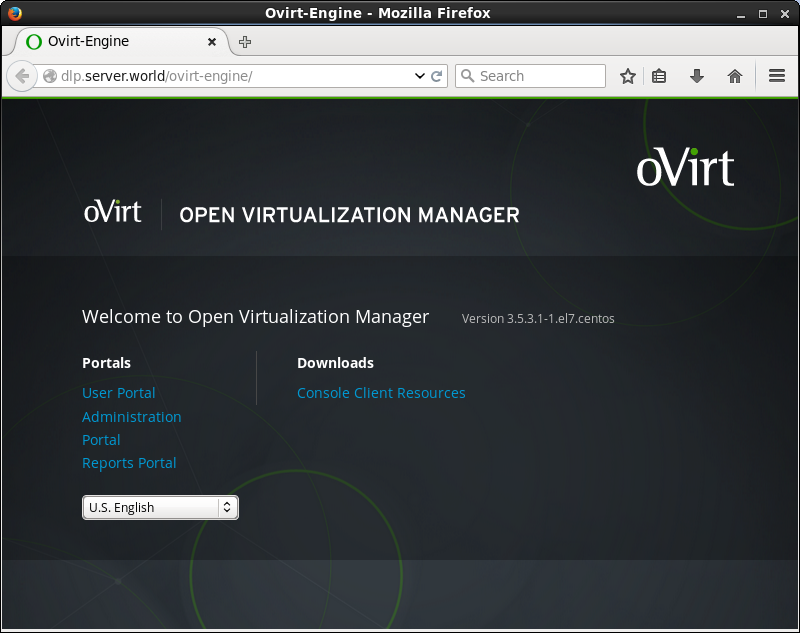

使用在安装oVirt控制服务器期间设置的管理员用户密码登录：

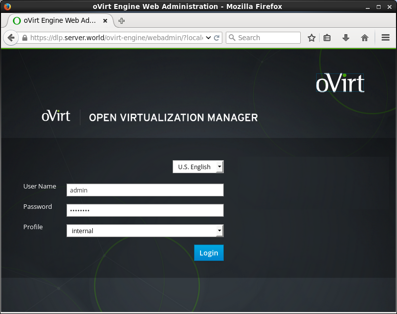

登录成功，下面为oVirt管理门户的主页：

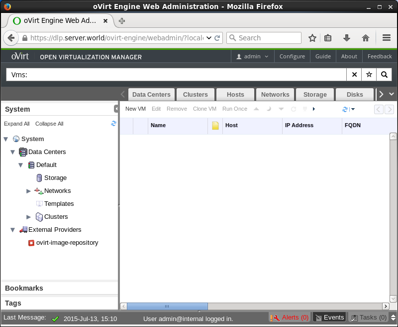

添加目标节点以进行管理。转到“Hosts”标签，然后点击“New”：


输入要添加的节点的信息，然后点击“OK”：


配置“Power Management”。此功能启用由HP或Dell制造的特定硬件。因此，如果您的机器有对应则配置，如果没有则不配置，点击“OK”继续：


添加节点后，它的条目将如下所示显示在“Hosts”标签上（从oVirt控制服务器到节点的自动安装和配置是在后台运行，需要等待几分钟，直到完成）：

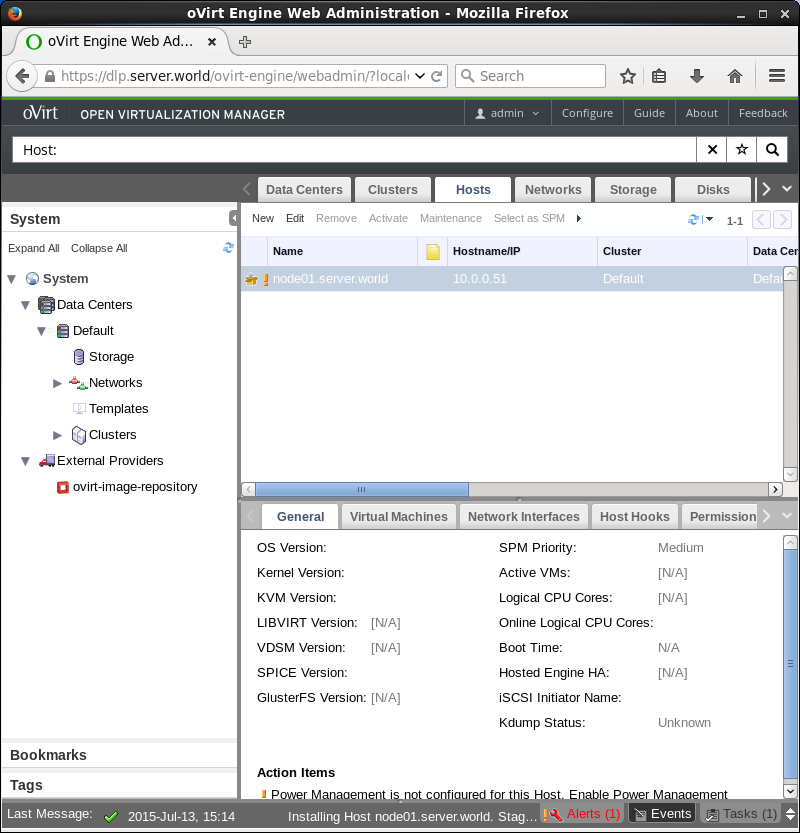

几分钟后，显示系统信息，节点激活如下。可以添加节点：

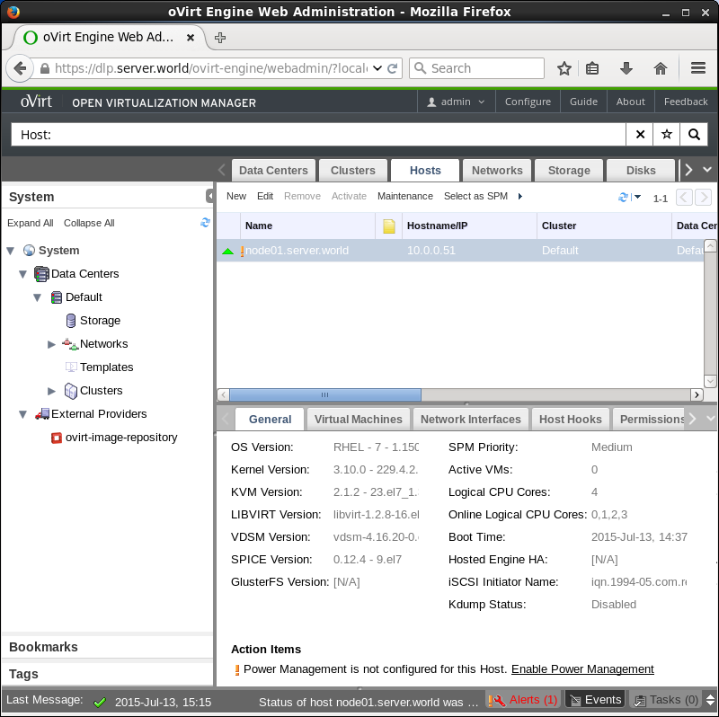

### 2.2.4. 添加存储

登录到oVirt管理门户并转到“Storage”标签，然后点击“New Domain”：

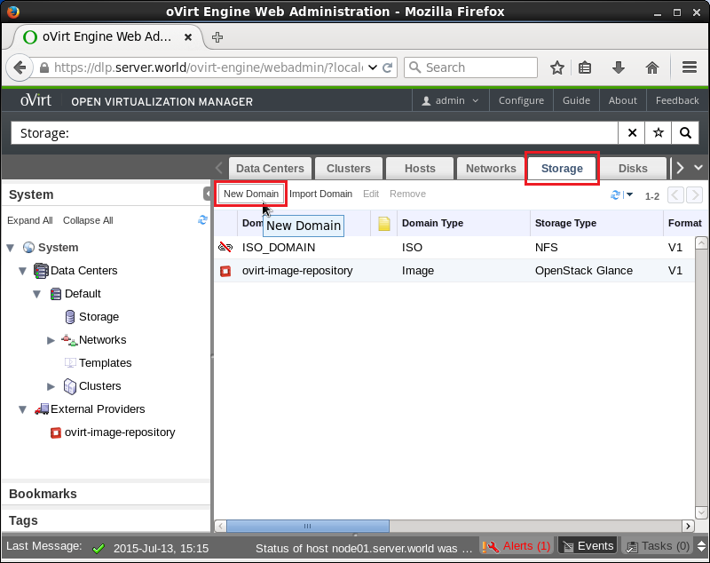

在“Name”字段输入任意名称。在“Export Path”字段输入在oVirt控制服务器设置中添加的存储路径：

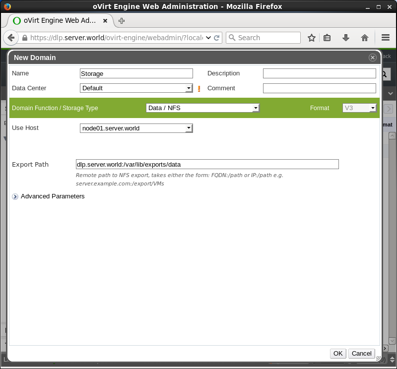

添加后，如下列出：

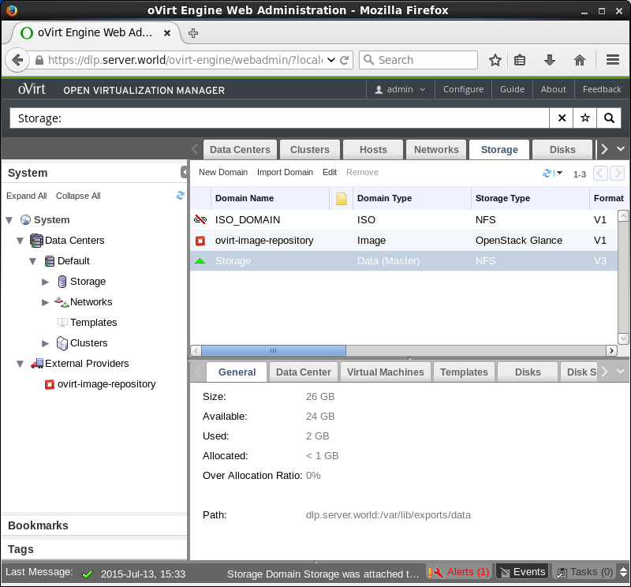

在顶部窗格中选择“ISO_DOMIAN”，并转到“Data Center”标签，然后点击“Attach”按钮，如下所示：


选中“default”复选框，然后点击“OK”：


确认“ISO_DOMAIN”为“Active”，所有完成：

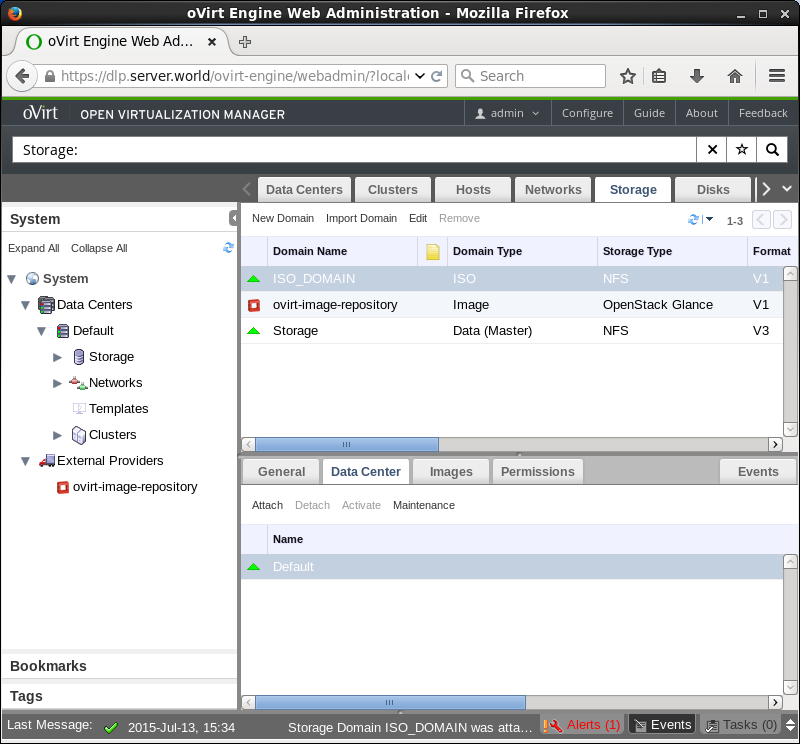

### 2.2.5. 创建虚拟机

在oVirt管理门户上创建虚拟机。

在oVirt控制服务器上下载要为客户机安装的ISO文件。接下来，按如下方式上传：

`engine-iso-uploader -i ISO_DOMAIN upload /tmp/CentOS-7-x86_64-DVD-1503-01.iso` # 命令格式：`engine-iso-uploader -i [ISO Domain] upload [ISO File]`

```
Please provide the REST API password for the admin@internal oVirt Engine user (CTRL+D to abort):  # oVirt管理员密码
Uploading, please wait...
INFO: Start uploading /tmp/CentOS-7-x86_64-DVD-1503-01.iso
INFO: /tmp/CentOS-7-x86_64-DVD-1503-01.iso uploaded successfully
```

访问oVirt管理门户并转到“Virtual Machine”标签，然后点击“New VM”：

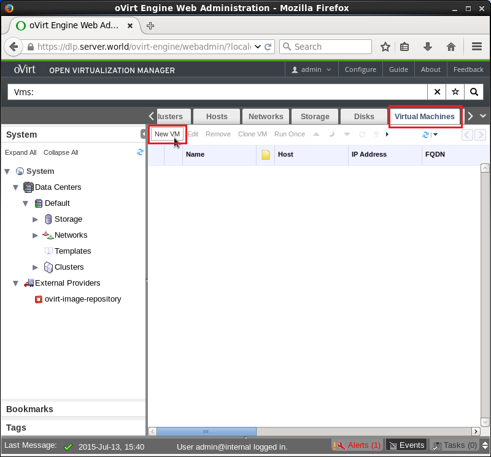

输入要创建的虚拟机的值，然后点击“OK”：


点击“Configure Virtual Disks”：


输入虚拟磁盘的值，然后点击“OK”：


点击“Configure Later”（如果想添加更多虚拟磁盘，点击“Add another Virtual Disk”）：

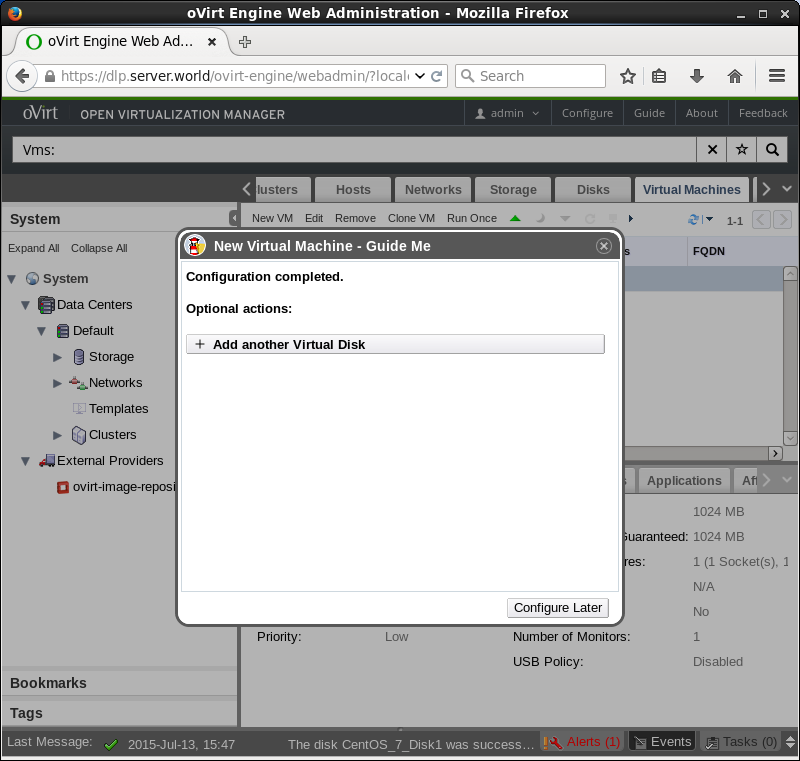

点击“Run Once”以启动虚拟机：

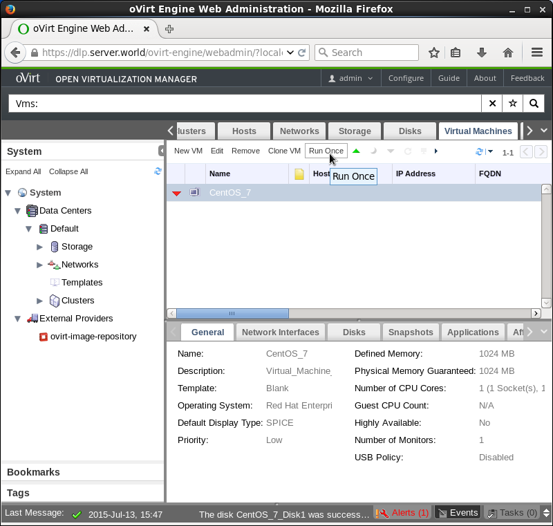

选中“Attach CD”复选框以安装客户机虚拟机进行初始引导，然后单击“OK”：

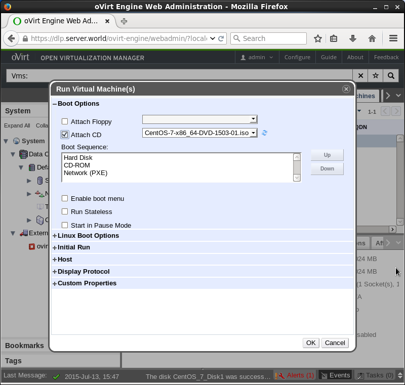

点击“Console”按钮：

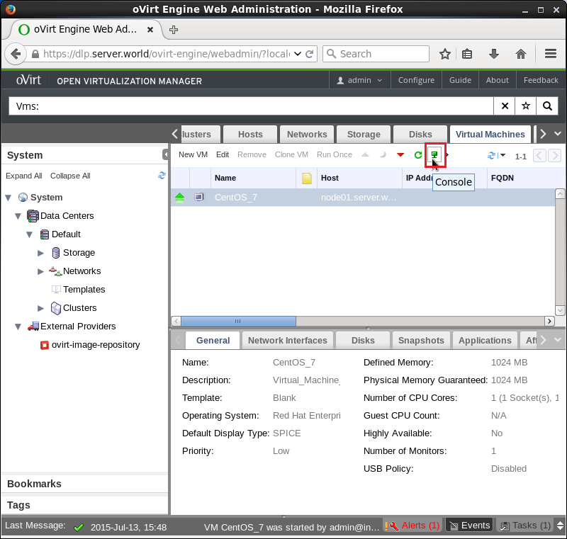

显示虚拟机屏幕，继续安装：

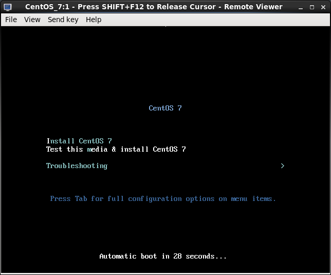

安装完成，虚拟机运行：


