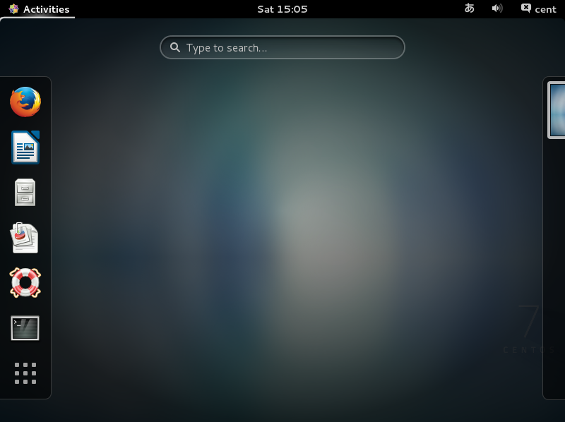
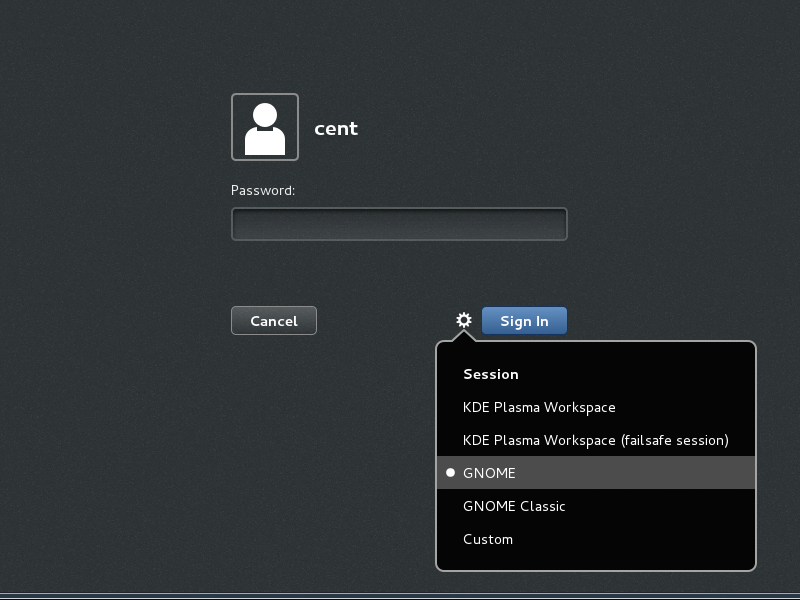
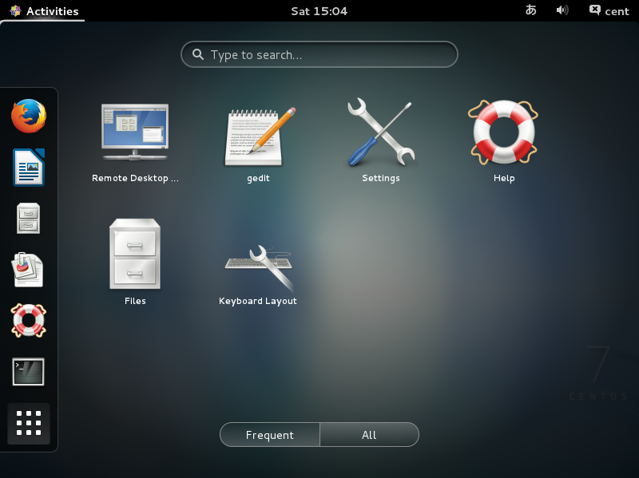

## 3.1. GNOME桌面

`yum -y groups install "GNOME Desktop"` # 安装[GNOME](https://www.gnome.org/)桌面环境

`startx` # 安装后运行

GNOME桌面环境启动。第一次引导，初始设置运行如下。

选择系统语言：


选择键盘类型：


是否需要设置在线帐号：


配置完成后，单击“开始使用CentOS Linux”：


GNOME桌面环境启动后：


CentOS7的GNOME桌面默认以经典模式启动，如果要使用**GNOME Shell**，按以下设置：

`echo "exec gnome-session" >> ~/.xinitrc`

`startx`

GNOME Shell启动：



如果[设置了系统图形登录](../附0. 一些系统配置/附0.6. 更改运行级别.html)，也可以切换到GNOME Shell。单击位于“Sign In”按钮旁边的按钮：


在列表中选择“GNOME”（默认为GNOME Classic）：



登录GNOME Shell：



**一些补充**：

切换默认以命令行还是桌面启动：

查看`/etc/inittab`

```
# inittab is no longer used when using systemd.
#
# ADDING CONFIGURATION HERE WILL HAVE NO EFFECT ON YOUR SYSTEM.
#
# Ctrl-Alt-Delete is handled by /usr/lib/systemd/system/ctrl-alt-del.target
#
# systemd uses 'targets' instead of runlevels. By default, there are two main targets:
#
# multi-user.target: analogous to runlevel 3
# graphical.target: analogous to runlevel 5
#
# To view current default target, run:
# systemctl get-default
#
# To set a default target, run:
# systemctl set-default TARGET.target
#
```

有两种启动方式：

```
# multi-user.target: analogous to runlevel 3  # 命令行模式
# graphical.target: analogous to runlevel 5  # 图形模式
```

运行`systemctl get-default`查看当前默认：

```
multi-user.target
```

运行`systemctl set-default graphical.target`切换至图形模式启动。

重启检查是否生效。

运行`systemctl set-default multi-user.target`切换回命令行模式启动。
