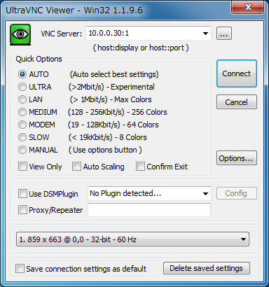

## 3.4. VNC服务器

### 3.4.1. VNC服务器

安装VNC服务器以从远程客户端连接GUI。此示例基于[GNOME桌面环境](../3. 桌面环境/3.1. GNOME桌面.html)。

`yum -y install tigervnc-server` # 安装VNC服务器

`su - cent` # 切换到要配置VNC的用户

`vncpasswd` # 设置VNC密码

```
Password:  # 输入密码
Verify:  # 确认密码
```

`vncserver :1 -geometry 800x600 -depth 24` # 运行时显示编号'1'，屏幕分辨率'800x600'，颜色深度'24'

打开防火墙端口5901/TCP（对应上面的数字“1”）.

### 3.4.2. VNC客户端

在客户机上安装VNC viewer，如[UltraVNC](http://www.uvnc.com/downloads/ultravnc.html)。

安装完成后，运行“UltraVNC Viewer”，输入`IP地址:显示编号`（10.0.0.30:1）：



输入在服务端设置的密码：


连接成功：

