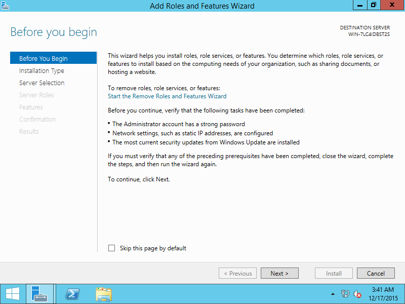
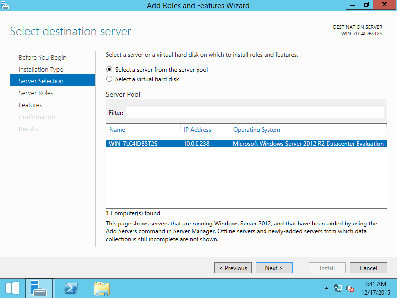
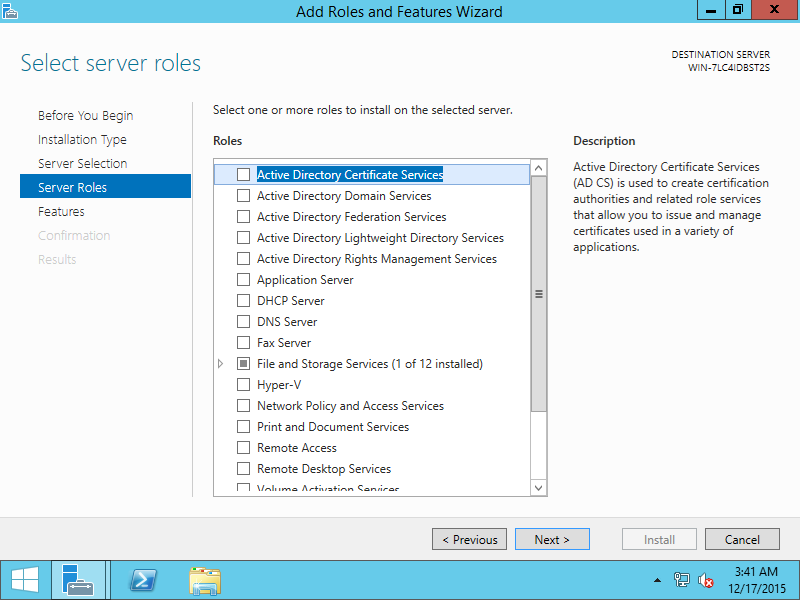
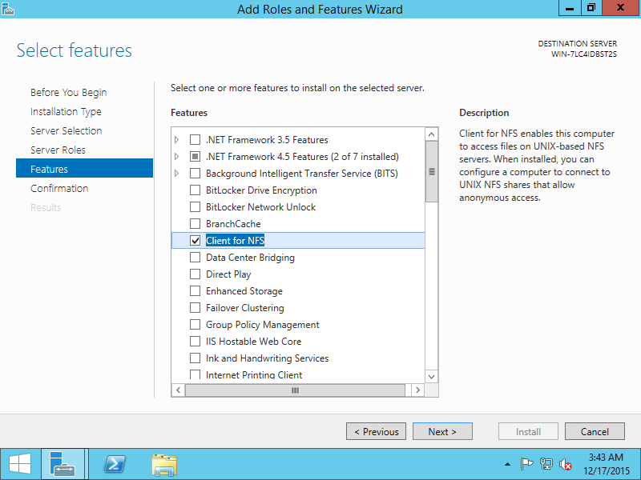
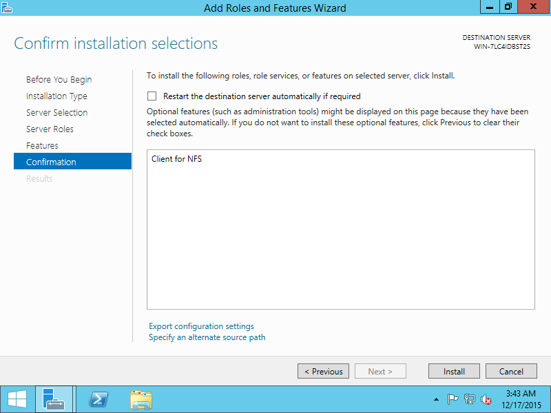
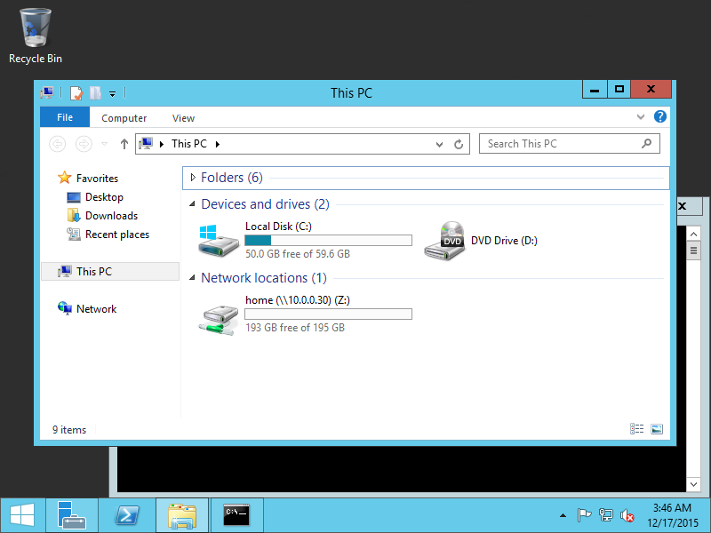
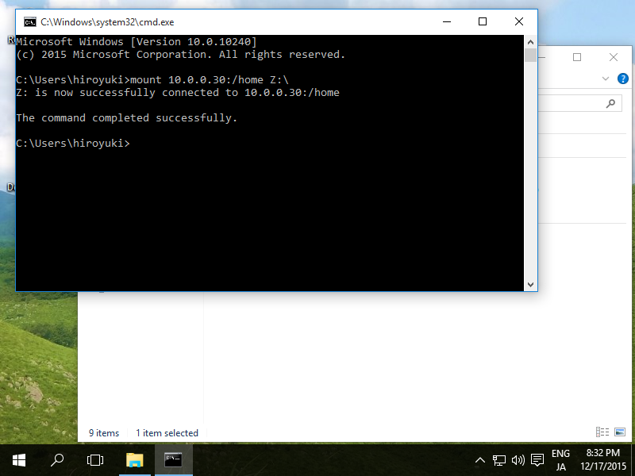
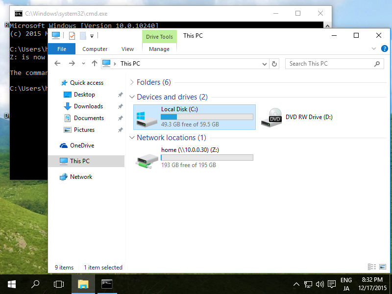

## 4.1. NFS服务器

配置NFS服务器以共享目录到网络。

此示例基于以下环境：


### 4.1.1. 配置NFS服务器

`yum -y install nfs-utils`

编辑`/etc/idmapd.conf`文件，将`Domain =`一行取消注释并修改为自己的域名`Domain = srv.world`。

编辑`/etc/exports`文件，写入NFS输出设置`/home 10.0.0.0/24(rw,no_root_squash)`。

```
systemctl start rpcbind nfs-server
systemctl enable rpcbind nfs-server
```

firewalld防火墙设置：

```
firewall-cmd --add-service=nfs --permanent
firewall-cmd --reload
```

输出设置的基本选项（这里基本只是翻译过来的，具体用法可网上查下资料，有空了可能会再整理下）：

|选项|描述|
|-|-|
|rw|在NFS卷上同时允许读取和写入请求。|
|ro|在NFS卷上只允许读取请求。|
|sync|只有在更改已提交到稳定存储后才会对请求进行回复。（默认）|
|async|此选项允许NFS服务器违反NFS协议并在该请求所做的任何更改已提交到稳定存储器之前对请求进行回复。|
|secure|此选项要求请求源自小于IPPORT_RESERVED（1024）的Internet端口。（默认）|
|insecure|此选项接受所有端口。|
|wdelay|如果其怀疑另一个相关的写请求可能正在进行或可能很快到达，则延迟向磁盘稍微提交写入请求。（默认）|
|no_wdelay|如果同时设置了async，此选项不起作用。如果NFS服务器怀疑另一个相关的写请求可能正在进行或可能很快到达，则NFS服务器通常会将写请求提交到磁盘。这允许多个写请求提交到磁盘，其中一个操作可以提高性能。如果NFS服务器主要收到小的无关的请求，这种行为实际上可能会降低性能，因此no_wdelay可用来关闭它。|
|subtree_check|此选项启用子树检查。（默认）|
|no_subtree_check|此选项禁用子树检查，这稍微有安全影响，但可以提高某些情况下的可靠性。|
|root_squash|将请求从uid/gid 0映射到匿名uid/gid。注意，这不适用于可能同样敏感的任何其他uid或gid，如bin用户或staff组。在登入NFS主机使用分享之目录的使用者如果是root时，那么这个使用者的权限将被压缩成为匿名使用者，通常他的UID与GID都会变成nobody那个系统账号的身份。|
|no_root_squash|关闭root squashing。此选项主要适用于无磁盘客户端。登入NFS主机使用分享目录的使用者，如果是root的话，那么对于这个分享的目录来说，他就具有root的权限！这个项目“极不安全”，不建议使用。|
|all_squash|Map all uids and gids to the anonymous user. Useful for NFS exported public FTP directories, news spool directories, etc.|
|no_all_squash|Turn off all squashing. (Default)|
|anonuid=UID|These options explicitly set the uid and gid of the anonymous account. This option is primarily useful for PC/NFS clients, where you might want all requests appear to be from one user. As an example, consider the export entry for /home/joe in the example section below, which maps all requests to uid 150.|
|anongid=GID|Read above (anonuid=UID)|

### 4.1.2. 配置NFS客户端

#### 4.1.2.1. CentOS客户端

`yum -y install nfs-utils`

编辑`/etc/idmapd.conf`文件，

编辑`/etc/idmapd.conf`文件，将`Domain =`一行取消注释并修改为自己的域名`Domain = srv.world`。

```
systemctl start rpcbind
systemctl enable rpcbind
```

`mount -t nfs dlp.srv.world:/home /home` # 挂载NFS

`df -hT` # 查看

```
Filesystem              Type      Size  Used Avail Use% Mounted on
/dev/mapper/centos-root xfs        46G  1.4G   45G   4% /
devtmpfs                devtmpfs  1.9G     0  1.9G   0% /dev
tmpfs                   tmpfs     1.9G     0  1.9G   0% /dev/shm
tmpfs                   tmpfs     1.9G  8.3M  1.9G   1% /run
tmpfs                   tmpfs     1.9G     0  1.9G   0% /sys/fs/cgroup
/dev/vda1               xfs       497M  219M  278M  45% /boot
dlp.srv.world:/home     nfs4       46G  1.4G   45G   4% /home
```

在fstab上配置NFS挂载以在系统引导时挂载：编辑`/etc/fstab`文件，在下面加入一行`dlp.srv.world:/home /home nfs defaults 0 0`。


配置auto-mounting。例如，设置NFS目录在/mntdir上：

`yum -y install autofs`

编辑`/etc/auto.master`文件，在最后加入一行`/-    /etc/auto.mount`。

编辑`/etc/auto.mount`文件，新建`/mntdir -fstype=nfs,rw  dlp.srv.world:/home`（格式为：[挂载点] [选项] [位置]）。

`mkdir /mntdir` # 创建目录

```
systemctl start autofs
systemctl enable autofs
```

`cd /mntdir` # 到挂载点，以确保其正常挂载

`ll`

```
total 0
drwx------ 2 cent cent 59 Jul  9  2014 cent
```

`cat /proc/mounts | grep mntdir`

```
/etc/auto.mount /mntdir autofs rw,relatime,fd=18,pgrp=2093,timeout=300,minproto=5,maxproto=5,direct 0 0
dlp.srv.world:/home /mntdir nfs4 rw,relatime,vers=4.0,rsize=524288,wsize=524288,namlen=255,hard,proto=tcp,
port=0,timeo=600,retrans=2,sec=sys,clientaddr=10.0.0.31,local_lock=none,addr=10.0.0.30 0 0
```

#### 4.1.2.2. Windows客户端

##### 4.1.2.2.1. Windows Server系统

以Windows Server 2012 R2为例。

打开“Server Manager”（服务器管理器），单击“Add Roles and Fetures”（添加角色和功能）：


单击“Next”（下一步）继续：



选中“Roles-based or Feture-based installation”（基于角色或基于功能的安装），然后单击“Next”（下一步）继续：


选择您要添加角色或功能的服务器：



不选中任何内容，单击“Next”（下一步）：



选中“Client for NFS”（NFS客户端）框继续：



单击“Install”（安装）按钮开始安装：



安装完成后，单击“Close”（关闭）按钮：


现在可以挂载NFS共享，使用管理员权限运行cmd.exe：

`mount [NFS服务器主机名或IP地址]:/[共享名称] [本地驱动器]:\`

如果连接正常，成功消息如下所示：


打开资源管理器，然后挂载NFS共享显示如下：



##### 4.1.2.2.2. Windows桌面系统

以Windows 10为例。

打开“Control Panel”（控制面板）->“Programs and Fetures”（程序和功能）：


单击左侧的“Turn Windows fetures on or off”（启用或关闭Windows功能），并选择“Services for NFS”（NFS服务）的复选框，如下所示，然后单击“OK”（确定）按钮：


现在可以挂载NFS共享，使用管理员权限运行cmd.exe：

`mount [NFS服务器主机名或IP地址]:/[共享名称] [本地驱动器]:\`

如果连接正常，成功消息如下所示：



打开资源管理器，然后挂载NFS共享显示如下：


