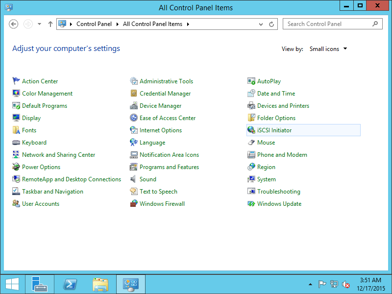
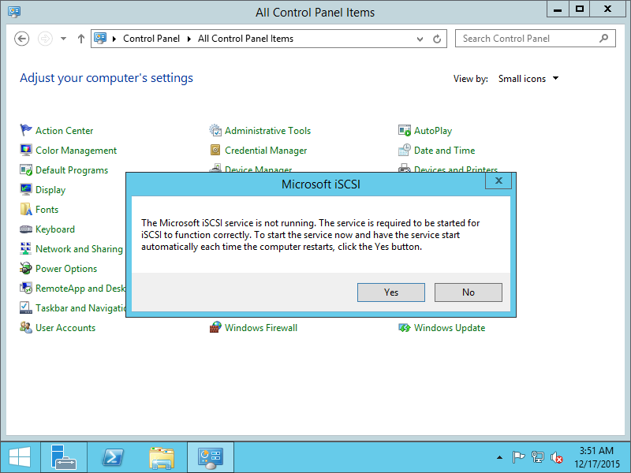
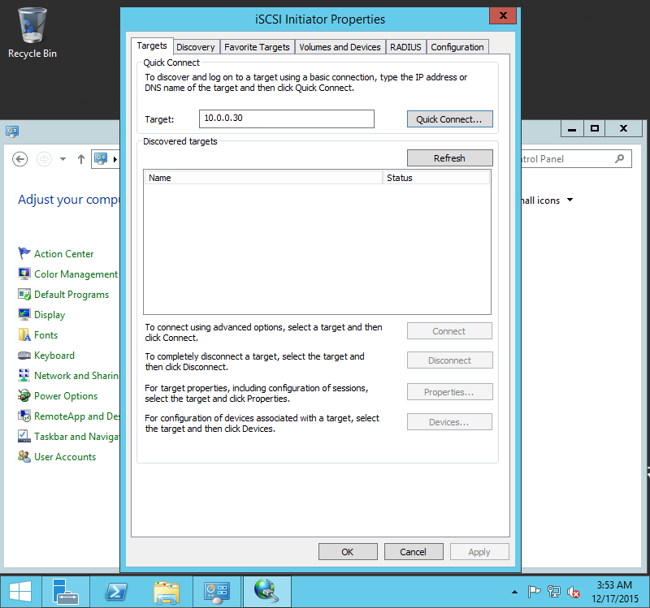
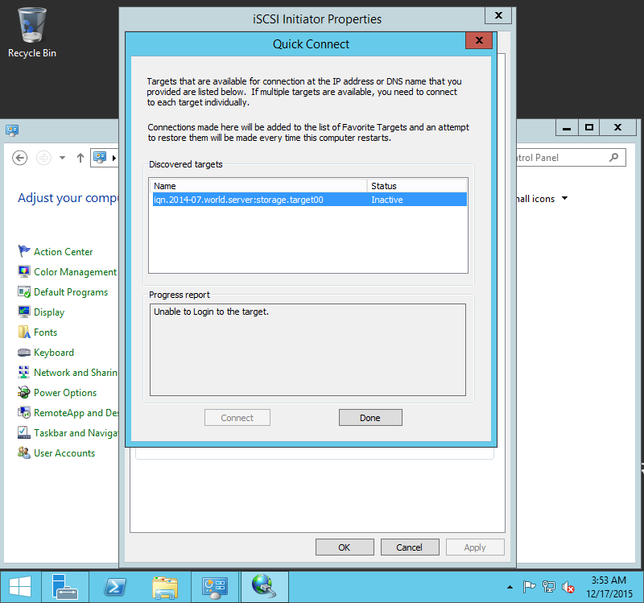
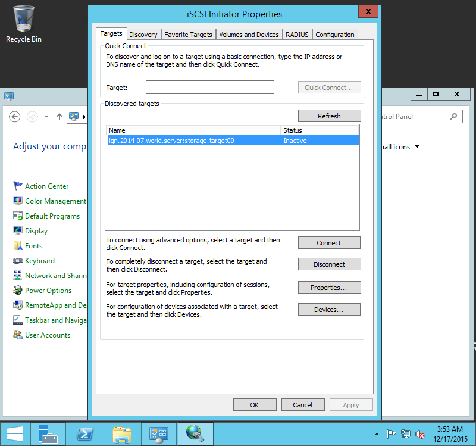
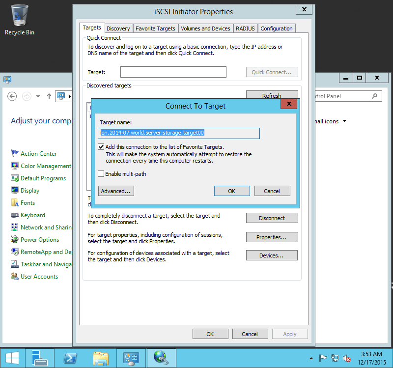
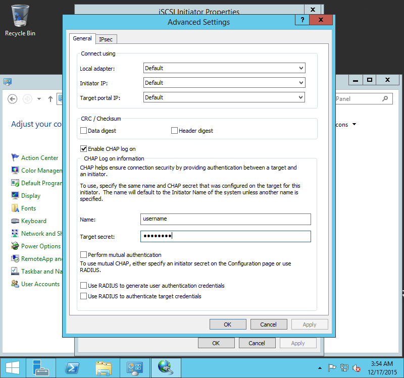
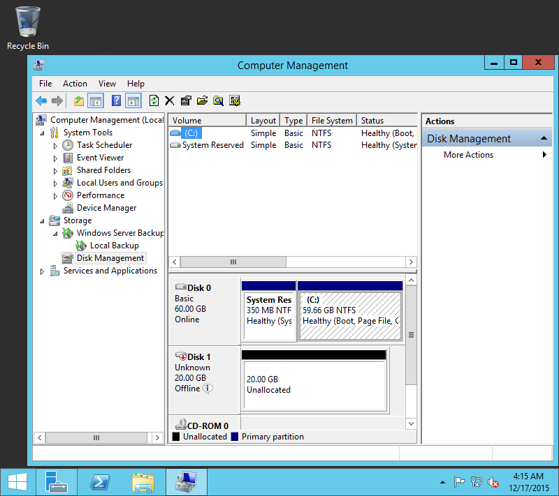

## 4.2. iSCSI

### 4.2.1. 配置iSCSI目标

网络上的存储称为iSCSI目标（iSCSI Target），连接到iSCSI目标的客户端称为iSCSI启动器（iSCSI Initiator）。

本例基于以下环境：


首先安装管理工具：

`yum -y install targetcli`

配置iSCSI目标，例如，在`/iscsi_disks`目录下创建磁盘映像并将其设置为SCSI设备：

`mkdir /iscsi_disks` # 创建目录

`targetcli` # 进入管理控制台

```
targetcli shell version 2.1.fb34
Copyright 2011-2013 by Datera, Inc and others.
For help on commands, type 'help'.

/> cd backstores/fileio

# 在/iscsi_disks/disk01.img上创建名为“disk01”的10G磁盘映像
/backstores/fileio> create disk01 /iscsi_disks/disk01.img 10G
Created fileio disk01 with size 10737418240

/backstores/fileio> cd /iscsi

# 创建目标
/iscsi> create iqn.2014-07.world.srv:storage.target00
Created target iqn.2014-07.world.srv:storage.target00.
Created TPG 1.
Global pref auto_add_default_portal=true
Created default portal listening on all IPs (0.0.0.0), port 3260.

/iscsi> cd iqn.2014-07.world.srv:storage.target00/tpg1/luns

# 设置LUN
/iscsi/iqn.20...t00/tpg1/luns> create /backstores/fileio/disk01
Created LUN 0.

/iscsi/iqn.20...t00/tpg1/luns> cd ../acls

# 设置ACL（它是允许连接的启动器的IQN）
/iscsi/iqn.20...t00/tpg1/acls> create iqn.2014-07.world.srv:www.srv.world
Created Node ACL for iqn.2014-07.world.srv:www.srv.world
Created mapped LUN 0.

/iscsi/iqn.20...t00/tpg1/acls> cd iqn.2014-07.world.srv:www.srv.world

# 设置用于验证的UserID
/iscsi/iqn.20....srv.world> set auth userid=username
Parameter userid is now 'username'.

/iscsi/iqn.20....srv.world> set auth password=password
Parameter password is now 'password'.

/iscsi/iqn.20....srv.world> exit
Global pref auto_save_on_exit=true
Last 10 configs saved in /etc/target/backup.
Configuration saved to /etc/target/saveconfig.json
```

配置完成后，目标进入监听如下：

`ss -napt | grep 3260`

```
LISTEN     0      256          *:3260                     *:*
```

`systemctl enable target`

firewalld防火墙规则：

```
firewall-cmd --add-service=iscsi-target --permanent
firewall-cmd --reload
```

**使用scsi-target-utils配置iSCSI目标**：

`yum --enablerepo=epel -y install scsi-target-utils` # 从EPEL安装

配置iSCSI目标，例如，在`/iscsi_disks`目录下创建磁盘映像并将其设置为共享磁盘：

`mkdir /iscsi_disks`

`dd if=/dev/zero of=/iscsi_disks/disk01.img count=0 bs=1 seek=10G`

编辑`/etc/tgt/targets.conf`文件：

```
# 添加以下内容到最后
# 如果您设置了一些设备，添加<target>-</target>，并按照相同的方式设置
# 命名规则：[ iqn.yaer-month.domain:any name ]
<target iqn.2015-12.world.srv:target00>
    # 提供的设备作为iSCSI目标
    backing-store /iscsi_disks/disk01.img
    # 允许连接的iSCSI启动器IP地址
    initiator-address 10.0.0.31
    # 验证信息（设置任意“用户名”，“密码”）
    incominguser username password
</target>
```

如果启用了SELinux，更改SELinux Context：

`chcon -R -t tgtd_var_lib_t /iscsi_disks`

`semanage fcontext -a -t tgtd_var_lib_t /iscsi_disks`

firewalld防火墙规则：

```
firewall-cmd --add-service=iscsi-target --permanent
firewall-cmd --reload
```

启动tgtd并验证状态：

```
systemctl start tgtd
systemctl enable tgtd
```

`tgtadm --mode target --op show`

```
Target 1: iqn.2015-12.world.srv:target00
    System information:
        Driver: iscsi
        State: ready
    I_T nexus information:
    LUN information:
        LUN: 0
            Type: controller
            SCSI ID: IET     00010000
            SCSI SN: beaf10
            Size: 0 MB, Block size: 1
            Online: Yes
            Removable media: No
            Prevent removal: No
            Readonly: No
            SWP: No
            Thin-provisioning: No
            Backing store type: null
            Backing store path: None
            Backing store flags:
        LUN: 1
            Type: disk
            SCSI ID: IET     00010001
            SCSI SN: beaf11
            Size: 10737 MB, Block size: 512
            Online: Yes
            Removable media: No
            Prevent removal: No
            Readonly: No
            SWP: No
            Thin-provisioning: No
            Backing store type: rdwr
            Backing store path: /iscsi_disks/disk01.img
            Backing store flags:
    Account information:
        username
    ACL information:
        10.0.0.31
```

### 4.2.2. 配置iSCSI启动器

基于上面示例相同环境。

#### 4.2.2.1. CentOS

`yum -y install iscsi-initiator-utils`

编辑`/etc/iscsi/initiatorname.iscsi`文件：

```
# 更改为您在iSCSI目标服务器上设置的相同IQN
InitiatorName=iqn.2014-07.world.srv:www.srv.world
```

编辑`/etc/iscsi/iscsid.conf`文件：

```
# 取消注释
node.session.auth.authmethod = CHAP

# 取消注释并指定在iSCSI目标服务器上设置的用户名和密码
node.session.auth.username = username
node.session.auth.password = password
```

`iscsiadm -m discovery -t sendtargets -p 10.0.0.30` # 发现目标

```
[  635.510656] iscsi: registered transport (tcp)
10.0.0.30:3260,1 iqn.2014-07.world.srv:storage.target00
```

`iscsiadm -m node -o show` # 发现后确认状态

```
# BEGIN RECORD 6.2.0.873-21
node.name = iqn.2014-07.world.srv:storage.target00
node.tpgt = 1
node.startup = automatic
node.leading_login = No
...
...
...
node.conn[0].iscsi.IFMarker = No
node.conn[0].iscsi.OFMarker = No
# END RECORD
```

`iscsiadm -m node --login` # 登录到目标

```
Logging in to [iface: default, target: iqn.2014-07.world.srv:storage.target00, portal: 10.0.0.30,3260] (multiple)
[  708.383308] scsi2 : iSCSI Initiator over TCP/IP
[  709.393277] scsi 2:0:0:0: Direct-Access     LIO-ORG  disk01           4.0  PQ: 0 ANSI: 5
[  709.395709] scsi 2:0:0:0: alua: supports implicit and explicit TPGS
[  709.398155] scsi 2:0:0:0: alua: port group 00 rel port 01
[  709.399762] scsi 2:0:0:0: alua: port group 00 state A non-preferred supports TOlUSNA
[  709.401763] scsi 2:0:0:0: alua: Attached
[  709.402910] scsi 2:0:0:0: Attached scsi generic sg0 type 0
Login to [iface: default, target: iqn.2014-07.world.srv:storage.target00, portal: 10.0.0.30,3260] successful.
```

`iscsiadm -m session -o show` # 确认已建立的会话

```
tcp: [1] 10.0.0.30:3260,1 iqn.2014-07.world.srv:storage.target00 (non-flash)
```

确认分区：

```
major minor  #blocks  name

 252        0   52428800 sda
 252        1     512000 sda1
 252        2   51915776 sda2
 253        0    4079616 dm-0
 253        1   47833088 dm-1
   8        0   20971520 sdb
```

从目标服务器提供的新设备添加为“sdb”

设置iSCSI设备后，在启动器上配置如下来使：

`parted --script /dev/sdb "mklabel msdos"` # 创建标签

`parted --script /dev/sdb "mkpart primary 0% 100%"` # 创建分区

`mkfs.xfs -i size=1024 -s size=4096 /dev/sdb1` # 格式化为XFS

```
meta-data=/dev/sdb1        isize=1024   agcount=16, agsize=327616 blks
         =                 sectsz=4096  attr=2, projid32bit=1
         =                 crc=0
data     =                 bsize=4096   blocks=5241856, imaxpct=25
         =                 sunit=0      swidth=0 blks
naming   =version 2        bsize=4096   ascii-ci=0 ftype=0
log      =internal log     bsize=4096   blocks=2560, version=2
         =                 sectsz=4096  sunit=1 blks, lazy-count=1
realtime =none             extsz=4096   blocks=0, rtextents=0
```

`mount /dev/sdb1 /mnt` # 挂载

```
[ 6894.010661] XFS (sdb1): Mounting Filesystem
[ 6894.031358] XFS (sdb1): Ending clean mount
```

`df -hT`

```
Filesystem              Type      Size  Used Avail Use% Mounted on
/dev/mapper/centos-root xfs        46G 1023M   45G   3% /
devtmpfs                devtmpfs  1.9G     0  1.9G   0% /dev
tmpfs                   tmpfs     1.9G     0  1.9G   0% /dev/shm
tmpfs                   tmpfs     1.9G  8.3M  1.9G   1% /run
tmpfs                   tmpfs     1.9G     0  1.9G   0% /sys/fs/cgroup
/dev/sda1               xfs       497M  120M  378M  25% /boot
/dev/sdb1               xfs        20G   33M   20G   1% /mnt
```

#### 4.2.2.2. Windows

以Windows Server 2012 R2为例（同样适用于Windows 7/8/10）。

打开[Control Panel] - [iSCSI Initiator]：



点击[Yes]继续：



在[Target]部分中输入iSCSI目标服务器的主机名或IP地址，然后单击[Quick Connect]：



检测到iSCSI目标服务器，然后单击[Done]：



单击[Connect]：



单击[Advanced...]：



选中[Enable CHAP log on]并在[Name]和[Target Secret]输入在iSCSI目标配置中设置的用户名和密码，单击[OK]，返回到上一步界面，再单击[OK]继续：



验证成功后，状态将变为[Connected]，如下所示。可以使用iSCSI存储：


打开[Computer Management]，然后附加iSCSI存储：


