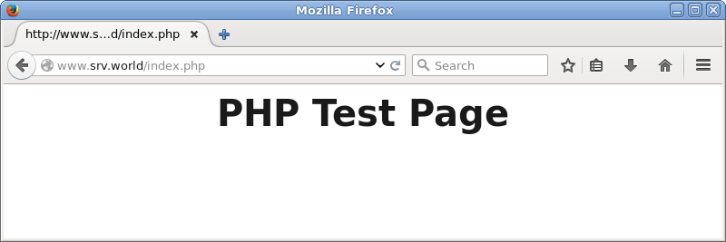
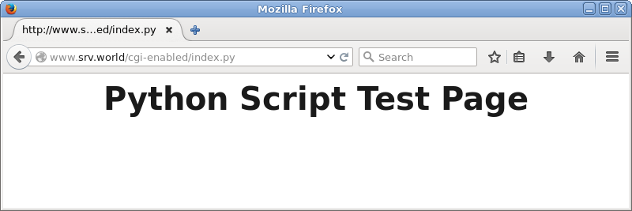

## 5.1. Apache httpd

### 5.1.1. 安装httpd

`yum -y install httpd` # 安装httpd

`rm -f /etc/httpd/conf.d/welcome.conf` # 删除欢迎界面

根据自己的环境配置httpd，编辑`/etc/httpd/conf/httpd.conf`文件：

```
# 改为管理员邮件地址
ServerAdmin root@srv.world

# 更改为你服务器的名称
ServerName www.srv.world:80

# 更改
AllowOverride All

# 添加目录索引
DirectoryIndex index.html index.cgi index.php

# 添加服务器响应头到结尾
ServerTokens Prod

# 打开keepalive
KeepAlive On
```

相关资料（其他配置或更进一步的内容可自己查阅资料）：

ServerTokens的一些可能的赋值：

`ServerTokens Prod` 显示“Server: Apache”

`ServerTokens Major` 显示“Server: Apache/2″

`ServerTokens Minor` 显示“Server: Apache/2.2″

`ServerTokens Min` 显示“Server: Apache/2.2.17″

`ServerTokens OS` 显示“Server: Apache/2.2.17 (Unix)”

`ServerTokens Full` 显示“Server: Apache/2.2.17 (Unix) PHP/5.3.5″

KeepAlive的总结：

在内存非常充足的服务器上，不管是否关闭 KeepAlive 功能，服务器性能不会有明显变化；如果服务器内存较少，或者服务器有非常大量的文件系统访问时，或者主要处理动态网页服务，关闭 KeepAlive 后可以节省很多内存，而节省出来的内存用于文件系统Cache，可以提高文件系统访问的性能，并且系统会更加稳定。 
　　如果服务器内存较少，或者服务器有非常大量的文件系统访问时，或者主要处理动态网页服务，关闭 KeepAlive 后可以节省很多内存，而节省出来的内存用于文件系统Cache，可以提高文件系统访问的性能，并且系统会更加稳定。 

```
systemctl start httpd
systemctl enable httpd
```

firewalld防火墙设置（HTTP默认端口80/TCP）：

```
firewall-cmd --add-service=http --permanent
firewall-cmd --reload
```

编辑`/var/www/html/index.html`，创建一个HTML测试页：

```
<html>
<body>
<div style="width: 100%; font-size: 40px; font-weight: bold; text-align: center;">
Test Page
</div>
</body>
</html>
```

使用Web浏览器从客户端电脑访问，如果显示以下页面，则运行正常：


### 5.1.2. 使用Perl脚本

启用CGI执行并使用Perl脚本。

`yum -y install perl perl-CGI` # 安装Perl

默认情况下，在`/var/www/cgi-bin`目录下允许CGI。目录下可以使用Perl脚本。其下的所有文件都被处理为CGI。

`grep -n "^ *ScriptAlias" /etc/httpd/conf/httpd.conf` # 显示CGI的设置

```
247: ScriptAlias /cgi-bin/ "/var/www/cgi-bin/"
```

如果要在其他目录中允许CGI（例如，在`/var/www/html/cgi-enabled`允许），请如下配置：

编辑`/etc/httpd/conf.d/cgi-enabled.conf`文件：

```
# 创建内容，将.cgi和.pl作为CGI脚本
<Directory "/var/www/html/cgi-enabled">
    Options +ExecCGI
    AddHandler cgi-script .cgi .pl
</Directory>
```

`systemctl restart httpd` # 重启httpd

如果启用了SELinux，并允许CGI在不是默认的目录下，如上面新加的目录，更改规则如下：

```
chcon -R -t httpd_sys_script_exec_t /var/www/html/cgi-enabled
semanage fcontext -a -t httpd_sys_script_exec_t /var/www/html/cgi-enabled
```

编辑`/var/www/html/cgi-enabled/index.cgi`文件，创建一个CGI测试页：

```
#!/usr/bin/perl

print "Content-type: text/html\n\n";
print "<html>\n<body>\n";
print "<div style=\"width: 100%; font-size: 40px; font-weight: bold; text-align: center;\">\n";
print "CGI Test Page";
print "\n</div>\n";
print "</body>\n</html>\n";
```

`chmod 705 /var/www/html/cgi-enabled/index.cgi` # 更改权限

使用Web浏览器从客户端电脑访问，如果显示以下页面，则运行正常：


### 5.1.3. 使用PHP脚本

`yum -y install php php-mbstring php-pear` # 安装PHP

编辑`/etc/php.ini`文件，将`date.timezone =`一行取消注释并设置为自己的时区：`date.timezone = "Asia/Shanghai"`

`systemctl restart httpd`

编辑`/var/www/html/index.php`文件，创建一个PHP测试页面：

```
<html>
<body>
<div style="width: 100%; font-size: 40px; font-weight: bold; text-align: center;">
<?php
   print Date("Y/m/d");
?>
</div>
</body>
</html>
```

使用Web浏览器从客户端电脑访问，如果显示以下页面，则运行正常：



### 5.1.4. 使用Ruby脚本

配置httpd以使用Ruby脚本作为CGI。

`yum -y install ruby` # 安装Ruby

默认情况下，在`/var/www/cgi-bin`目录下允许CGI。目录下可以使用Perl脚本。其下的所有文件都被处理为CGI。

`grep -n "^ *ScriptAlias" /etc/httpd/conf/httpd.conf` # 显示CGI的设置

```
247: ScriptAlias /cgi-bin/ "/var/www/cgi-bin/"
```

如果要在其他目录中允许CGI（例如，在`/var/www/html/cgi-enabled`允许），请如下配置：

编辑`/etc/httpd/conf.d/cgi-enabled.conf`文件：

```
# 创建内容，将.rb作为CGI脚本
<Directory "/var/www/html/cgi-enabled">
    Options +ExecCGI
    AddHandler cgi-script .rb
</Directory>
```

`systemctl restart httpd` # 重启httpd

如果启用了SELinux，并允许CGI在不是默认的目录下，如上面新加的目录，更改规则如下：

```
chcon -R -t httpd_sys_script_exec_t /var/www/html/cgi-enabled
semanage fcontext -a -t httpd_sys_script_exec_t /var/www/html/cgi-enabled
```

编辑`/var/www/html/cgi-enabled/index.rb`文件，创建一个CGI测试页面：

```
#!/usr/bin/ruby

print "Content-type: text/html\n\n"
print "<html>\n<body>\n"
print "<div style=\"width: 100%; font-size: 40px; font-weight: bold; text-align: center;\">\n"
print "Ruby Script Test Page"
print "\n</div>\n"
print "</body>\n</html>\n"
```

`chmod 705 /var/www/html/cgi-enabled/index.rb`

使用Web浏览器从客户端电脑访问，如果显示以下页面，则运行正常：


### 5.1.5. 使用Ruby脚本

启用CGI执行并使用Python脚本。

`yum -y install python` # 安装Python

默认情况下，在`/var/www/cgi-bin`目录下允许CGI。目录下可以使用Perl脚本。其下的所有文件都被处理为CGI。

`grep -n "^ *ScriptAlias" /etc/httpd/conf/httpd.conf` # 显示CGI的设置

```
247: ScriptAlias /cgi-bin/ "/var/www/cgi-bin/"
```

如果要在其他目录中允许CGI（例如，在`/var/www/html/cgi-enabled`允许），请如下配置：

编辑`/etc/httpd/conf.d/cgi-enabled.conf`文件：

```
# 创建内容，将.py作为CGI脚本
<Directory "/var/www/html/cgi-enabled">
    Options +ExecCGI
    AddHandler cgi-script .py
</Directory>
```

`systemctl restart httpd` # 重启httpd

如果启用了SELinux，并允许CGI在不是默认的目录下，如上面新加的目录，更改规则如下：

```
chcon -R -t httpd_sys_script_exec_t /var/www/html/cgi-enabled
semanage fcontext -a -t httpd_sys_script_exec_t /var/www/html/cgi-enabled
```

编辑`/var/www/html/cgi-enabled/index.py`文件，创建一个CGI测试页面：

```
#!/usr/bin/env python

print "Content-type: text/html\n\n"
print "<html>\n<body>"
print "<div style=\"width: 100%; font-size: 40px; font-weight: bold; text-align: center;\">"
print "Python Script Test Page"
print "</div>\n</body>\n</html>"
```

`chmod 705 /var/www/html/cgi-enabled/index.py`

使用Web浏览器从客户端电脑访问，如果显示以下页面，则运行正常：



### 5.1.6. 启用Userdir

启用Userdir，用户可以使用此设置创建网站。

配置httpd，编辑`/etc/httpd/conf.d/userdir.conf`：

```
# 注释掉下面一行
#UserDir disabled

# 取消下面一行注释
UserDir public_html

<Directory "/home/*/public_html">
    # 修改下面两行
    AllowOverride All
    Options None
    Require method GET POST OPTIONS
</Directory>
```

`systemctl restart httpd`

创建一个用户的测试页：

```
mkdir public_html
chmod 711 /home/cent
chmod 755 /home/cent/public_html
```
编辑`./public_html/index.html`文件：

```
<html>
<body>
<div style="width: 100%; font-size: 40px; font-weight: bold; text-align: center;">
UserDir Test Page
</div>
</body>
</html>
```

使用Web浏览器从客户端电脑访问，如果显示以下页面，则运行正常：


### 5.1.7. 虚拟主机

配置虚拟主机以使用多个域名，以下示例在域名为`srv.world`，虚拟域名为`virtual.host`（根目录`/home/cent/public_html`）的环境中设置。

编辑`/etc/httpd/conf.d/vhost.conf`文件：

```
# 原始域名
<VirtualHost *:80>
   DocumentRoot /var/www/html
   ServerName www.srv.world
</VirtualHost>

# 虚拟域名
<VirtualHost *:80>
   DocumentRoot /home/cent/public_html
   ServerName www.virtual.host
   ServerAdmin webmaster@virtual.host
   ErrorLog logs/virtual.host-error_log
   CustomLog logs/virtual.host-access_log combined
</VirtualHost>
```

`systemctl restart httpd`

编辑`~/public_html/virtual.php`文件，创建测试页：

```
<html>
<body>
<div style="width: 100%; font-size: 40px; font-weight: bold; text-align: center;">
Virtual Host Test Page
</div>
</body>
</html>
```

使用Web浏览器从客户端电脑访问，如果显示以下页面，则运行正常：


### 5.1.8. 配置SSL


