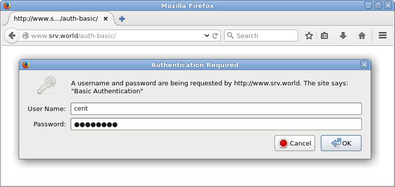

## 5.2. Nginx

### 5.2.1. 安装Nginx

`yum --enablerepo=epel -y install nginx` # 从EPEL安装

配置基本设置，编辑`/etc/nginx/nginx.conf`文件：

```
# 更改主机名
server_name www.srv.world;
```

```
systemctl start nginx
systemctl enable nginx
```

firewalld防火墙设置（HTTP默认端口80/TCP）：

```
firewall-cmd --add-service=http --permanent
firewall-cmd --reload
```

使用Web浏览器从客户端电脑访问Nginx的默认页面，如果显示以下页面，则运行正常：


### 5.2.2. 虚拟主机

本例配置其他域名为“virtual.host”：

编辑`/etc/nginx/conf.d/virtual.host.conf`文件：

```
server {
    listen       80;
    server_name  www.virtual.host;

    location / {
        root   /usr/share/nginx/virtual.host;
        index  index.html index.htm;
    }
}
```

编辑`/usr/share/nginx/virtual.host/index.html`文件，创建测试页以确保其正常工作：

```
<html>
<body>
<div style="width: 100%; font-size: 40px; font-weight: bold; text-align: center;">
Nginx Virtual Host Test Page
</div>
</body>
</html>
```


### 5.2.3. 启用Userdir

启用普通用户的Userdir在主目录中打开其网站。

编辑`/etc/nginx/nginx.conf`文件：

```
# 在“server”部分添加以下内容
        location ~ ^/~(.+?)(/.*)?$ {
            alias /home/$1/public_html$2;
            index  index.html index.htm;
            autoindex on;
        }
```

`systemctl restart nginx`

使用普通用户创建测试页以确保其正常工作：

```
chmod 711 /home/cent
mkdir ~/public_html
chmod 755 ~/public_html
```

编辑`~/public_html/index.html`文件：

```
<html>
<body>
<div style="width: 100%; font-size: 40px; font-weight: bold; text-align: center;">
Nginx UserDir Test Page
</div>
</body>
</html>
```


### 5.2.4. 配置SSL

配置SSL以使用安全加密连接。

首先[创建证书](../5. 服务器/5.3. 创建SSL证书.html)。

编辑`/etc/nginx/nginx.conf`文件：

```
# 在“server”部分添加以下内容
    server {
        listen       80 default_server;
        listen       [::]:80 default_server;
        listen       443 ssl;
        server_name  www.srv.world;
        root         /usr/share/nginx/html;

        ssl_protocols TLSv1 TLSv1.1 TLSv1.2;
        ssl_prefer_server_ciphers on;
        ssl_ciphers ECDHE+RSAGCM:ECDH+AESGCM:DH+AESGCM:ECDH+AES256:DH+AES256:ECDH+AES128:DH+AES:!aNULL!eNull:!EXPORT:!DES:!3DES:!MD5:!DSS;
        ssl_certificate      /etc/pki/tls/certs/server.crt;
        ssl_certificate_key  /etc/pki/tls/certs/server.key;
```

firewalld防火墙设置（HTTPS默认端口443/TCP）：

```
firewall-cmd --add-service=https --permanent
firewall-cmd --reload
```

使用HTTPS访问默认页面，以确保其正常工作：


### 5.2.5. 启用基本身份验证

启用基本身份验证以限制特定网页上的访问。

以在目录`/var/www/html/auth-basic`下设置基本身份验证设置为例：

`yum -y install httpd-tools`

编辑`/etc/nginx/nginx.conf`文件：

```
# 在“server”部分添加以下内容
        location /auth-basic {
            auth_basic            "Basic Auth";
            auth_basic_user_file  "/etc/nginx/.htpasswd";
        }
```

`htpasswd -c /etc/nginx/.htpasswd cent`

```
New password:  # 设置密码
Re-type new password:  # 确认密码
Adding password for user cent
```

`systemctl restart nginx`

使用Web浏览器从客户端电脑访问，如下所示需要认证，使用上面添加的用户密码验证：



访问成功：


### 5.2.6. 反向代理

**反向代理**

例如，将端口80上配置到Nginx的HTTP连接转发到后端Apache httpd服务器：

编辑`/etc/nginx/nginx.conf`文件：

```
# 在“server”部分作以下更改
    server {
        listen      80 default_server;
        listen      [::]:80 default_server;
        server_name www.srv.world;

        proxy_redirect           off;
        proxy_set_header         X-Real-IP $remote_addr;
        proxy_set_header         X-Forwarded-For $proxy_add_x_forwarded_for;
        proxy_set_header         Host $http_host;

        location / {
            proxy_pass http://node01.srv.world/;
        }
     }
```

`systemctl restart nginx`

将后端的httpd设置更改为logging X-Forwarded-For header：

编辑`/etc/httpd/conf/httpd.conf`文件：

```
# 更改如下
LogFormat "\"%{X-Forwarded-For}i\" %l %u %t \"%r\" %>s %b \"%{Referer}i\" \"%{User-Agent}i\"" combined
```

`systemctl restart httpd`

从客户端HTTP访问Nginx服务器，确保所有工作正常，访问如下：


**转发WebSocket**

例如，配置Nginx为在后端服务器的端口1337上工作的应用程序/chat设置代理开启（[示例应用程序来自这里](https://www.server-world.info/en/note?os=CentOS_7&p=nodejs)）。

编辑`/etc/nginx/nginx.conf`：

```
# 在“server”部分作以下更改
    server {
        listen      80 default_server;
        listen      [::]:80 default_server;
        server_name www.srv.world;

        location /socket.io/ {
            proxy_pass http://node01.srv.world:1337/socket.io/;
            proxy_http_version 1.1;
            proxy_set_header   Upgrade $http_upgrade;
            proxy_set_header   Connection "upgrade";
        }

        location /chat {
            proxy_pass         http://node01.srv.world:1337/;
            proxy_http_version 1.1;
            proxy_set_header   Upgrade $http_upgrade;
            proxy_set_header   Connection "upgrade";
        }

        location / {
            proxy_pass http://node01.srv.world/;
        }
     }
```

`systemctl restart nginx`

如果启用了SELinux，更改规则如下：

`semanage port -a -t http_port_t -p tcp 1337`

访问示例应用程序以确保它在代理环境中正常工作：


**负载均衡**

配置Nginx的反向代理设置使用负载均衡功能：

```
(1) www.srv.world      [10.0.0.31]   - Nginx Server
(2) node01.srv.world   [10.0.0.51]   - Backend Web Server#1
(3) node02.srv.world   [10.0.0.52]   - Backend Web Server#2
(4) node03.srv.world   [10.0.0.53]   - Backend Web Server#3
```

例如，将Nginx配置为带有后端httpd服务器的负载均衡的代理服务器：

编辑`/etc/nginx/nginx.conf`文件：

```
# 添加到“http”部分
# “backup”表示此服务器仅在其他服务器关闭时启用
# “weight = *”表示均衡权重
http {
    upstream backends {
        server node01.srv.world:80 weight=3;
        server node02.srv.world:80;
        server node03.srv.world:80 backup;
    }

# 在“server”部分作以下更改
    server {
        listen      80 default_server;
        listen      [::]:80 default_server;
        server_name www.srv.world;

        proxy_redirect           off;
        proxy_set_header         X-Real-IP $remote_addr;
        proxy_set_header         X-Forwarded-For $proxy_add_x_forwarded_for;
        proxy_set_header         Host $http_host;

        location / {
            proxy_pass http://backends;
        }
     }
```

`systemctl restart nginx`

从客户端访问Nginx服务器，以确保正常工作：


