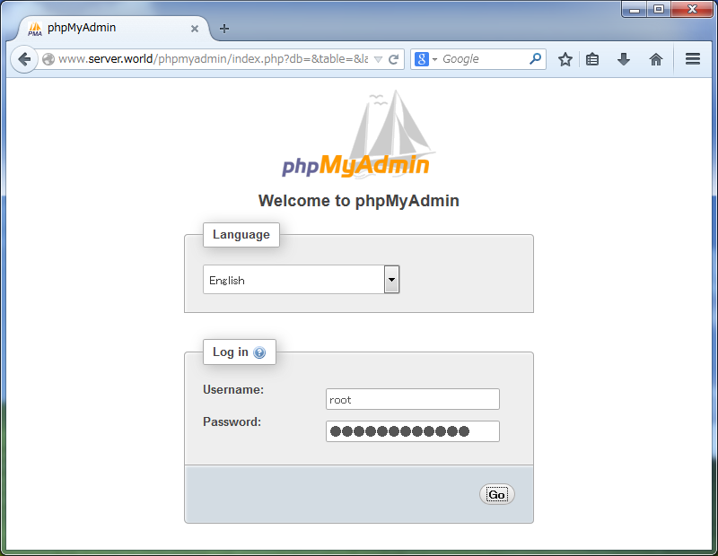

## 6.1. MariaDB

### 6.1.1. MariaDB 5.5

安装MariaDB 5.5（CentOS7默认版本）以配置数据库服务器。

`yum -y install mariadb-server`

编辑`/etc/my.cnf`文件：

```
# 在[mysqld]下面添加以下内容
character-set-server=utf8
```

```
systemctl start mariadb
systemctl enable mariadb
```

MariaDB的初始设置：

`mysql_secure_installation`

```
NOTE: RUNNING ALL PARTS OF THIS SCRIPT IS RECOMMENDED FOR ALL MariaDB
      SERVERS IN PRODUCTION USE!  PLEASE READ EACH STEP CAREFULLY!

In order to log into MariaDB to secure it, we'll need the current
password for the root user.  If you've just installed MariaDB, and
you haven't set the root password yet, the password will be blank,
so you should just press enter here.

Enter current password for root (enter for none):
OK, successfully used password, moving on...

Setting the root password ensures that nobody can log into the MariaDB
root user without the proper authorisation.

# 设置root密码
Set root password? [Y/n] y  # 输入y确认
New password:  # 设置密码
Re-enter new password:  # 确认密码
Password updated successfully!
Reloading privilege tables..
 ... Success!

By default, a MariaDB installation has an anonymous user, allowing anyone
to log into MariaDB without having to have a user account created for
them.  This is intended only for testing, and to make the installation
go a bit smoother.  You should remove them before moving into a
production environment.
# 移除anonymous（匿名）用户
Remove anonymous users? [Y/n] y  # 输入y确认
 ... Success!

Normally, root should only be allowed to connect from 'localhost'.  This
ensures that someone cannot guess at the root password from the network.

# 禁止远程root登录
Disallow root login remotely? [Y/n] y  # 输入y确认
 ... Success!

By default, MariaDB comes with a database named 'test' that anyone can
access.  This is also intended only for testing, and should be removed
before moving into a production environment.

# 移除测试数据库
Remove test database and access to it? [Y/n] y  # 输入y确认
 - Dropping test database...
 ... Success!
 - Removing privileges on test database...
 ... Success!

Reloading the privilege tables will ensure that all changes made so far
will take effect immediately.

# 重新加载权限表
Reload privilege tables now? [Y/n] y  # 输入y确认
 ... Success!

Cleaning up...

All done!  If you've completed all of the above steps, your MariaDB
installation should now be secure.

Thanks for using MariaDB!
```

使用root连接MariaDB：

`mysql -u root -p`

```
Enter password:  # 输入上面设置的MariaDB的root密码
Welcome to the MariaDB monitor.  Commands end with ; or \g.
Your MariaDB connection id is 3
Server version: 5.5.37-MariaDB MariaDB Server

Copyright (c) 2000, 2014, Oracle, Monty Program Ab and others.

Type 'help;' or '\h' for help. Type '\c' to clear the current input statement.

MariaDB [(none)]> select user,host,password from mysql.user;  # 显示用户列表
+------+-----------+-------------------------------------------+
| user | host      | password                                  |
+------+-----------+-------------------------------------------+
| root | localhost | *xxxxxxxxxxxxxxxxxxxxxxxxxxxxxxxxxxxxxxxx |
| root | 127.0.0.1 | *xxxxxxxxxxxxxxxxxxxxxxxxxxxxxxxxxxxxxxxx |
| root | ::1       | *xxxxxxxxxxxxxxxxxxxxxxxxxxxxxxxxxxxxxxxx |
+------+-----------+-------------------------------------------+
3 rows in set (0.00 sec)


MariaDB [(none)]> show databases;  # 显示数据库列表
+--------------------+
| Database           |
+--------------------+
| information_schema |
| mysql              |
| performance_schema |
+--------------------+
3 rows in set (0.00 sec)

MariaDB [(none)]> exit  # 退出连接
Bye
```

如果MariaDB用于远程主机，firewalld防火墙设置（MariaDB使用端口3306/TCP）：

```
firewall-cmd --add-service=mysql --permanent
firewall-cmd --reload
```

安装phpMyAdmin以在Web浏览器上从客户端运行MariaDB。

[安装Apache httpd](../5. 服务器/5.1. Apache httpd.html)

[安装PHP](../5. 服务器/5.1. Apache httpd.html#513-使用php脚本)

`yum --enablerepo=epel -y install phpMyAdmin php-mysql php-mcrypt` # 从EPEL安装phpMyAdmin

编辑`/etc/httpd/conf.d/phpMyAdmin.conf`文件：

```
# 在几个Require ip后添加允许访问的IP地址（10.0.0.0/24根据实际情况替换）
Require ip 127.0.0.1 10.0.0.0/24
```

`systemctl restart httpd`

使用Web浏览器从客户端访问`http://(主机名或IP地址)/phpmyadmin/`，然后使用MariaDB的用户在以下界面登录。此示例使用root用户：



登录成功，可以在这里操作MariaDB：


可以在`http://(主机名或IP地址)/phpmyadmin/setup`更改MariaDB的设置：


