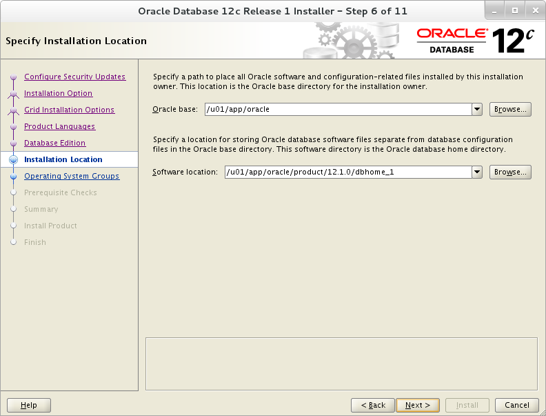
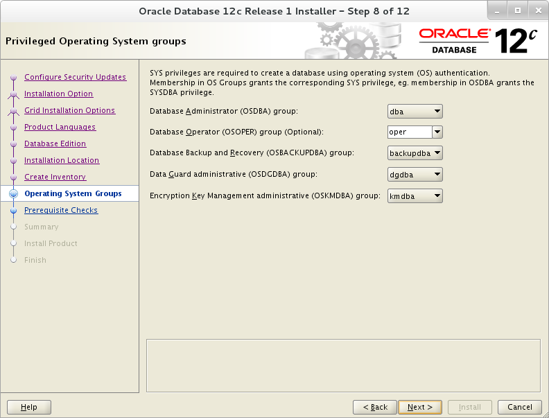
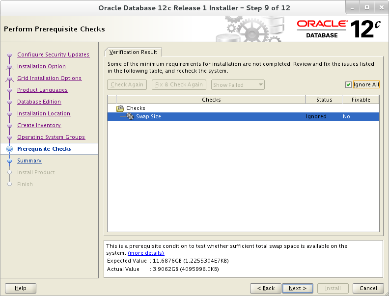
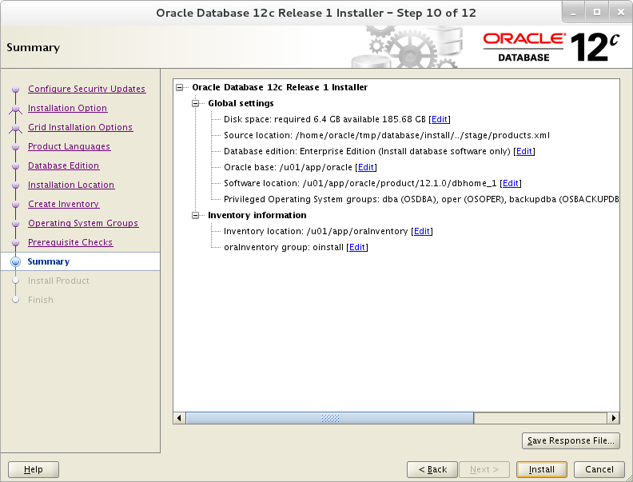
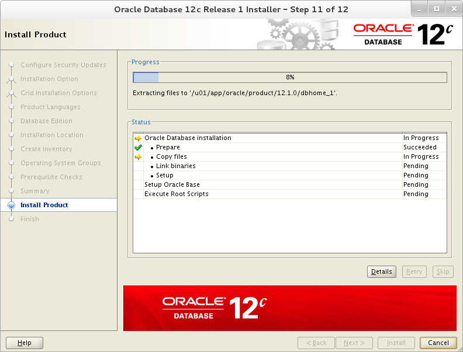
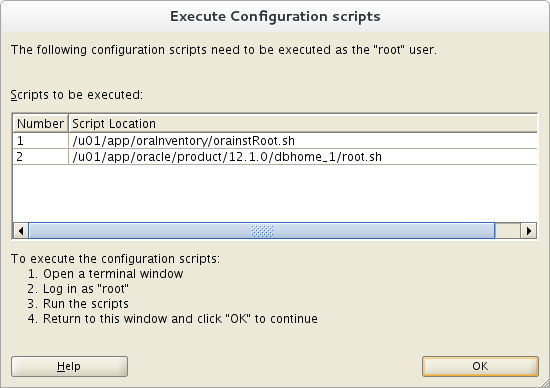
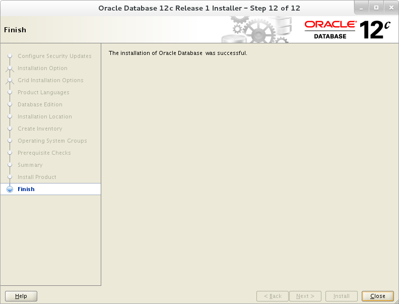

## 6.3. Oracle Database

### 6.3.1. 前提条件

安装Oracle Database 12c之前，在此处更改一些设置以安装Oracle数据库的要求。

[安装桌面环境](../3. 桌面环境/3.1. GNOME桌面.html)

安装所需的软件包：

`yum -y install binutils compat-libcap1 gcc gcc-c++ glibc glibc.i686 glibc-devel glibc.i686 ksh libaio libaio.i686 libaio-devel libaio-devel.i686 libgcc libgcc.i686 libstdc++ libstdc++l7.i686 libstdc++-devel libstdc++-devel.i686 compat-libstdc++-33 compat-libstdc++-33.i686 libXi libXi.i686 libXtst libXtst.i686 make sysstat`

编辑内核参数：

`MEMTOTAL=$(free -b | sed -n '2p' | awk '{print $2}')`

`SHMMAX=$(expr $MEMTOTAL / 2)`

`SHMMNI=4096`

`PAGESIZE=$(getconf PAGE_SIZE)`

`cat >> /etc/sysctl.conf << EOF`

```
fs.aio-max-nr = 1048576
fs.file-max = 6815744
kernel.shmmax = $SHMMAX
kernel.shmall = `expr \( $SHMMAX / $PAGESIZE \) \* \( $SHMMNI / 16 \)`
kernel.shmmni = $SHMMNI
kernel.sem = 250 32000 100 128
net.ipv4.ip_local_port_range = 9000 65500
net.core.rmem_default = 262144
net.core.rmem_max = 4194304
net.core.wmem_default = 262144
net.core.wmem_max = 1048576
EOF
```

`sysctl -p`

```
fs.aio-max-nr = 1048576
fs.file-max = 6815744
kernel.shmmax = 6274715648
kernel.shmall = 392169728
kernel.shmmni = 4096
kernel.sem = 250 32000 100 128
net.ipv4.ip_local_port_range = 9000 65500
net.core.rmem_default = 262144
net.core.rmem_max = 4194304
net.core.wmem_default = 262144
net.core.wmem_max = 1048576
```

为Oracle数据库服务创建用户和组：

```
i=54321; for group in oinstall dba backupdba oper dgdba kmdba; do
groupadd -g $i $group; i=`expr $i + 1`
done
```

`useradd -u 1200 -g oinstall -G dba,oper,backupdba,dgdba,kmdba -d /home/oracle oracle`

`passwd oracle`

```
Changing password for user oracle.
New password:
Retype new password:
passwd: all authentication tokens updated successfully.
```

`mkdir -p /u01/app/oracle`

`chown -R oracle:oinstall /u01/app`

`chmod -R 775 /u01`

编辑`/etc/pam.d/login`文件：

```
# 在第14行附近添加
session    required     pam_selinux.so open
session    required     pam_namespace.so
 session    required     pam_limits.so
 session    optional     pam_keyinit.so force revoke
session    include      system-auth
-session   optional     pam_ck_connector.so
```

编辑`/etc/security/limits.conf`文件：

```
# 添加到最后
oracle  soft  nproc   2047
oracle  hard  nproc   16384
oracle  soft  nofile  1024
oracle  hard  nofile  65536
oracle  soft  stack   10240
oracle  hard  stack   32768
```

使用用户“oracle”登录系统并设置环境变量：

编辑`~/.bash_profile`文件：

```
# 添加到最后
umask 022
export ORACLE_BASE=/u01/app/oracle
```

创建一个临时目录进行安装：

`mkdir tmp`

### 6.3.2. 安装Oracle Database 12c

使用上一步创建的用户“oracle”登录桌面环境：


[下载Oracle Databse 12c for Linux](http://www.oracle.com/technology/software/products/database/index.html)并上传到服务器tmp目录，并运行安装程序：

```
cd tmp
unzip linuxamd64_12102_database_1of2.zip
unzip linuxamd64_12102_database_2of2.zip
```

`./database/runInstaller`

Oracle安装程序启动如下：

首先，设置电子邮件地址和密码，是否从Oracle接收信息，如安全问题等：


在此示例中，选择“Install database software only”：


在此示例中，选择“Single Instance Database installation”：


选择语言：


选择要安装的版本：


指定Oracle的基本目录和文件，在此示例中，保留默认值并继续下一步：



指定安装的目录，在此示例中，保留默认值并继续下一步：


指定特权组，在此示例中，保留默认值并继续下一步：



检查前提条件，如果某些设置未配置为推荐设置，则通知如下显示，再次确认：



将显示配置的摘要，如果全部确定，单击“Install”：



安装开始：



显示以下界面，然后打开终端，使用root用户执行以下命令：



`/u01/app/oraInventory/orainstRoot.sh`

```
Changing permissions of /u01/app/oraInventory.
Adding read,write permissions for group.
Removing read,write,execute permissions for world.

Changing groupname of /u01/app/oraInventory to oinstall.
The execution of the script is complete.
```

`/u01/app/oracle/product/12.1.0/dbhome_1/root.sh`

```
Performing root user operation.

The following environment variables are set as:
    ORACLE_OWNER= oracle
    ORACLE_HOME=  /u01/app/oracle/product/12.1.0/dbhome_1

Enter the full pathname of the local bin directory: [/usr/local/bin]:  # 回车
   Copying dbhome to /usr/local/bin ...
   Copying oraenv to /usr/local/bin ...
   Copying coraenv to /usr/local/bin ...

Creating /etc/oratab file...
Entries will be added to the /etc/oratab file as needed by
Database Configuration Assistant when a database is created
Finished running generic part of root script.
Now product-specific root actions will be performed.
```

安装完成，点击“Close”按钮：



为Oracle用户设置环境变量：

编辑`~/.bash_profile`文件：

```
# 添加到最后
export ORACLE_HOME=/u01/app/oracle/product/12.1.0/dbhome_1
export PATH=$PATH:$ORACLE_HOME/bin
```

`source ~/.bash_profile`

`rm -rf tmp`

### 6.3.3. 添加网络侦听器

创建Oracle网络侦听器，它是Oracle上的网络服务。

使用oracle管理员用户登录并输入命令`netca`，如下所示：


选中“Listener Configuration”框，然后转到下一步：


下一步：


设置侦听器的名称：


本例保持默认“TCP”：


设置端口，本例保持默认：


如果要创建更多侦听器，选择“Yes”。本例选择“No”：


配置完成：


创建侦听器后，tnslsnr侦听您配置的端口，如下所示：

`ss -napt`

```
State      Recv-Q Send-Q          Local Address:Port       Peer Address:Port
LISTEN     0      128                         *:22                    *:*
LISTEN     0      128                 127.0.0.1:631                   *:*
LISTEN     0      100                 127.0.0.1:25                    *:*
ESTAB      0      52                  10.0.0.30:22             10.0.0.5:50113
LISTEN     0      128                        :::1521                 :::*      users:(("tnslsnr",3988,9))
LISTEN     0      128                        :::22                   :::*
LISTEN     0      128                       ::1:631                  :::*
LISTEN     0      100                       ::1:25                   :::*
```

`tnsping localhost`

```
TNS Ping Utility for Linux: Version 12.1.0.2.0 - Production on 04-JUL-2015 01:03:07

Copyright (c) 1997, 2014, Oracle.  All rights reserved.

Used parameter files:

Used HOSTNAME adapter to resolve the alias
Attempting to contact (DESCRIPTION=(CONNECT_DATA=(SERVICE_NAME=))(ADDRESS=(PROTOCOL=TCP)(HOST=127.0.0.1)
(PORT=1521)))
OK (0 msec)
```


