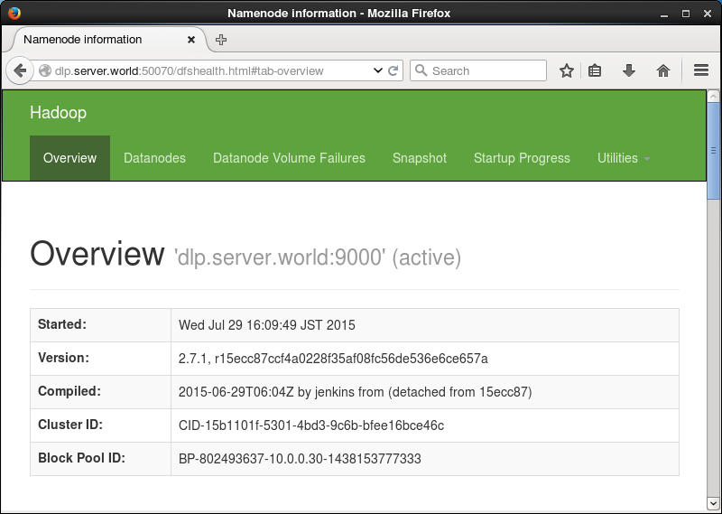
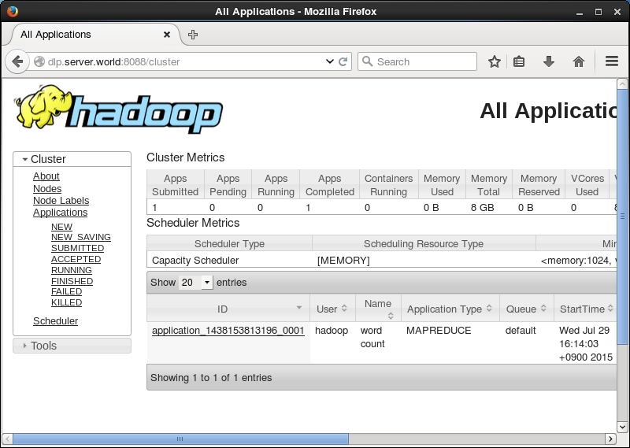

## 附0.5. 分布式文件系统

### 附0.5.1. Hadoop

[Hadoop](http://hadoop.apache.org/)是一个分布式系统基础架构，由Apache基金会开发。用户可以在不了解分布式底层细节的情况下，开发分布式程序。充分利用集群的威力高速运算和存储。Hadoop实现了一个分布式文件系统（Hadoop Distributed File System），简称HDFS。

本例基于以下环境：


现在**所有节点**[安装JDK](../13. 语言开发环境/13.5. Java.html)。

在**所有节点**上为Hadoop创建一个用户：

`useradd -d /usr/hadoop hadoop`

`chmod 755 /usr/hadoop`

`passwd hadoop`

```
Changing password for user hadoop.
New password:
Retype new password:
passwd: all authentication tokens updated successfully.
```

以“hadoop”用户登录到**主节点**，并创建SSH密钥对（无密码短语）并将其发送到其它节点：

`ssh-keygen`

```
Generating public/private rsa key pair.
Enter file in which to save the key (/usr/hadoop/.ssh/id_rsa):
Created directory '/usr/hadoop/.ssh'.
Enter passphrase (empty for no passphrase):
Enter same passphrase again:
Your identification has been saved in /usr/hadoop/.ssh/id_rsa.
Your public key has been saved in /usr/hadoop/.ssh/id_rsa.pub.
The key fingerprint is:
xx:xx:xx:xx:xx:xx:xx:xx:xx:xx:xx:xx:xx:xx:xx:xx hadoop@dlp.srv.world
The key's randomart image is:
```

发送密钥到各节点（包括localhost）：

`ssh-copy-id localhost`

```
The authenticity of host 'localhost (::1)' can't be established.
ECDSA key fingerprint is xx:xx:xx:xx:xx:xx:xx:xx:xx:xx:xx:xx:xx:xx:xx:xx.
Are you sure you want to continue connecting (yes/no)? yes
/bin/ssh-copy-id: INFO: attempting to log in with the new key(s), to filter out any that are already installed
/bin/ssh-copy-id: INFO: 1 key(s) remain to be installed -- if you are prompted now it is to install the new keys
hadoop@localhost's password:

Number of key(s) added: 1

Now try logging into the machine, with:   "ssh 'localhost'"
and check to make sure that only the key(s) you wanted were added.
```

`ssh-copy-id node01.srv.world`

`ssh-copy-id node02.srv.world`

在**所有节点**上安装Hadoop（以“hadoop”用户操作）。确认[下载最新版本](https://hadoop.apache.org/releases.html)：

`curl -O http://ftp.jaist.ac.jp/pub/apache/hadoop/common/hadoop-2.7.1/hadoop-2.7.1.tar.gz `

`tar zxvf hadoop-2.7.1.tar.gz -C /usr/hadoop --strip-components 1`

编辑`~/.bash_profile`文件：

```
# 添加以下内容到最后
export HADOOP_HOME=/usr/hadoop
export HADOOP_COMMON_HOME=$HADOOP_HOME
export HADOOP_HDFS_HOME=$HADOOP_HOME
export HADOOP_MAPRED_HOME=$HADOOP_HOME
export HADOOP_YARN_HOME=$HADOOP_HOME
export HADOOP_OPTS="-Djava.library.path=$HADOOP_HOME/lib/native"
export HADOOP_COMMON_LIB_NATIVE_DIR=$HADOOP_HOME/lib/native
export PATH=$PATH:$HADOOP_HOME/sbin:$HADOOP_HOME/bin
```

`source ~/.bash_profile`

在**主节点**上配置Hadoop（以“hadoop”用户操作）：

为所有节点上的数据创建目录：

`mkdir ~/datanode`

`ssh node01.srv.world "mkdir ~/datanode"`

`ssh node02.srv.world "mkdir ~/datanode"`

编辑`~/etc/hadoop/hdfs-site.xml`文件：

```
# 添加到<configuration> - </configuration>之间
<configuration>
  <property>
    <name>dfs.replication</name>
    <value>2</value>
  </property>
  <property>
    <name>dfs.datanode.data.dir</name>
    <value>file:///usr/hadoop/datanode</value>
  </property>
</configuration>
```

发送到从节点：

`scp ~/etc/hadoop/hdfs-site.xml node01.srv.world:~/etc/hadoop/`

`scp ~/etc/hadoop/hdfs-site.xml node02.srv.world:~/etc/hadoop/`

编辑`~/etc/hadoop/core-site.xml`文件：

```
# 添加到<configuration> - </configuration>之间
<configuration>
  <property>
    <name>fs.defaultFS</name>
    <value>hdfs://dlp.srv.world:9000/</value>
  </property>
</configuration>
```

发送到从节点：

`scp ~/etc/hadoop/core-site.xml node01.srv.world:~/etc/hadoop/`

`scp ~/etc/hadoop/core-site.xml node02.srv.world:~/etc/hadoop/`

`sed -i -e 's/\${JAVA_HOME}/\/usr\/java\/default/' ~/etc/hadoop/hadoop-env.sh`

发送到从节点：

`scp ~/etc/hadoop/hadoop-env.sh node01.srv.world:~/etc/hadoop/`

`scp ~/etc/hadoop/hadoop-env.sh node02.srv.world:~/etc/hadoop/`

`mkdir ~/namenode`

编辑`~/etc/hadoop/hdfs-site.xml`文件：

```
# 添加到<configuration> - </configuration>之间
<configuration>
  <property>
    <name>dfs.namenode.name.dir</name>
    <value>file:///usr/hadoop/namenode</value>
  </property>
</configuration>
```

编辑`~/etc/hadoop/mapred-site.xml`文件：

```
<configuration>
  <property>
    <name>mapreduce.framework.name</name>
    <value>yarn</value>
  </property>
</configuration>
```

编辑`~/etc/hadoop/yarn-site.xml`文件：

```
# 添加到<configuration> - </configuration>之间
<configuration>
  <property>
    <name>yarn.resourcemanager.hostname</name>
    <value>dlp.srv.world</value>
  </property>
  <property>
    <name>yarn.nodemanager.hostname</name>
    <value>dlp.srv.world</value>
  </property>
  <property>
    <name>yarn.nodemanager.aux-services</name>
    <value>mapreduce_shuffle</value>
  </property>
</configuration>
```

编辑`~/etc/hadoop/slaves`文件：

```
# 添加所有节点（删除localhost）
dlp.srv.world
node01.srv.world
node02.srv.world
```

格式化NameNode并启动的Hadoop服务：

`hdfs namenode -format`

```
15/07/28 19:58:14 INFO namenode.NameNode: STARTUP_MSG:
/************************************************************
STARTUP_MSG: Starting NameNode
STARTUP_MSG:   host = dlp.srv.world/10.0.0.30
STARTUP_MSG:   args = [-format]
STARTUP_MSG:   version = 2.7.1
.....
.....
15/07/28 19:58:17 INFO namenode.NameNode: SHUTDOWN_MSG:
/************************************************************
SHUTDOWN_MSG: Shutting down NameNode at dlp.srv.world/10.0.0.30
************************************************************/
```

`start-dfs.sh`

```
Starting namenodes on [dlp.srv.world]
dlp.srv.world: starting namenode, logging to /usr/hadoop/logs/hadoop-hadoop-namenode-dlp.srv.world.out
dlp.srv.world: starting datanode, logging to /usr/hadoop/logs/hadoop-hadoop-datanode-dlp.srv.world.out
node02.srv.world: starting datanode, logging to /usr/hadoop/logs/hadoop-hadoop-datanode-node02.srv.world.out
node01.srv.world: starting datanode, logging to /usr/hadoop/logs/hadoop-hadoop-datanode-node01.srv.world.out
Starting secondary namenodes [0.0.0.0]
0.0.0.0: starting secondarynamenode, logging to /usr/hadoop/logs/hadoop-hadoop-secondarynamenode-dlp.srv.world.out
```

`start-yarn.sh`

```
starting yarn daemons
starting resourcemanager, logging to /usr/hadoop/logs/yarn-hadoop-resourcemanager-dlp.srv.world.out
dlp.srv.world: starting nodemanager, logging to /usr/hadoop/logs/yarn-hadoop-nodemanager-dlp.srv.world.out
node02.srv.world: starting nodemanager, logging to /usr/hadoop/logs/yarn-hadoop-nodemanager-node02.srv.world.out
node01.srv.world: starting nodemanager, logging to /usr/hadoop/logs/yarn-hadoop-nodemanager-node01.srv.world.out
```

`jps` # 显示状态（结果如下所示）

```
2130 NameNode
2437 SecondaryNameNode
2598 ResourceManager
2710 NodeManager
3001 Jps
2267 DataNode
```

执行示例程序以确认正常工作：

`hdfs dfs -mkdir /test` # 创建一个目录`/test`

`hdfs dfs -copyFromLocal ~/NOTICE.txt /test` # 将本地文件复制到`/test`

`hdfs dfs -cat /test/NOTICE.txt` # 显示文件的内容

```
This product includes software developed by The Apache Software
Foundation (http://www.apache.org/).
```

`hadoop jar ~/share/hadoop/mapreduce/hadoop-mapreduce-examples-2.7.1.jar wordcount /test/NOTICE.txt /output01` # 执行示例程序

```
15/07/28 19:28:47 INFO client.RMProxy: Connecting to ResourceManager at dlp.srv.world/10.0.0.30:8032
15/07/28 19:28:48 INFO input.FileInputFormat: Total input paths to process : 1
15/07/28 19:28:48 INFO mapreduce.JobSubmitter: number of splits:1
.....
.....
```

`hdfs dfs -ls /output01` # 显示结果

```
Found 2 items
-rw-r--r--   2 hadoop supergroup      0 2015-07-29 14:29 /output01/_SUCCESS
-rw-r--r--   2 hadoop supergroup    123 2015-07-29 14:29 /output01/part-r-00000
```

`hdfs dfs -cat /output01/part-r-00000` # 显示结果文件的内容（生成字数）

```
(http://www.apache.org/).       1
Apache          1
Foundation      1
Software        1
The             1
This            1
by              1
developed       1
includes        1
product         1
software        1
```

访问`http://(服务器的主机名或IP地址):50070/`，可以看到Hadoop集群摘要：



访问`http://(服务器的主机名或IP地址):8088/`，可以看到Hadoop集群信息：


