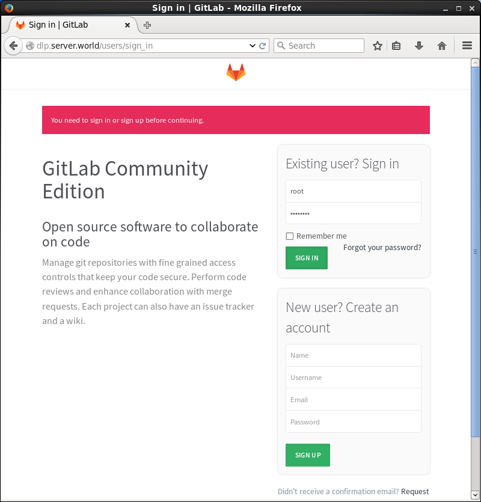
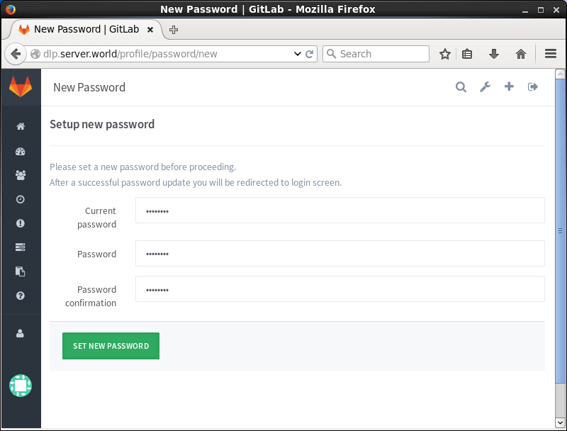

## 附1.6. 项目管理

### 附1.6.1. GitLab

[GitLab](http://gitlab.org/)是一个利用[Ruby on Rails](http://rubyonrails.org/)开发的开源应用程序，实现一个自托管的Git项目仓库，可通过Web界面进行访问公开的或者私人项目。如果觉得安装麻烦可以使用[GitLab Installers](https://bitnami.com/stack/gitlab)一键安装程序。

安装并启动[SSH服务器](../1. 初始化设置/1.9. 配置SSH.html)，[SMTP服务器](../9. 邮件服务器/9.1. 安装Postfix.html)。如果使用了firewalld防火墙，打开“http”服务端口。

安装GitLab：

`curl -O https://packages.gitlab.com/install/repositories/gitlab/gitlab-ce/script.rpm.sh`

`sh script.rpm.sh`

`yum -y install gitlab-ce`

`gitlab-ctl reconfigure`

访问`http://(服务器的主机名或IP地址)/`，然后使用用户“root”和初始密码“5iveL!fe”登录：

初次登录后，需要更改密码。更改为任意密码：

这是GitLab主页。可以在本地网络中像GitHub那样使用：

### 附1.6.2. Redmine

[Redmine](https://www.redmine.org/)是基于Web的项目管理和缺陷跟踪工具。它用日历和甘特图辅助项目及进度可视化显示，支持多项目管理。

安装并启动[Apache httpd](../5. Web服务器/5.1. Apache httpd.html)，[SMTP服务器](../9. 邮件服务器/9.1. 安装Postfix.html)，[MariaDB数据库服务器](../6. 数据库/6.1. MariaDB.html)，[Ruby 2.2](../13. 语言开发环境/13.1. Ruby.html#1311-安装ruby-22)

