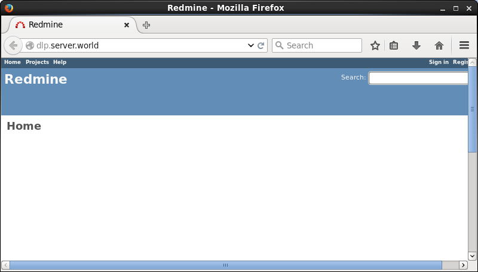
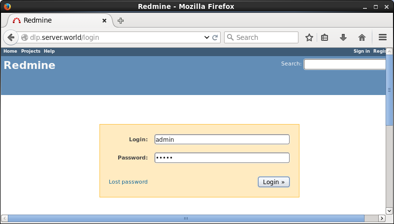
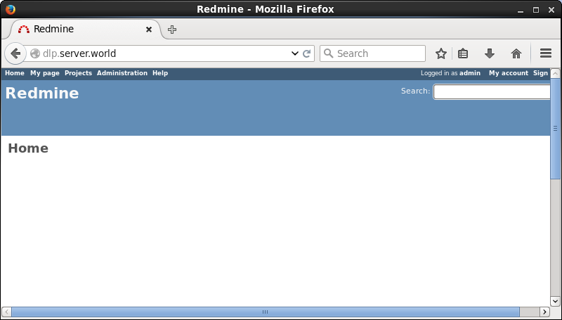
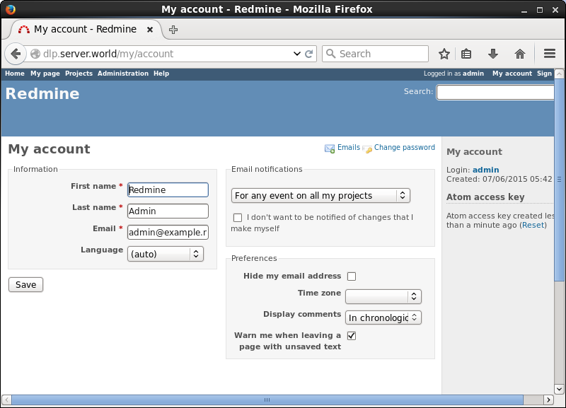
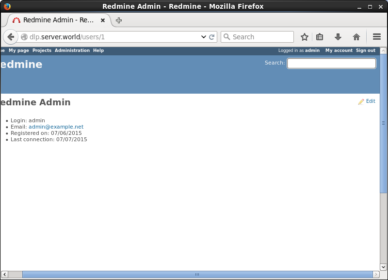

## 附1.6. 项目管理与版本控制

### 附1.6.1. GitLab

[GitLab](http://gitlab.org/)是一个利用[Ruby on Rails](http://rubyonrails.org/)开发的开源应用程序，实现一个自托管的Git项目仓库，可通过Web界面进行访问公开的或者私人项目。如果觉得安装麻烦可以使用[GitLab Installers](https://bitnami.com/stack/gitlab)一键安装程序。

安装并启动[SSH服务器](../1. 初始化设置/1.9. 配置SSH.html)，[SMTP服务器](../9. 邮件服务器/9.1. 安装Postfix.html)。如果使用了firewalld防火墙，打开“http”服务端口。

安装GitLab：

`curl -O https://packages.gitlab.com/install/repositories/gitlab/gitlab-ce/script.rpm.sh`

`sh script.rpm.sh`

`yum -y install gitlab-ce`

`gitlab-ctl reconfigure`

访问`http://(服务器的主机名或IP地址)/`，然后使用用户“root”和初始密码“5iveL!fe”登录：


初次登录后，需要更改密码。更改为任意密码：


这是GitLab主页。可以在本地网络中像GitHub那样使用：


### 附1.6.2. Redmine

[Redmine](https://www.redmine.org/)是基于Web的项目管理和缺陷跟踪工具。它用日历和甘特图辅助项目及进度可视化显示，支持多项目管理。

安装并启动[Apache httpd](../5. Web服务器/5.1. Apache httpd.html)，[SMTP服务器](../9. 邮件服务器/9.1. 安装Postfix.html)和[MariaDB数据库服务器](../6. 数据库/6.1. MariaDB.html)并安装[Ruby 2.2](../13. 语言开发环境/13.1. Ruby.html#1311-安装ruby-22)

安装其他一些需要的软件包：

`yum -y install ImageMagick ImageMagick-devel libcurl-devel httpd-devel mariadb-devel ipa-pgothic-fonts`

在MariaDB上为Redmine创建一个用户和数据库：

`mysql -u root -p`

```
Enter password:
Welcome to the MariaDB monitor.  Commands end with ; or \g.
Your MariaDB connection id is 10
Server version: 5.5.41-MariaDB MariaDB Server

Copyright (c) 2000, 2014, Oracle, MariaDB Corporation Ab and others.

Type 'help;' or '\h' for help. Type '\c' to clear the current input statement.

MariaDB [(none)]> create database redmine; 
Query OK, 1 row affected (0.00 sec)

# 在“password”部分设置任意密码
MariaDB [(none)]> grant all privileges on redmine.* to redmine@'localhost' identified by 'password'; 
Query OK, 0 rows affected (0.00 sec)

MariaDB [(none)]> flush privileges; 
Query OK, 0 rows affected (0.00 sec)

MariaDB [(none)]> exit
```

确认[最新版本的下载链接](http://www.redmine.org/projects/redmine/wiki/Download)，下载并安装：

`wget http://www.redmine.org/releases/redmine-3.0.3.tar.gz`

`tar zxvf redmine-3.0.3.tar.gz`

`mv redmine-3.0.3 /var/www/redmine`

`cd /var/www/redmine`

编辑`./config/database.yml`文件：

```
# 数据库设置
production:
    adapter: mysql2
    # 数据库名称
    database: redmine
    host: localhost
    # 数据库用户
    username: redmine
    # 上面数据库用户的密码
    password: password
    encoding: utf8
```

编辑`./config/configuration.yml`文件：

```
# SMTP设置
production:
    email_delivery:
        delivery_method: :smtp
        smtp_settings:
            address: "localhost"
            port: 25
            domain: 'dlp.srv.world'
    rmagick_font_path: /usr/share/fonts/ipa-pgothic/ipagp.ttf
```

`gem install bundler --no-rdoc --no-ri` # 安装bundler

`bundle install --without development test postgresql sqlite` # 安装Gem

`bundle exec rake generate_secret_token` # 生成密钥

`bundle exec rake db:migrate RAILS_ENV=production` # 生成表

`gem install passenger --no-rdoc --no-ri` # 安装Passenger

`passenger-install-apache2-module` # 安装Apache2的模块

```
Welcome to the Phusion Passenger Apache 2 module installer, v5.0.6.

This installer will guide you through the entire installation process. It
shouldn't take more than 3 minutes in total.

Here's what you can expect from the installation process:

 1. The Apache 2 module will be installed for you.
 2. You'll learn how to configure Apache.
 3. You'll learn how to deploy a Ruby on Rails application.

Don't worry if anything goes wrong. This installer will advise you on how to
solve any problems.

Press Enter to continue, or Ctrl-C to abort.
1  # 指定“1”并回车
.....
.....
After you restart Apache, you are ready to deploy any number of web
applications on Apache, with a minimum amount of configuration!
.....
```

为Redmine配置httpd。本例演示配置为虚拟主机：

编辑`/etc/httpd/conf.d/passenger.conf`文件：

```
LoadModule passenger_module /usr/lib64/ruby/gems/2.2.0/gems/passenger-5.0.13/buildout/apache2/mod_passenger.so
PassengerRoot /usr/lib64/ruby/gems/2.2.0/gems/passenger-5.0.13
PassengerDefaultRuby /usr/bin/ruby

NameVirtualHost *:80
<VirtualHost *:80>
    ServerName dlp.srv.world
    DocumentRoot /var/www/redmine/public
</VirtualHost>
```

`chown -R apache. /var/www/redmine`

`systemctl restart httpd`

访问在httpd上配置的URL，然后Redmine的主页如下所示。点击“Sing in”按钮：



使用初始用户名/密码“admin/admin”登录：



登录成功，首先更改管理员密码 点击“My account”：



点击“admin”：



点击“edit”：



在“Authentication”部分输入任意密码并保存更改


### 附1.6.3. Gitolite

[Gitolite](https://github.com/sitaramc/gitolite)是一款Perl语言开发的Git服务管理工具，通过公钥对用户进行认证，并能够通过配置文件对写操作进行基于分支和路径的精细授权。


