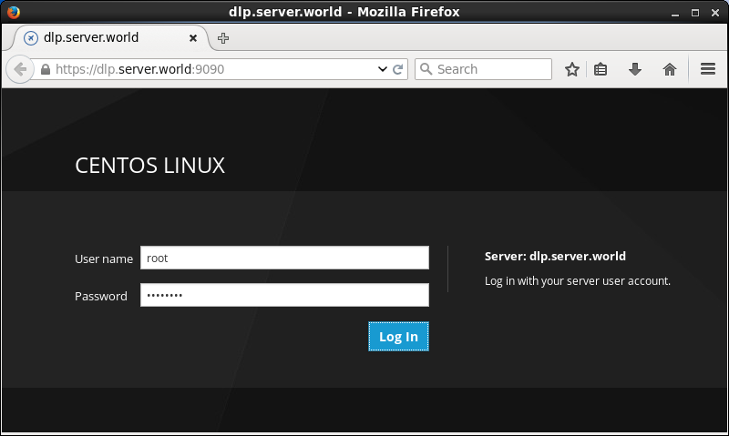
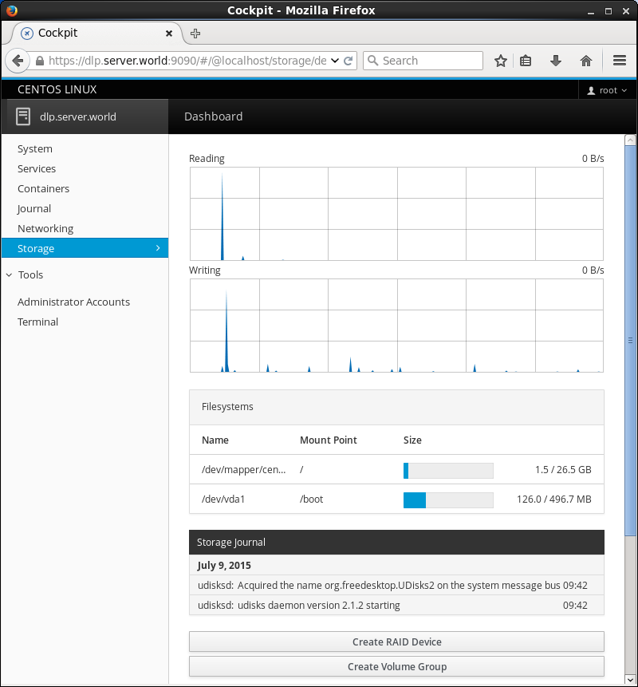
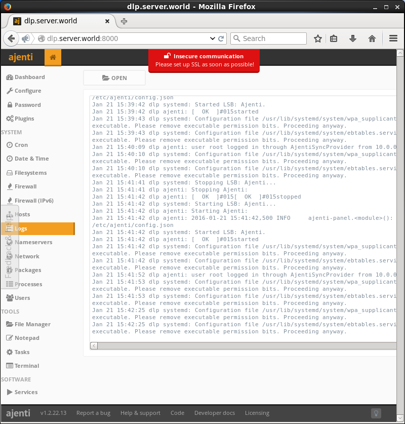
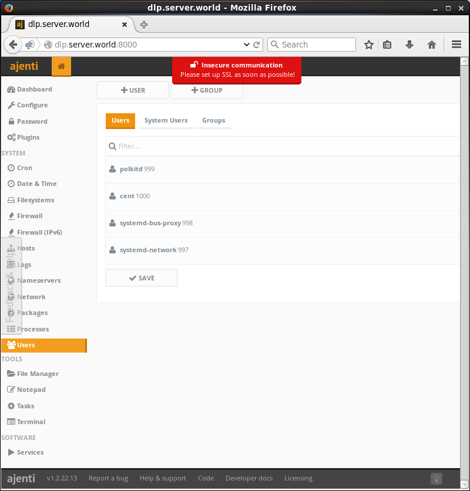
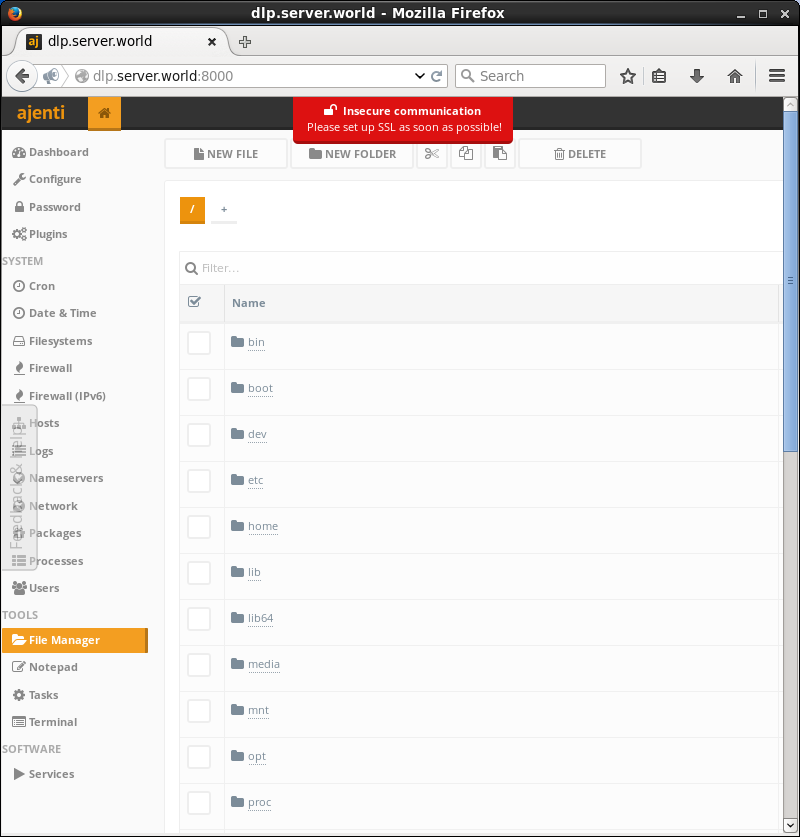
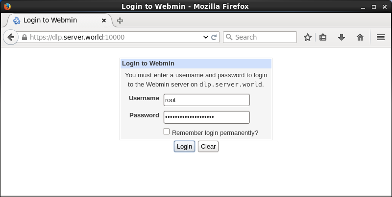

## 附1.7. 系统管理工具

### 附1.7.1. Cockpit

[Cockpit](http://cockpit-project.org/)是红帽开发的网页版图像化服务管理工具，优点是无需中间层，且可以管理多种服务。

安装Cockpit：

`yum -y install cockpit`

```
systemctl start cockpit
systemctl enable cockpit.socket
```

使用客户端Web浏览器访问`https://(服务器的主机名或IP地址):9090/`，显示Cockpit登录界面。本例以用户“root”登录：



下面是Cockpit主页。可以在这里管理系统：


左侧菜单中的“Services”，可以管理或操作系统服务：


左侧菜单中的“Containers”，可以管理或操作Docker容器：


左侧菜单中的“Journal”，可以管理或操作系统日志：


左侧菜单中的“Networking”，可以管理或操作网络：


左侧菜单中的“Storage”，可以管理或操作存储：



左侧菜单中的“Administrator Accounts”，可以管理或操作系统帐户：


左侧菜单中的“Terminal”，可以直接使用命令来运行系统：


### 附1.7.2. Ajenti

[Ajenti](http://ajenti.org/)包含[Apache](../5. Web服务器/5.1. Apache httpd.html)，[BIND9](../10. 网络服务/10.1. DNS DHCP服务.html#1011-bind)，[Cron](https://www.centos.org/docs/5/html/5.2/Deployment_Guide/s2-autotasks-cron-configuring.html)，[CTDB](http://ctdb.samba.org/)，[DHCPD](../10. 网络服务/10.1. DNS DHCP服务.html#1012-dhcp服务器)，[NFSD](../4. 存储服务器/4.1. NFS服务器.html)，[Iptables](http://www.netfilter.org/projects/iptables/)，[Munin](../12. 系统监控/12.2. Munin.html)，[MySQL](../6. 数据库/6.1. MariaDB.html)，[Netatalk](http://netatalk.sourceforge.net/)，[NGINX](../5. Web服务器/5.2. Nginx.html)，[PostgreSQL](../6. 数据库/6.2. PostgreSQL.html)，[Samba](../8. 文件服务器/8.2. Samba.html)，[lm-sensors](https://en.wikipedia.org/wiki/Lm_sensors)，[Squid 3](../10. 网络服务/10.2. 代理服务器.html#1021-安装squid)，[Supervisor](http://supervisord.org/)等的管理。并可以便捷的进行二次开发，完全开源。

安装Ajenti，可以[参考官网](http://support.ajenti.org/topics/1122-installing-on-centosrhel/)：

`yum -y install http://repo.ajenti.org/ajenti-repo-1.0-1.noarch.rpm`

`yum --enablerepo=epel -y install ajenti` # 同时开启EPEL

编辑`/etc/ajenti/config.json`文件：

```
# 禁用SSL（不适用于CentOS 7.2）
 "ssl": {
        "enable": false,
```

`systemctl restart ajenti`

使用客户端Web浏览器访问`http://(服务器的主机名或IP地址):8000/`，显示Ajenti登录界面。使用默认用户“root”，密码“admin”登录：


下面是Ajenti主页。可以在这里管理系统：


左侧菜单中的“Services”，可以管理或操作系统服务：


左侧菜单中的“Logs”，可以管理或操作系统日志：



左侧菜单中的“Network”，可以管理或操作网络：


左侧菜单中的“Filesystems”，可以管理或操作文件系统：


左侧菜单中的“Users”，可以管理或操作用户帐号：



左侧菜单中的“File Manager”，可以管理或操作文件或目录：



左侧菜单中的“Terminal”，可以直接使用命令来运行系统：


### 附1.7.3. Webmin

[Webmin](http://www.webmin.com/)是功能强大的基于Web的Unix系统管理工具。

首先安装所需的软件包：

`yum -y install perl-Net-SSLeay`

安装Webmin（确认[最新版本下载连接](http://download.webmin.com/download/yum/)）：

`yum -y install http://download.webmin.com/download/yum/webmin-1.750-1.noarch.rpm`

编辑`/etc/webmin/miniserv.conf`文件：

```
# 添加以下内容到最后（允许访问的IP地址）
allow=127.0.0.1 10.0.0.0/24
```

`/etc/rc.d/init.d/webmin restart`

使用客户端Web浏览器访问`https://(服务器的主机名或IP地址):10000/`，显示Webmin登录界面。使用用户“root”登录：



下面是Webmin主页。可以在这里进行操作：


点击左侧菜单上的“Webmin”->“Webmin Configuration”，然后点击右侧窗格中的“Language”，可以更改为自己的语言：


### 附1.7.4. Usermin

[Usermin](http://www.webmin.com/usermin.html)是一个基于Web的为Unix、Linux用户提供网络邮件，修改密码，邮件过滤器，fetchmail和更多功能。


### 附1.7.5. Virtualmin

[Virtualmin](http://www.webmin.com/virtualmin.html)是一个Webmin的模块，用来简化虚拟主机的管理和设置。


