## 附1.7. 系统管理工具

### 附1.7.1. Cockpit

[Cockpit](http://cockpit-project.org/)是红帽开发的网页版图像化服务管理工具，优点是无需中间层，且可以管理多种服务。

安装Cockpit：

`yum -y install cockpit`

```
systemctl start cockpit
systemctl enable cockpit.socket
```

使用客户端Web浏览器访问`https://(服务器的主机名或IP地址):9090/`，显示Cockpit登录界面。本例以用户“root”登录：


下面是Cockpit主页。可以在这里管理系统：

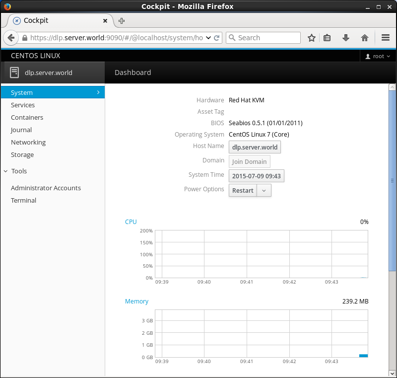

左侧菜单中的“Services”，可以管理或操作系统服务：

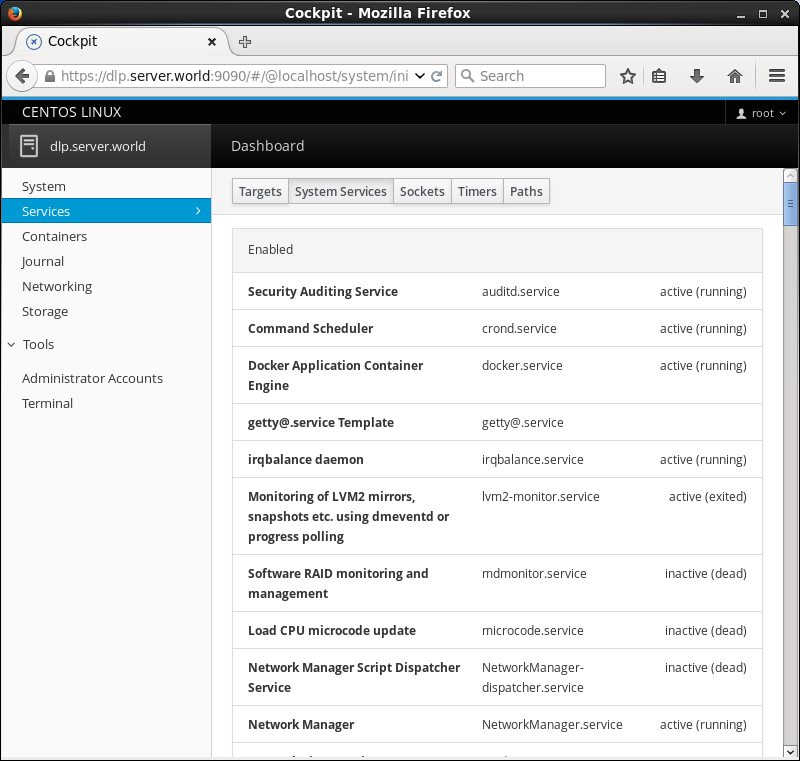

左侧菜单中的“Containers”，可以管理或操作Docker容器：

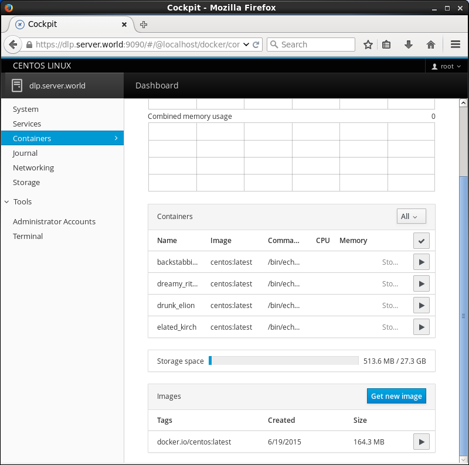

左侧菜单中的“Journal”，可以管理或操作系统日志：

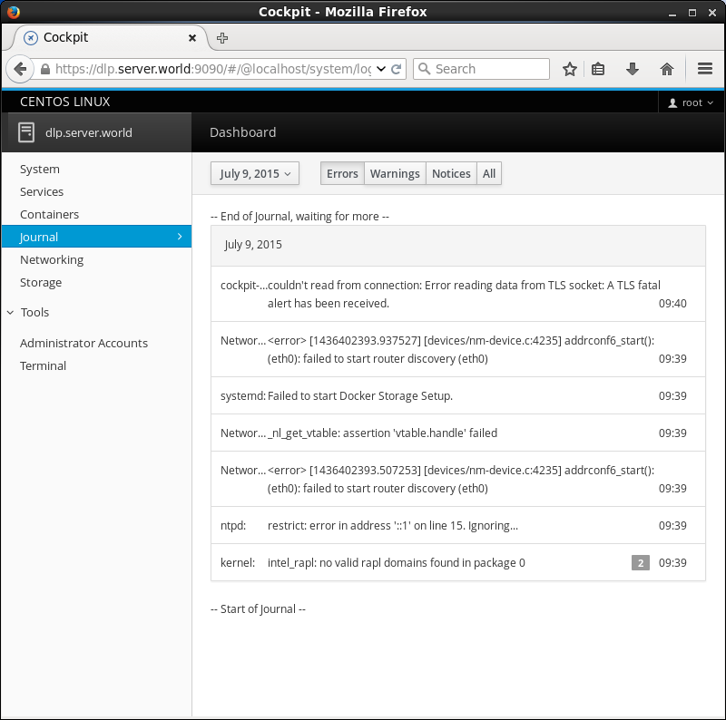

左侧菜单中的“Networking”，可以管理或操作网络：

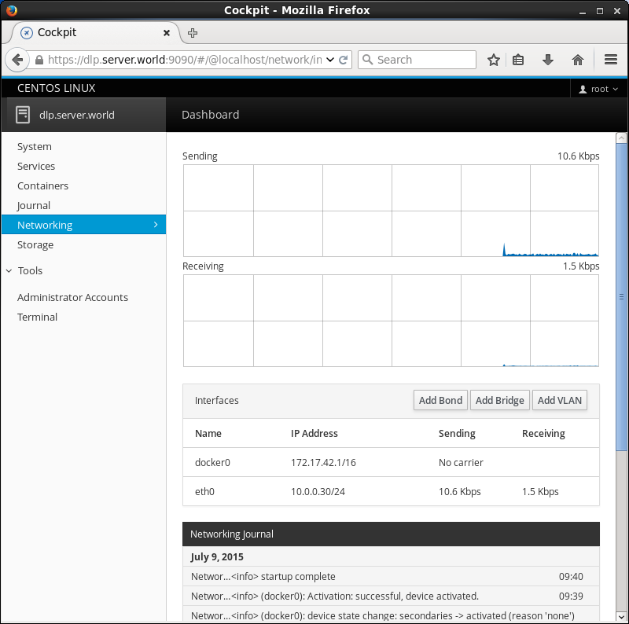

左侧菜单中的“Storage”，可以管理或操作存储：


左侧菜单中的“Administrator Accounts”，可以管理或操作系统帐户：

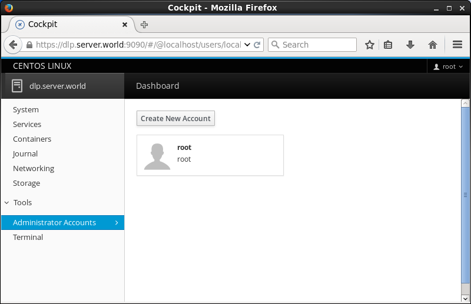

左侧菜单中的“Terminal”，可以直接使用命令来运行系统：

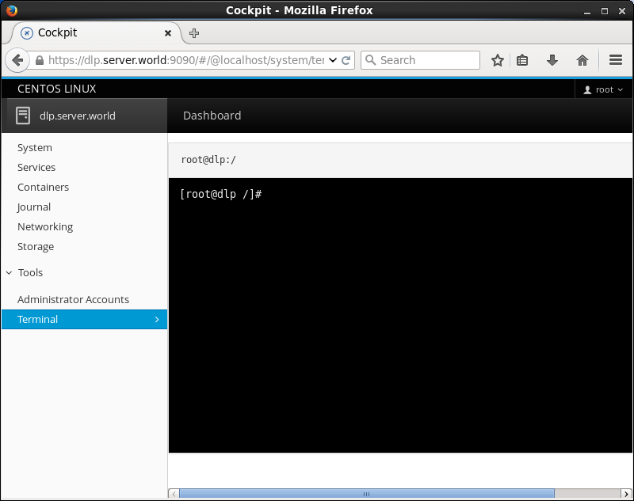

### 附1.7.2. Ajenti

[Ajenti](http://ajenti.org/)包含[Apache](../5. Web服务器/5.1. Apache httpd.html)，[BIND9](../10. 网络服务/10.1. DNS DHCP服务.html#1011-bind)，[Cron](https://access.redhat.com/documentation/en-US/Red_Hat_Enterprise_Linux/6/html/Deployment_Guide/ch-Automating_System_Tasks.html)，[CTDB](http://ctdb.samba.org/)，[DHCPD](../10. 网络服务/10.1. DNS DHCP服务.html#1012-dhcp服务器)，[NFSD](../4. 存储服务器/4.1. NFS服务器.html)，[Iptables](http://www.netfilter.org/projects/iptables/)，[Munin](../12. 系统监控/12.2. Munin.html)，[MySQL](../6. 数据库/6.1. MariaDB.html)，[Netatalk](http://netatalk.sourceforge.net/)，[NGINX](../5. Web服务器/5.2. Nginx.html)，[PostgreSQL](../6. 数据库/6.2. PostgreSQL.html)，[Samba](../8. 文件服务器/8.2. Samba.html)，[lm-sensors](https://en.wikipedia.org/wiki/Lm_sensors)，[Squid 3](../10. 网络服务/10.2. 代理服务器.html#1021-安装squid)，[Supervisor](http://supervisord.org/)等的管理。并可以便捷的进行二次开发，完全开源。

安装Ajenti，可以[参考官网](http://support.ajenti.org/topics/1122-installing-on-centosrhel/)：

`yum -y install http://repo.ajenti.org/ajenti-repo-1.0-1.noarch.rpm`

`yum --enablerepo=epel -y install ajenti` # 同时开启EPEL

编辑`/etc/ajenti/config.json`文件：

```
# 禁用SSL（不适用于CentOS 7.2）
 "ssl": {
        "enable": false,
```

`systemctl restart ajenti`

使用客户端Web浏览器访问`http://(服务器的主机名或IP地址):8000/`，显示Ajenti登录界面。使用默认用户“root”，密码“admin”登录：


下面是Ajenti主页。可以在这里管理系统：


左侧菜单中的“Services”，可以管理或操作系统服务：


左侧菜单中的“Logs”，可以管理或操作系统日志：


左侧菜单中的“Network”，可以管理或操作网络：


左侧菜单中的“Filesystems”，可以管理或操作文件系统：

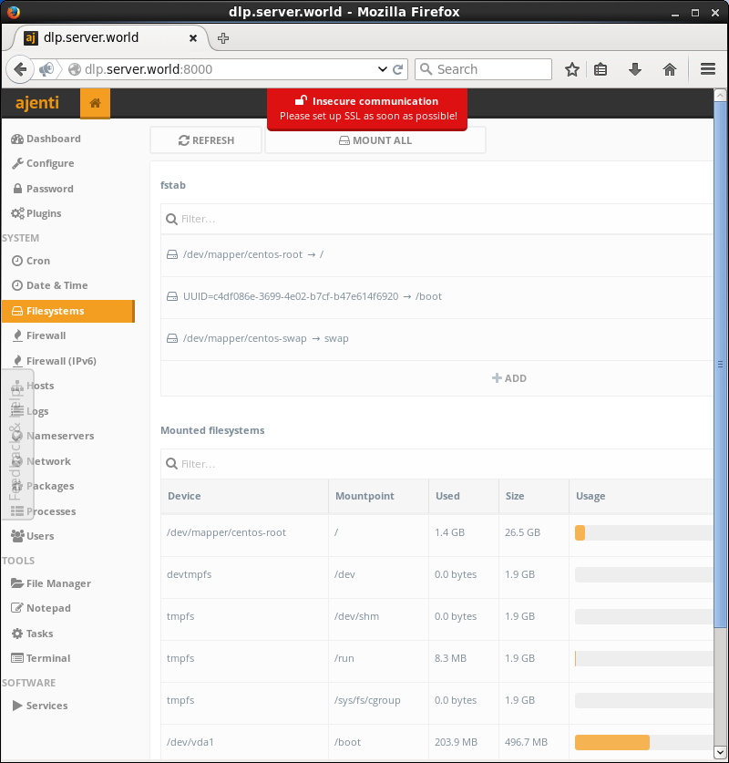

左侧菜单中的“Users”，可以管理或操作用户帐号：


左侧菜单中的“File Manager”，可以管理或操作文件或目录：


左侧菜单中的“Terminal”，可以直接使用命令来运行系统：

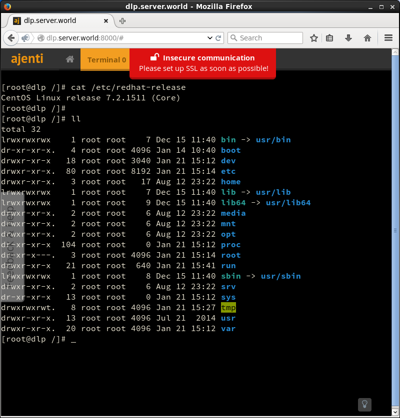

### 附1.7.3. Webmin

[Webmin](http://www.webmin.com/)是功能强大的基于Web的Unix系统管理工具。

首先安装所需的软件包：

`yum -y install perl-Net-SSLeay`

安装Webmin（确认[最新版本下载连接](http://download.webmin.com/download/yum/)）：

`yum -y install http://download.webmin.com/download/yum/webmin-1.750-1.noarch.rpm`

编辑`/etc/webmin/miniserv.conf`文件：

```
# 添加以下内容到最后（允许访问的IP地址）
allow=127.0.0.1 10.0.0.0/24
```

`/etc/rc.d/init.d/webmin restart`

使用客户端Web浏览器访问`https://(服务器的主机名或IP地址):10000/`，显示Webmin登录界面。使用用户“root”登录：


下面是Webmin主页。可以在这里进行操作：


点击左侧菜单上的“Webmin”->“Webmin Configuration”，然后点击右侧窗格中的“Language”，可以更改为自己的语言：

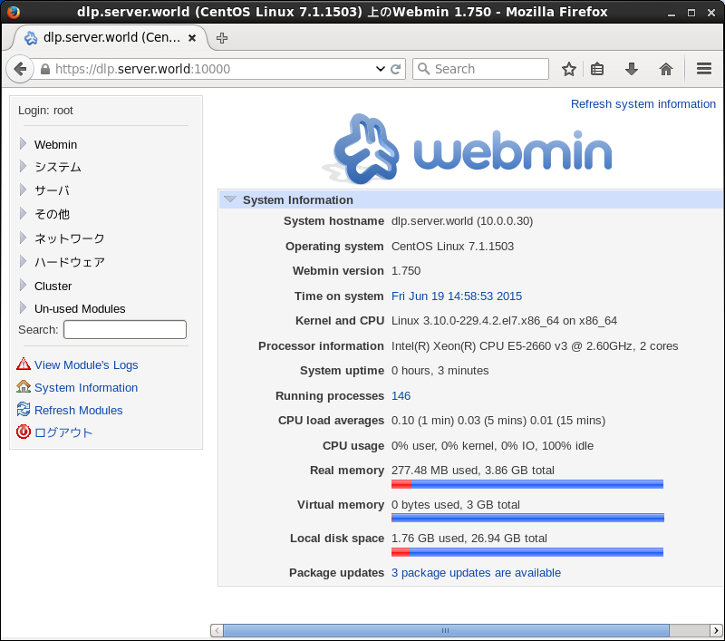

### 附1.7.4. Usermin

[Usermin](http://www.webmin.com/usermin.html)是一个基于Web的为Unix、Linux用户提供网络邮件，修改密码，邮件过滤器，fetchmail和更多功能。

首先安装所需的软件包：

`yum --enablerepo=epel -y install perl-Net-SSLeay perl-Authen-PAM` # 从EPEL安装

安装Usermin（确认[最新版本下载连接](http://download.webmin.com/download/yum/)）：

`yum -y install http://download.webmin.com/download/yum/usermin-1.661-1.noarch.rpm`

编辑`/etc/usermin/miniserv.conf`文件:

```
# 添加以下内容到最后（允许访问的IP地址）
allow=127.0.0.1 10.0.0.0/24
# 禁止root登录
denyusers=root
```

`/etc/rc.d/init.d/usermin start`

使用客户端Web浏览器访问`https://(服务器的主机名或IP地址):20000/`，显示Usermin登录界面。使用普通账户登录：


下面是Usermin主页。可以在这里进行操作：


点击左侧菜单上的“Usermin”->“Change Language”，可以更改为自己的语言：

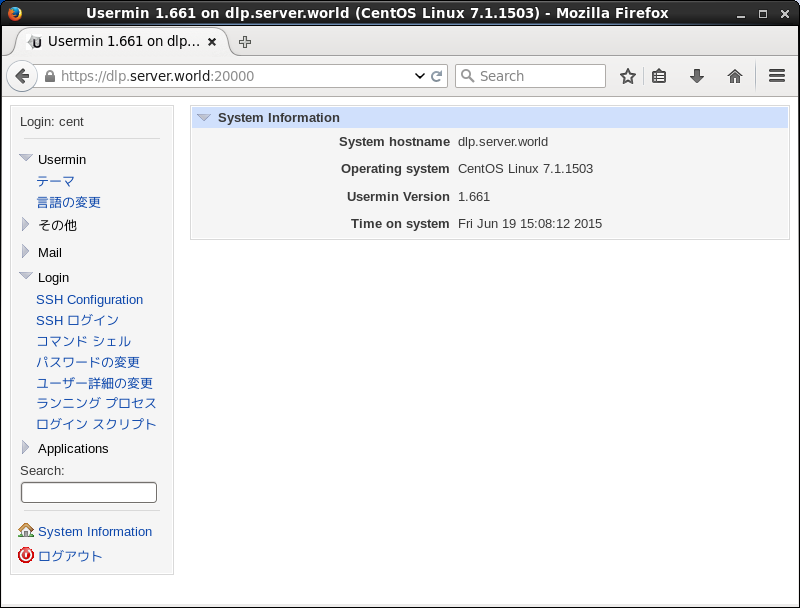

### 附1.7.5. Virtualmin

[Virtualmin](http://www.webmin.com/virtualmin.html)用于[Apache httpd](../5. Web服务器/5.1. Apache httpd.html)或[Postfix](../9. 邮件服务器/9.1. 安装Postfix.html)的虚拟主机的管理和设置。

Virtualmin是一个Webmin的模块，因此先[安装Webmin](#附173-webmin)。

安装Virtualmin：

`curl -O http://software.virtualmin.com/gpl/scripts/install.sh`

`sh install.sh`

```
.....
Continue? (y/n) y
.....
```

访问Webmin站点`https://(服务器的主机名或IP地址):10000/`，然后选择“Cancel”（应用默认设置）或“Next”（手动配置）：

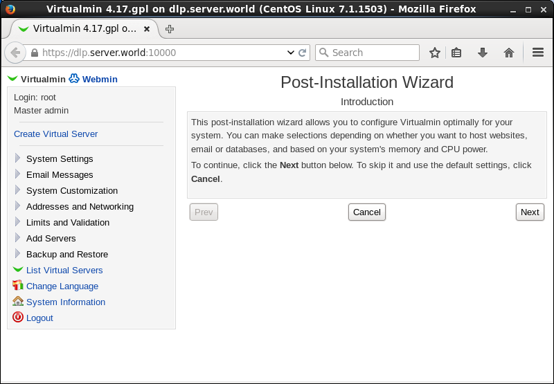

下面是Virtualmin主页。可以在这里进行操作：


### 附1.7.6. Spacewalk

[Spacewalk](http://spacewalk.redhat.com/)是一个开放源码的Linux系统管理解决方案，是Red Hat Satellite的开源版本。

#### 附1.7.6.1. 安装Spacewalk

为Spacewalk配置所需的库（下载前确认[最新的RPM](http://yum.spacewalkproject.org/latest/RHEL/7/x86_64/)）：

`yum -y install http://yum.spacewalkproject.org/latest/RHEL/7/x86_64/spacewalk-repo-2.3-4.el7.noarch.rpm`

```
cat > /etc/yum.repos.d/jpackage-generic.repo << EOF
[jpackage-generic]
name=JPackage generic
mirrorlist=http://www.jpackage.org/mirrorlist.php?dist=generic&type=free&release=5.0
enabled=1
gpgcheck=1
gpgkey=http://www.jpackage.org/jpackage.asc
EOF
```

可以选择[PostgreSQL](../6. 数据库/6.2. PostgreSQL.html)和[Oracle 10g](../6. 数据库/6.3. Oracle Database.html)或更高版本作为后端数据库。本例选择PostgreSQL：

`yum --enablerepo=epel -y install spacewalk-setup-postgresql spacewalk-postgresql perl dojo` # 同时开启EPEL

`spacewalk-setup --disconnected`

```
** Database: Setting up database connection for PostgreSQL backend.
** Database: Installing the database:
** Database: This is a long process that is logged in:
** Database:   /var/log/rhn/install_db.log
*** Progress: #
** Database: Installation complete.
** Database: Populating database.
*** Progress: #####################################
* Setting up users and groups.
** GPG: Initializing GPG and importing key.
** GPG: Creating /root/.gnupg directory
You must enter an email address.
# 设置管理员邮件地址
Admin Email Address? root@dlp.srv.world
* Performing initial configuration.
* Activating Spacewalk.
** Loading Spacewalk Certificate.
** Verifying certificate locally.
** Activating Spacewalk.
* Enabling Monitoring.
* Configuring apache SSL virtual host.
# 默认设置回车（启用SSL）
Should setup configure apache's default ssl server for you (saves original ssl.conf) [Y]?
** /etc/httpd/conf.d/ssl.conf has been backed up to ssl.conf-swsave
* Configuring tomcat.
* Configuring jabberd.
* Creating SSL certificates.
# 设置CA证书的密码
CA certificate password?
Re-enter CA certificate password?
# 公司
Organization? ServerWorld
# 部门
Organization Unit [dlp.srv.world]?
# 邮件地址
Email Address [root@dlp.srv.world]?
# 城市
City? CD
# 省
State? SC
# 国家代码
Country code (Examples: "US", "JP", "IN", or type "?" to see a list)? CN
** SSL: Generating CA certificate.
** SSL: Deploying CA certificate.
** SSL: Generating server certificate.
** SSL: Storing SSL certificates.
* Deploying configuration files.
* Update configuration in database.
* Setting up Cobbler..
Processing /etc/cobbler/modules.conf
`/etc/cobbler/modules.conf' -> `/etc/cobbler/modules.conf-swsave'
Processing /etc/cobbler/settings
`/etc/cobbler/settings' -> `/etc/cobbler/settings-swsave'
# 默认设置回车（启用PXE配置）
Cobbler requires tftp and xinetd services be turned on for PXE provisioning functionality. Enable these services [Y]?
* Restarting services.
Installation complete.
Visit https://dlp.srv.world to create the Spacewalk administrator account.
```

使用客户端的Web浏览器访问`http://(Spacewalk服务器的主机名或IP地址)/`。显示以下页面，设置任意管理员和密码，然后点击“Create Login”：


登录成，下面是Webmin主页：

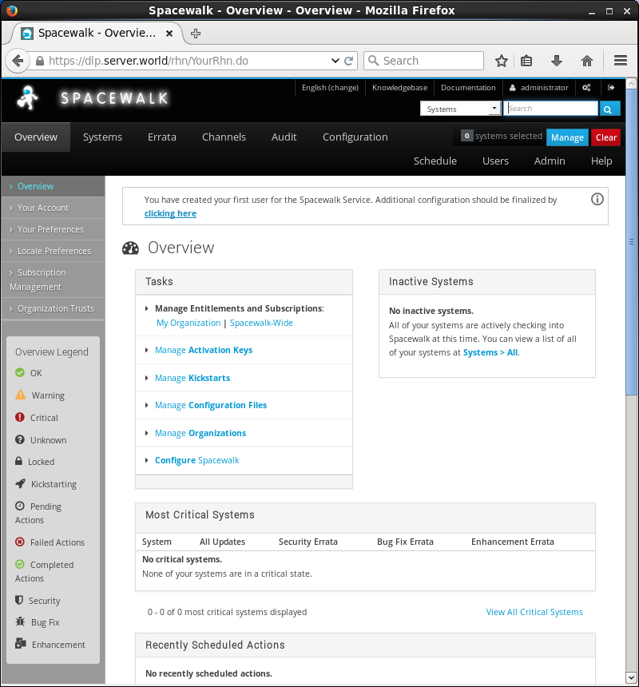

对于下次登录，登录页面显示如下，用上面设置的用户和密码进行身份验证：

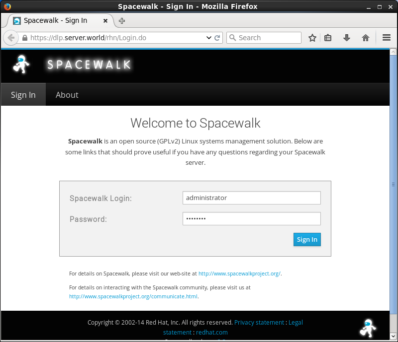

#### 附1.7.6.2. 初始设置

创建一个渠道和激活密钥。

使用管理员用户登录Spacewalk管理网站，转到“Channels”标签，然后点击“Manage Software Channels”：


点击“Create new Channel”：

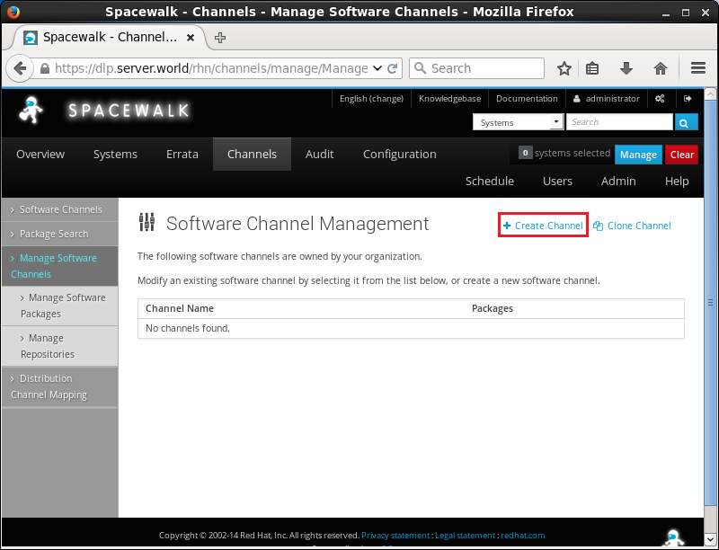

如下所示，在所需字段上设置项目，向下滚动并点击“Create Channel”：

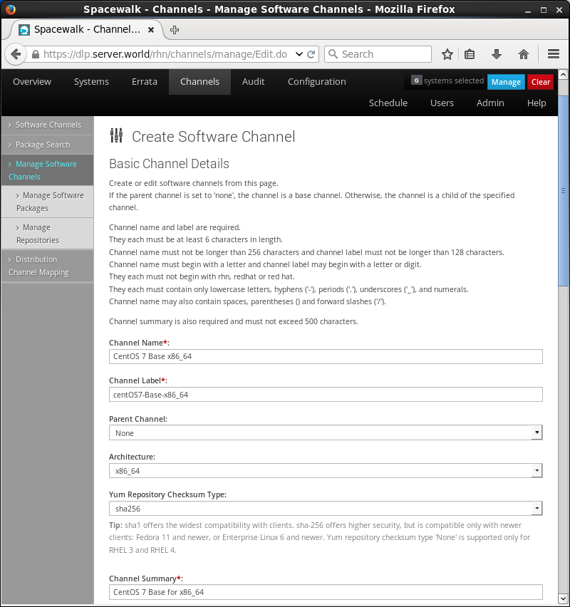

创建渠道后，点击“Systems”标签：

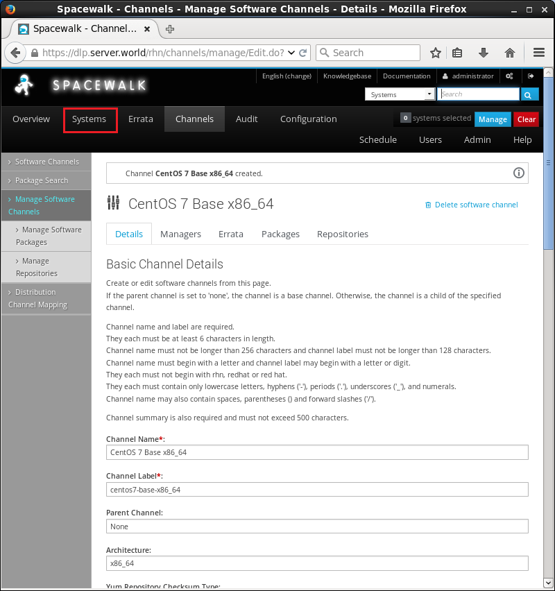

点击左侧菜单上的“Activation Keys”：


点击“Create new key”：

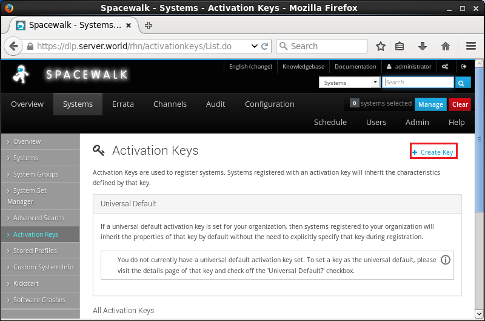

如下所示，在所需字段上设置项目，向下滚动并点击“Create Activation Key”：


创建激活密钥后，如下所示（注册客户端时需要它）：

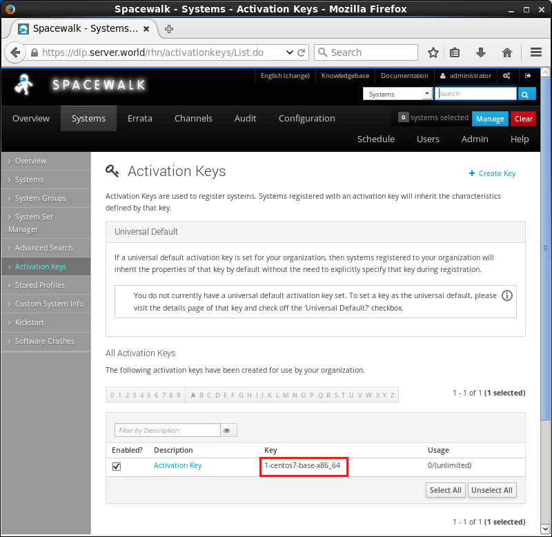

#### 附1.7.6.3. 客户端设置

注册系统作为Spacewalk客户端，由Spacewalk管理服务器进行管理。

在主机上配置Spacewalk客户端的库，并安装所需的软件包，最后注册到服务器。

`yum -y install http://yum.spacewalkproject.org/latest/RHEL/7/x86_64/spacewalk-client-repo-2.3-4.el7.noarch.rpm` 

`yum --enablerepo=epel -y install rhn-client-tools rhn-check rhn-setup rhnsd m2crypto yum-rhn-plugin` # 同时开启EPEL

`yum -y install http://dlp.srv.world/pub/rhn-org-trusted-ssl-cert-1.0-1.noarch.rpm` # 从Spacewalk管理服务器下载证书（将主机名替换为自己的）

`rhnreg_ks --serverUrl=https://dlp.srv.world/XMLRPC --sslCACert=/usr/share/rhn/RHN-ORG-TRUSTED-SSL-CERT --activationkey=1-centos7-base-x86_64` # 使用上一节生成的激活密钥注册系统

登录到Spacewalk管理站点并转到“Systems”标签，然后显示已注册的系统：

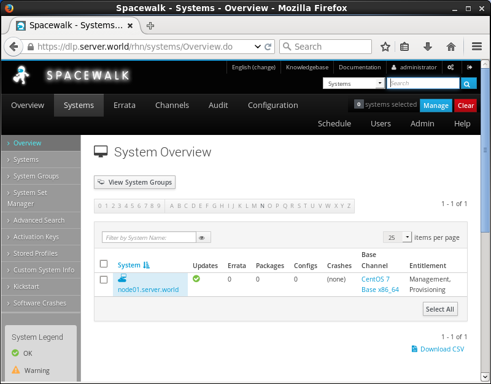

可以点击主机名确认详细信息：

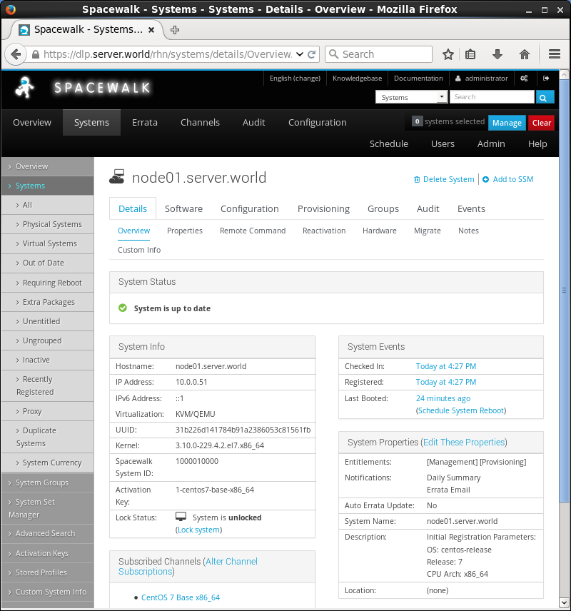

在这里可以确认已安装的软件包或安装新的软件包或是其他许多管理任务：

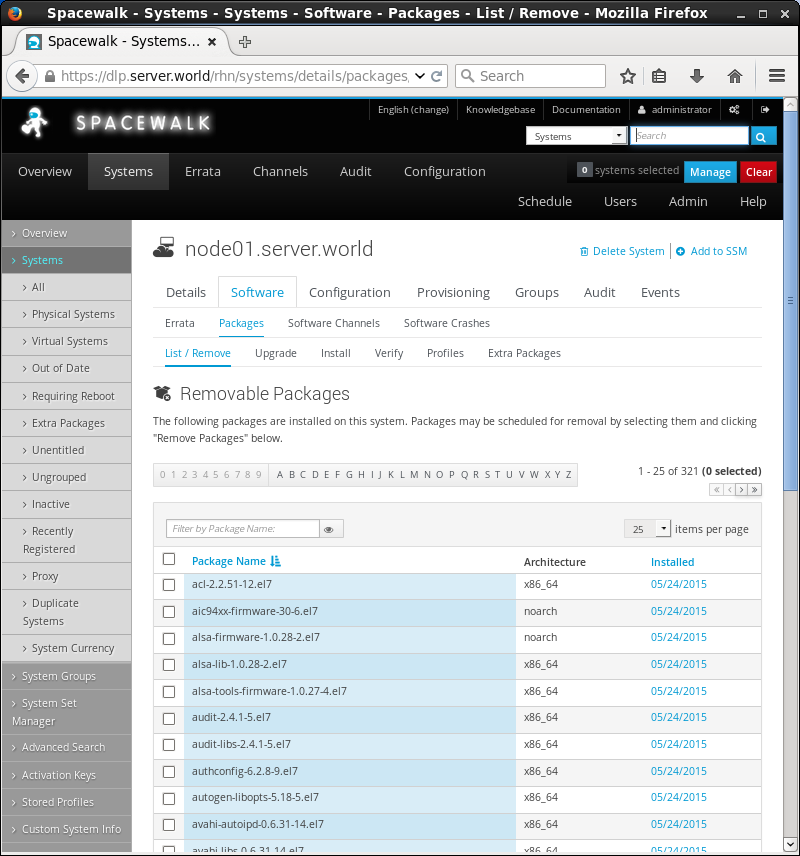

### 附1.7.7. Func

[Func](https://fedoraproject.org/wiki/Infrastructure/Fedorahosted-retirement)是由红帽公司以Fedora平台统一网络控制器（Fedora Unified Network Controller），目的是为了解决这一系列统一管理监控问题而设计开发的系统管理基础框架。

#### 附1.7.7.1. 安装Func

Func可以从管理服务器（称为“Certmaster”）操作远程服务器（称为“Minion”）。

本例基于以下环境配置：


在所有节点上安装用于Certmaster/Minion的Func：

`yum --enablerepo=epel -y install func` # 从EPEL安装

在Certmaster服务器上启动“certmaster”服务：

```
systemctl start certmaster
systemctl enable certmaster
```

“certmaster”服务firewalld防火墙规则：

```
firewall-cmd --add-port=51235/tcp --permanent
firewall-cmd --reload
```

在Minion服务器上启动“funcd”服务。配置Certmaster服务器，也作为一个Minion：

编辑`/etc/certmaster/minion.conf`文件：

```
# configuration for minions

[main]
# Certmaster服务器的主机名或IP地址
certmaster = dlp.srv.world
certmaster_port = 51235
log_level = DEBUG
cert_dir = /etc/pki/certmaster
```

```
systemctl start funcd
systemctl enable funcd
```

“funcd”服务firewalld防火墙规则：

```
firewall-cmd --add-port=51234/tcp --permanent
firewall-cmd --reload
```

当Funcd在Minion上初始运行时，需要如下所示签名Minion的证书：

`certmaster-ca --list` # 显示请求

```
dlp.srv.world
node01.srv.world
```

给它们签名：

`certmaster-ca --sign dlp.srv.world`

```
/var/lib/certmaster/certmaster/csrs/dlp.srv.world.csr signed - cert located at /var/lib/certmaster/certmaster/certs/dlp.srv.world.cert
```

`certmaster-ca --sign node01.srv.world`

```
/var/lib/certmaster/certmaster/csrs/node01.srv.world.csr signed - cert located at /var/lib/certmaster/certmaster/certs/node01.srv.world.cert
```

`func "*" list_minions` # 显示各Minion

```
dlp.srv.world
node01.srv.world
```

#### 附1.7.7.2. 基本操作

在Certmaster服务器上运行命令到Minions。基本用法如下：`func target call module method [args ...]`

显示Minion：

`func "*" list_minions` # 显示所有Minion

```
dlp.srv.world
node01.srv.world
```

`func "dlp.srv.world;node01.srv.world" list_minions` # 指定Minion并显示

```
dlp.srv.world
node01.srv.world
```

显示所有可用的模块（module）：

`func "node01.srv.world" call system list_modules` # 显示`node01.srv.world`的模块

```
{'node01.srv.world': ['bridge',
                      'certmastermod',
                      'command',
                      'confmgt_augeas',
                      'copyfile',
                      'cpu',
                      'delegation',
                      'disk',
                      'djangoctl',
                      'echo',
                      'fact',
                      'filetracker',
                      'func_getargs',
                      'func_module',
                      'getfile',
                      'hardware',
                      'httpd',
                      'iptables',
                      'iptables.port',
                      'jboss',
                      'jobs',
                      'mount',
                      'nagios',
                      'nagios_check',
                      'netapp.options',
                      'netapp.snap',
                      'netapp.vol',
                      'netapp.vol.clone',
                      'networktest',
                      'overlord',
                      'portinfo',
                      'process',
                      'pullfile',
                      'reboot',
                      'rpms',
                      'service',
                      'smart',
                      'snmp',
                      'sysctl',
                      'test',
                      'users',
                      'vlan',
                      'yumcmd']}
```

显示模块的所有可用方法（method）：

`func "node01.srv.world" call command list_methods` # 显示“command”模块的方法

```
{'node01.srv.world': ['run',
                      'config_items',
                      'grep',
                      'exists',
                      'save_config',
                      'module_version',
                      'grep',
                      'list_methods',
                      'module_description',
                      'get_method_args',
                      'module_api_version']}
```

#### 附1.7.7.3. 使用YumModule


#### 附1.7.7.4. 使用CopyFileModule


#### 附1.7.7.5. 使用CommandModule


